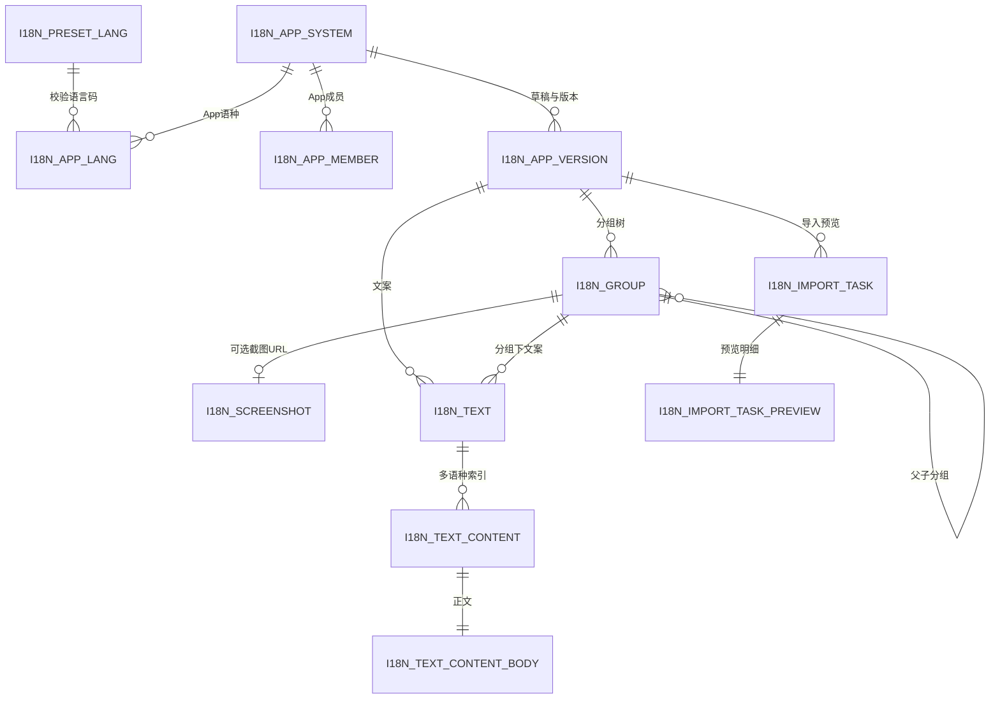
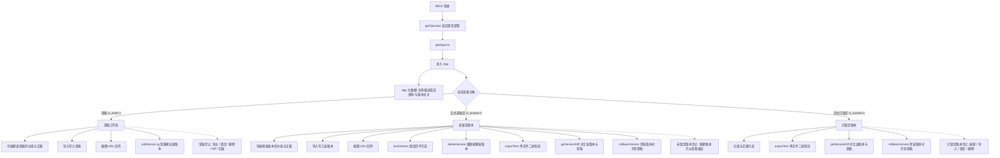
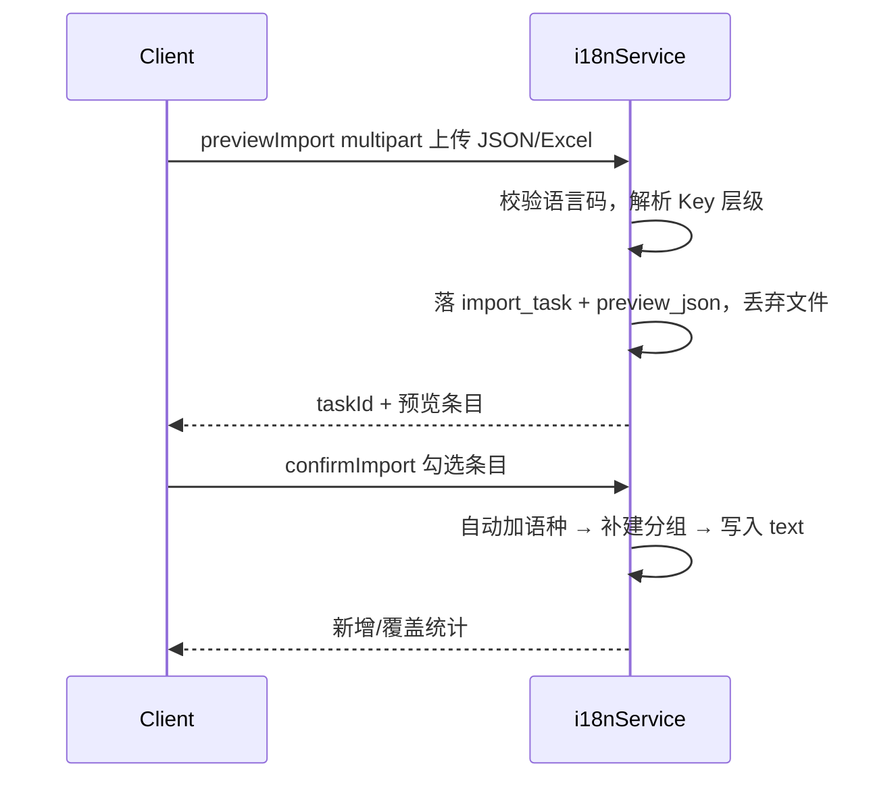
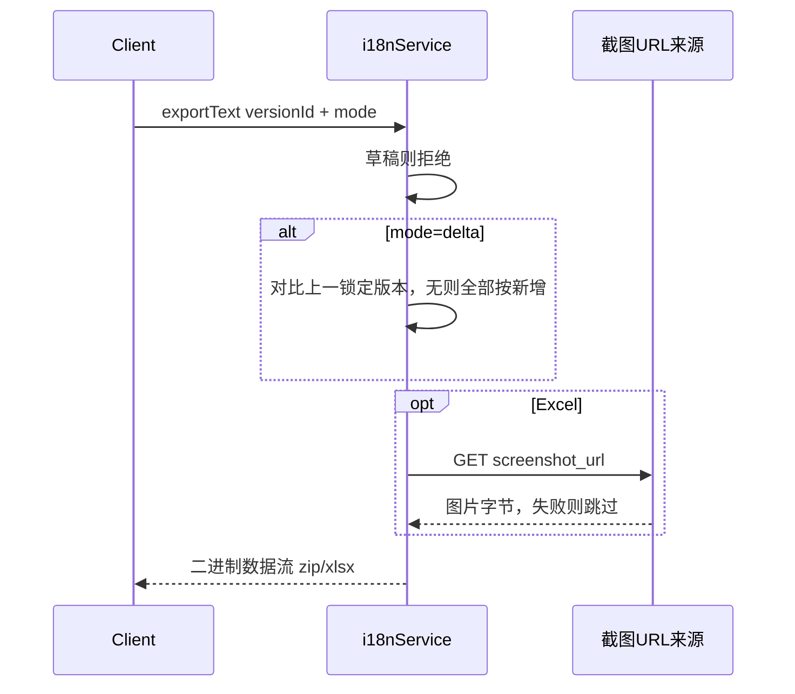
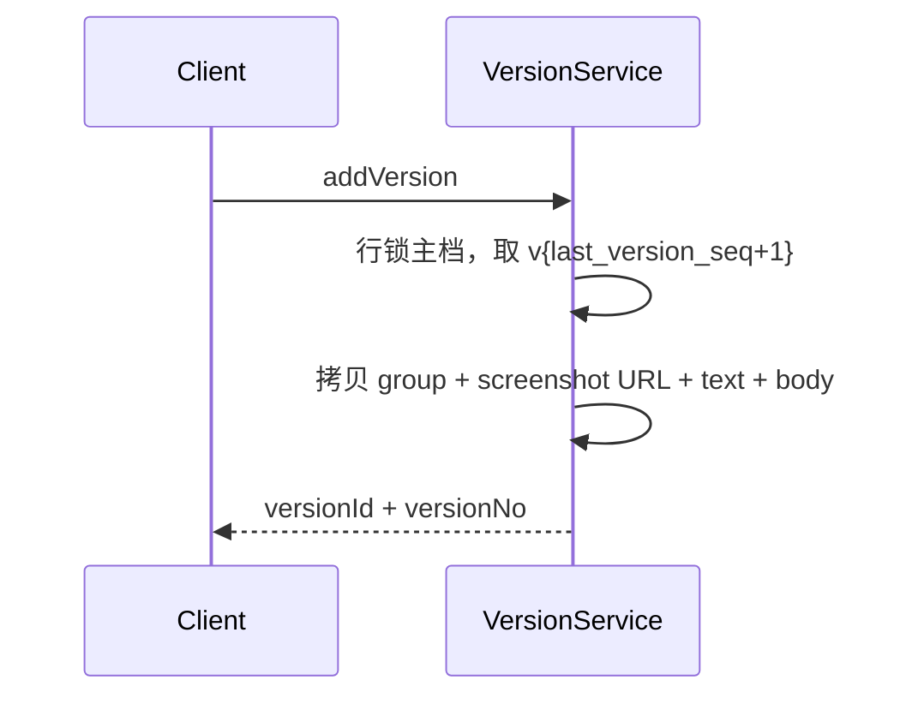
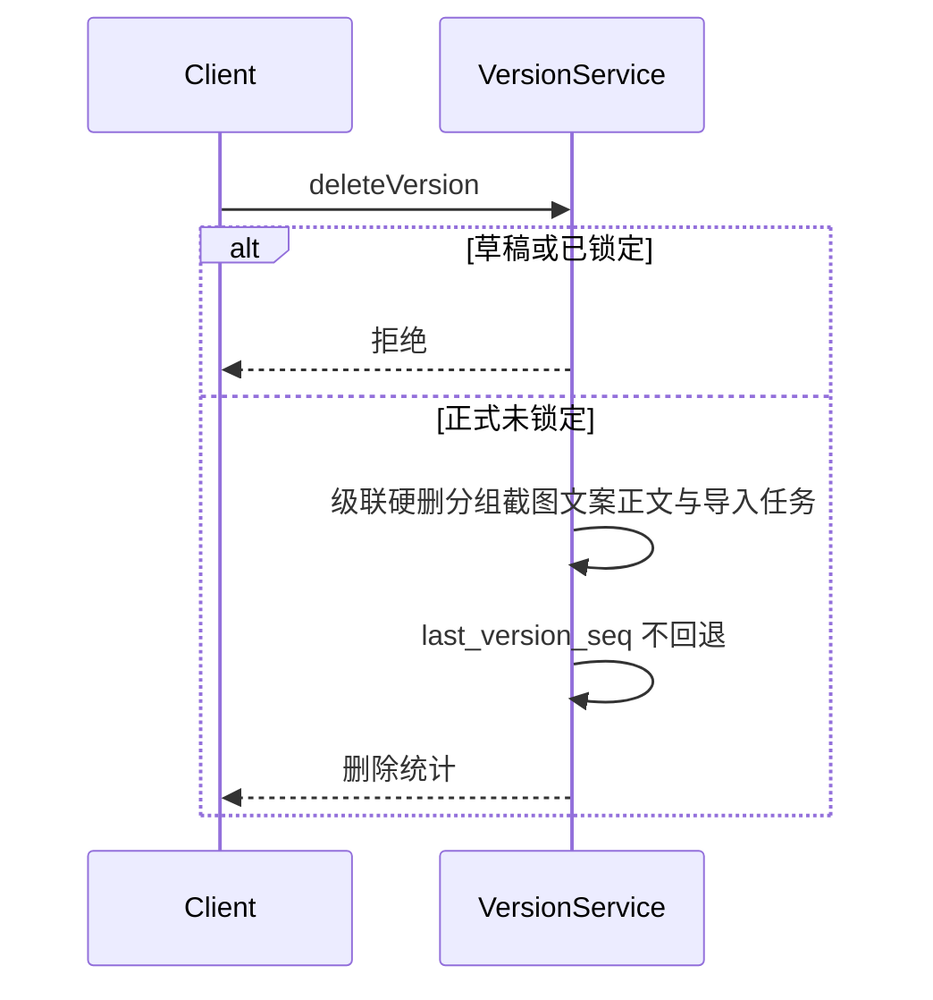
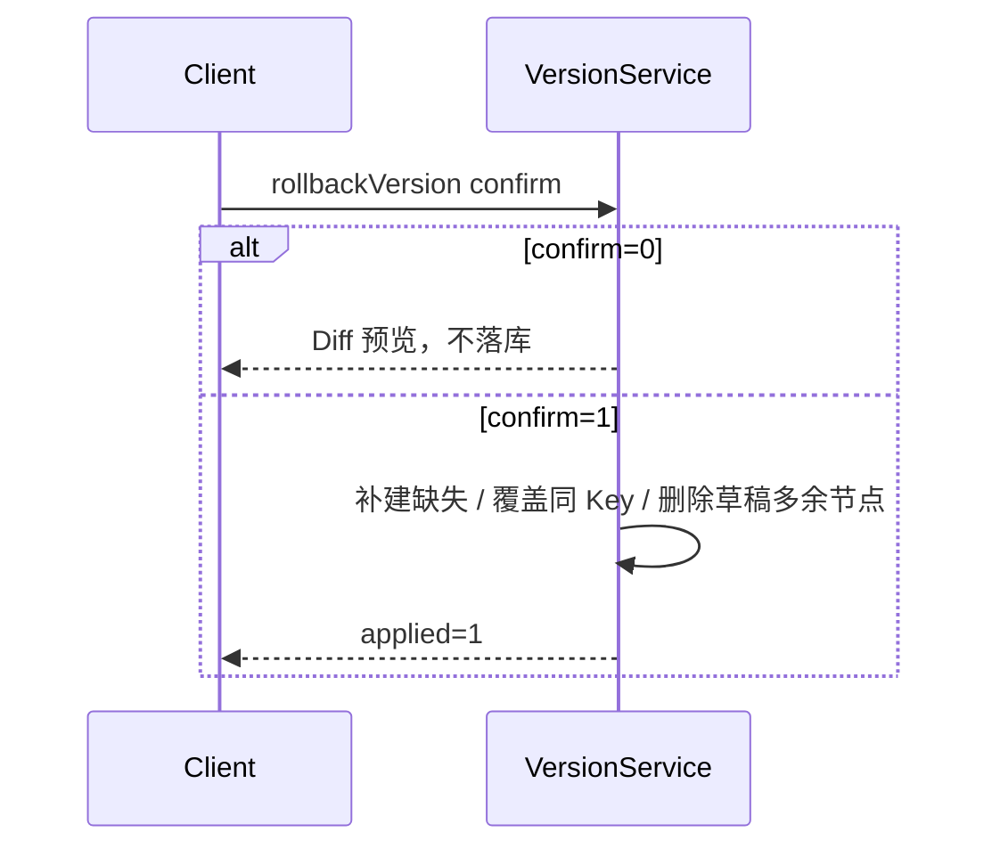
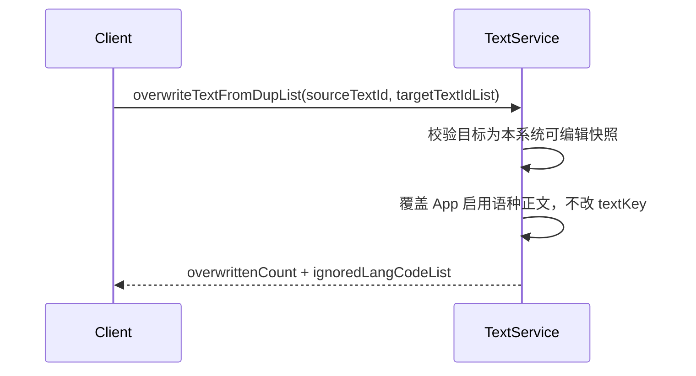

# i18n CMS 后端概要设计

> 接口设计须遵循公司接口设计规范，详见 [api-design-rules.md](api-design-rules.md)。
> 表结构设计须遵循公司数据库设计规范：MySQL 详见 [mysql-design-rules.md](mysql-design-rules.md)。
> Kafka 消息队列设计须遵循 [kafka-design-rules.md](kafka-design-rules.md)。
> 缓存设计须遵循公司 Redis 设计规范，详见 [redis-design-rules.md](redis-design-rules.md)。

**本版（2026-08-24）确认结论：**

1. 应用系统的名称、描述、成员、语种为 **App 级主数据**，不随版本快照保存；快照只含分组、截图 URL、文案（text）。
2. 截图表为 `i18n_screenshot`，只存 URL。
3. **导出直接返回数据流**，不上传任何文件中间件；导入为 multipart 直传本服务。**本服务不集成 fileService**。截图仍由前端现有上传组件上传，本服务只存 URL。
4. 无 OCR。
5. 文案实体统一为 **text**。
6. 未锁定正式版本可删除（草稿、已锁定不可删），版本号可跳号。
7. 删除语种只清 **草稿 + 未锁定版本** 该语种译文，已锁定版本保留。
8. 批量接口统一 `List` 后缀（`saveTextList`、`deleteTextList` 等）。
9. 超长文本（文案正文、导入预览 JSON）拆独立表。

---

## 1 引言

### 1.1 项目基本信息


| 项目   | 内容                                                             |
| ---- | -------------------------------------------------------------- |
| 项目名称 | i18n CMS（多语言文案管理系统）                                            |
| 需求链接 | 仓库文档 `doc/i18n CMS 需求文档V5.pdf`；交互原型 `http://10.25.34.20:8080/` |
| 创建日期 | 2026-08-20                                                     |
| 修订日期 | 2026-08-24                                                     |
| 负责人  | elin                                                           |


### 1.2 需求要点


| 序号  | 要点名称           | 涉及实体        | 简要描述                                     |
| --- | -------------- | ----------- | ---------------------------------------- |
| 1   | 统一认证鉴权         | 员工、会话       | 校验公司统一认证身份，识别内部员工                        |
| 2   | 平台超管全量权限       | 员工、系统       | 超管可查看并操作全部应用系统                           |
| 3   | 系统管理员即创建者      | 系统、成员       | 每个系统仅一名管理员，即创建者                          |
| 4   | 转让系统管理员        | 系统、成员       | 创建者可转让管理员角色（App 级，与版本无关）                 |
| 5   | 成员按姓名文本维护      | 系统成员        | 一期用姓名文本增删成员，不绑账号                         |
| 6   | 按权限过滤系统可见性     | 系统、成员       | 一期：超管全部；非超管仅自己创建的系统                      |
| 7   | 按名称搜索系统列表      | 系统          | 卡片列表，支持按系统名搜索                            |
| 8   | 聚合系统卡片统计       | 系统、分组、文案、成员 | 返回描述、语种、文案数、成员等（主数据 + 草稿文案数）             |
| 9   | 新建系统           | 系统、语种、成员    | 任何人可建；填名称、描述、语种、成员                       |
| 10  | 编辑系统概览         | 系统、成员       | 改 App 级名称、描述、成员（不按版本）                    |
| 11  | 硬删除系统          | 系统及下属数据     | 仅创建者；级联硬删                                |
| 12  | 系统新增语种         | 系统、语种       | 向 App 增加语种（不按版本），必须选自预设                  |
| 13  | 删除语种及译文        | 系统、文案       | 删 App 启用语种；只清草稿与未锁定版本该语种译文；已锁定版本保留       |
| 14  | 按版本查询分组树       | 分组、版本       | 多级树；随草稿或指定版本快照切换                         |
| 15  | 新增分组并强制 Key    | 分组          | Key 必填；同父节点唯一；可挂多级父分组                    |
| 16  | 修改分组信息         | 分组          | 改名称、Key、截图 URL                           |
| 17  | 删除分组           | 分组、文案       | 硬删分组及其下文案（含子分组）                          |
| 18  | 保存分组截图 URL     | 分组、截图       | 前端经现有上传组件上传，本服务只存 URL                    |
| 19  | 分页查询分组下文案      | 文案、版本       | 表格分页；按当前草稿或版本快照                          |
| 20  | 系统级文案挂载        | 文案、系统       | 文案可不属分组，引用 `$t('textKey')`               |
| 21  | Key/内容模糊搜索     | 文案          | 范围：当前分组 / 当前系统 / 全部系统                    |
| 22  | 跨范围搜索列与只读      | 文案          | 跨系统行不可编；禁迁移/批量删外系统                       |
| 23  | 版本下分组缺失提示      | 分组、版本       | 该版本无此分组时返回空并供前端提示                        |
| 24  | 手动保存文案（含批量）    | 文案          | 支持占位符原样存储；表格批量提交保存                       |
| 25  | 自动生成文案 Key     | 文案          | 截主语种前 16 字符，空格转 `_`，过滤特殊符                |
| 26  | 文案 Key 冲突改写    | 文案          | 自动生成冲突则 `{generatedKey}_{2位随机}`；手填冲突直接失败 |
| 27  | 存储富文本文案        | 文案          | 保存加粗/颜色/超链接等富文本 HTML                     |
| 28  | JSON 多语种一次导入预览 | 导入任务        | 多语种 JSON 文件一次上传，解析预览                     |
| 29  | Excel 全语种导入预览  | 导入任务        | 单文件含全部语种列                                |
| 30  | 按 Key 层级解析归属   | 分组、文案       | 末段为文案 Key；缺分组则自动创建                       |
| 31  | 勾选确认导入         | 文案、分组       | 按勾选写入当前可编辑快照                             |
| 32  | 导入语言码合法性校验     | 语种          | 非预设语言码整单拒绝；预设内未启用则自动加语种                  |
| 33  | 导出版本全量 JSON    | 版本、文案       | 每语种一文件打 zip；仅已打版本；数据流返回                  |
| 34  | 导出版本全量 Excel   | 版本、文案、截图    | Excel 内嵌分组截图；仅已打版本；数据流返回                 |
| 35  | 导出相对锁定版本的修改    | 版本、文案       | 相对上一锁定版本的增删改；无上一锁定版本则全量新增                |
| 36  | 按语种与树勾选过滤导出    | 文案、分组       | 可选语种；树勾到文案                               |
| 37  | 批量硬删除文案        | 文案          | 当前快照内硬删所选文案                              |
| 38  | 按语种删除文案译文      | 文案          | 删除指定语种内容，不删整条 Key                        |
| 39  | 按主语种跨系统查重      | 文案          | 有英文用英文，否则用语种顺序第一项                        |
| 40  | 勾选文案查重         | 文案          | 在权限范围内查所选文案的重复组                          |
| 41  | 系统全文案查重        | 系统、文案       | 查本系统全部文案在各系统中的重复                         |
| 42  | 查重结果仅返回重复组     | 文案          | 只返回有重复的组，组内条目相邻                          |
| 43  | 查重复制覆盖本系统文案    | 文案          | 不改本系统 Key；范围外语种忽略                        |
| 44  | 查重组内删除本系统重复    | 文案          | 本系统同组多于 1 条时可删                           |
| 45  | 迁移文案到指定分组      | 文案、分组       | 内容相同则跳过；Key 冲突按要点 26                     |
| 46  | 复制文案到指定分组      | 文案、分组       | 内容相同则跳过；Key 冲突按要点 26                     |
| 47  | 维护独立草稿工作区      | 草稿          | 未打版本的分组/文案编辑落在草稿                         |
| 48  | 从草稿新建版本快照      | 版本          | 版本号自增不可改；只拷分组+截图 URL+文案                  |
| 49  | 查询版本列表         | 版本          | 含版本号、说明、时间、作者、锁定态                        |
| 50  | 切换查看指定版本       | 版本、分组、文案    | 返回该快照的分组与文案（不含名称成员语种）                    |
| 51  | 编辑未锁定版本即改快照    | 版本          | 未锁定可改该快照的分组与文案                           |
| 52  | 删除未锁定版本        | 版本          | 正式且未锁定可硬删；草稿与已锁定不可删；号可跳                  |
| 53  | 锁定版本且不可解锁      | 版本          | 锁定后分组/文案只读；不可解锁；不可删除                     |
| 54  | 版本与草稿 Diff     | 版本、草稿       | 按分组 Key 全路径 + 文案 Key 高亮增删改               |
| 55  | 回滚预览并写入草稿      | 版本、草稿       | 确认后草稿与该版本完全对齐（多余节点删除）                    |
| 56  | 草稿禁止导出         | 草稿、版本       | 仅已打版本允许导出                                |
| 57  | 查询预设语种 List    | 语种          | 返回本库种子维护的预设语言码与名称                        |
| 58  | 系统语种必须选自预设     | 系统、语种       | 新增/导入语种均须在预设 List 内                      |


本期不包含：截图 OCR、AI 翻译、CLI/标准拉取接口、S3 一键发布、操作日志、审核流程。

---

## 2 整体设计

### 2.1 技术栈和框架


| 类别      | 技术选型                                                                             |
| ------- | -------------------------------------------------------------------------------- |
| 开发语言/框架 | Java / Spring Boot                                                               |
| 数据库     | MySQL，库名 `vesync_i18n`                                                           |
| 缓存      | 本期不使用 Redis                                                                      |
| 消息队列    | 本期不使用                                                                            |
| 其他中间件   | 不集成文件中间件。导入为 multipart 直传本服务，导出为响应数据流，截图由前端现有上传组件上传后只回传 URL；登录走 BEnd 网关 / 公司统一认证 |


### 2.2 方案设计

后台 CMS。URL：`POST /ops/admin/i18nService/v1/{分类}/{method}`。协议 BEndReq。YAPI 模块 `cloud-i18nService`。

数据分两层：

- **App 主数据（不版本化）**：名称、描述、成员、启用语种。改这些字段立即对整个 App 生效，与当前查看的草稿/版本无关。
- **版本快照（分组 + 截图 URL + 文案 text）**：每个 App 一条草稿 + 多个正式版本。未锁定可改、可删；锁定只读、不可解锁、不可删除。

文案实体统一命名为 **text**（`textId` / `textKey` / `i18n_text`）。

#### 2.2.1 需求分组

已将 58 条要点分为 5 组：

【分组 1】平台级管理（system）：要点 1、2、57、58
分组理由：登录身份、超管标记、预设语种属平台级目录数据。

【分组 2】应用系统（app，含导入导出）：要点 3–13、28–36、56
分组理由：App 主数据、成员、语种及项目级导入导出同属 App 边界。

【分组 3】分组与截图（group）：要点 14–18
分组理由：分组树与截图 URL 同一维护流程。

【分组 4】文案编辑搬迁与查重（text）：要点 19–27、37–46
分组理由：同一快照内文案 CRUD、迁移复制、查重覆盖。

【分组 5】版本与草稿（version）：要点 47–55
分组理由：草稿、快照、锁定、删除、Diff、回滚。

#### 2.2.2 数据库表清单


| 分组      | 所属库         | 表名                       | 说明                 | 核心实体  | 新增/已有 |
| ------- | ----------- | ------------------------ | ------------------ | ----- | ----- |
| system  | vesync_i18n | i18n_preset_lang         | 预设语言码（种子数据）        | 语种    | 新增    |
| app     | vesync_i18n | i18n_app_system          | 应用系统主档             | 系统    | 新增    |
| app     | vesync_i18n | i18n_app_member          | App 级成员姓名与角色       | 系统成员  | 新增    |
| app     | vesync_i18n | i18n_app_lang            | App 级启用语种及顺序       | 语种    | 新增    |
| app     | vesync_i18n | i18n_import_task         | 导入预览任务元数据          | 导入    | 新增    |
| app     | vesync_i18n | i18n_import_task_preview | 导入预览明细 JSON（超长独立表） | 导入    | 新增    |
| version | vesync_i18n | i18n_app_version         | 草稿与版本元数据           | 版本/草稿 | 新增    |
| group   | vesync_i18n | i18n_group               | 快照下多级分组            | 分组    | 新增    |
| group   | vesync_i18n | i18n_screenshot          | 分组截图 URL           | 截图    | 新增    |
| text    | vesync_i18n | i18n_text                | 快照下文案 Key 与归属      | 文案    | 新增    |
| text    | vesync_i18n | i18n_text_content        | 文案语种维度索引与内容指纹      | 文案译文  | 新增    |
| text    | vesync_i18n | i18n_text_content_body   | 文案正文（超长独立表）        | 文案正文  | 新增    |


已删除：`i18n_version_profile`、`i18n_version_lang`、`i18n_file`、`i18n_ocr_task`、`i18n_copy`、`i18n_copy_content`。

#### 2.2.3 实体关系概览




#### 2.2.4 API 接口清单


| 分组      | 接口名称       | 接口类型 | 协议类型    | 路径                                                        | 变更类型 | 本次说明                      |
| ------- | ---------- | ---- | ------- | --------------------------------------------------------- | ---- | ------------------------- |
| system  | 查询当前操作者    | 对外   | BEndReq | `/ops/admin/i18nService/v1/system/getOperator`            | 增加   | 返回当前登录用户账号、展示名及是否超管     |
| system  | 查询预设语种     | 对外   | BEndReq | `/ops/admin/i18nService/v1/system/getPresetLangList`      | 增加   | 只返回启用的预设语言码               |
| app     | 查询系统列表     | 对外   | BEndReq | `/ops/admin/i18nService/v1/app/getAppList`                | 增加   | 按名搜索；主数据 + 草稿文案数          |
| app     | 查询系统详情     | 对外   | BEndReq | `/ops/admin/i18nService/v1/app/getAppDetail`              | 增加   | App 级名称/描述/语种/成员          |
| app     | 新建系统       | 对外   | BEndReq | `/ops/admin/i18nService/v1/app/addApp`                    | 增加   | 写主数据并初始化草稿                |
| app     | 更新系统信息     | 对外   | BEndReq | `/ops/admin/i18nService/v1/app/updateApp`                 | 增加   | 改 App 级名称/描述/成员           |
| app     | 删除系统       | 对外   | BEndReq | `/ops/admin/i18nService/v1/app/deleteApp`                 | 增加   | 仅创建者；级联硬删                 |
| app     | 转让管理员      | 对外   | BEndReq | `/ops/admin/i18nService/v1/app/transferAppAdmin`          | 增加   | App 级转让，与版本无关             |
| app     | 新增系统语种     | 对外   | BEndReq | `/ops/admin/i18nService/v1/app/addAppLang`                | 增加   | App 级加语种                  |
| app     | 删除系统语种     | 对外   | BEndReq | `/ops/admin/i18nService/v1/app/deleteAppLang`             | 增加   | 只清草稿与未锁定版本译文              |
| app     | 导入预览       | 对外   | BEndReq | `/ops/admin/i18nService/v1/app/previewImport`             | 增加   | multipart 上传文件解析预览        |
| app     | 确认导入       | 对外   | BEndReq | `/ops/admin/i18nService/v1/app/confirmImport`             | 增加   | 勾选写入当前可编辑快照               |
| app     | 导出文案       | 对外   | BEndReq | `/ops/admin/i18nService/v1/app/exportText`                | 增加   | 响应体为文件数据流                 |
| group   | 查询分组树      | 对外   | BEndReq | `/ops/admin/i18nService/v1/group/getGroupTree`            | 增加   | 按草稿或版本返回多级树               |
| group   | 新增分组       | 对外   | BEndReq | `/ops/admin/i18nService/v1/group/addGroup`                | 增加   | 强制分组 Key；可选 screenshotUrl |
| group   | 更新分组       | 对外   | BEndReq | `/ops/admin/i18nService/v1/group/updateGroup`             | 增加   | 改名称、Key、截图 URL            |
| group   | 删除分组       | 对外   | BEndReq | `/ops/admin/i18nService/v1/group/deleteGroup`             | 增加   | 硬删分组、截图记录及下属文案            |
| text    | 分页查询文案     | 对外   | BEndReq | `/ops/admin/i18nService/v1/text/getTextList`              | 增加   | 支持分组/系统/全部搜索              |
| text    | 批量保存文案     | 对外   | BEndReq | `/ops/admin/i18nService/v1/text/saveTextList`             | 增加   | 新增改、自动 Key、富文本            |
| text    | 批量删除文案     | 对外   | BEndReq | `/ops/admin/i18nService/v1/text/deleteTextList`           | 增加   | 当前快照硬删                    |
| text    | 批量按语种删译文   | 对外   | BEndReq | `/ops/admin/i18nService/v1/text/deleteTextLangList`       | 增加   | 删指定语种内容                   |
| text    | 批量迁移文案     | 对外   | BEndReq | `/ops/admin/i18nService/v1/text/migrateTextList`          | 增加   | 迁到目标分组                    |
| text    | 批量复制文案     | 对外   | BEndReq | `/ops/admin/i18nService/v1/text/copyTextList`             | 增加   | 复制到目标分组                   |
| text    | 查询文案重复     | 对外   | BEndReq | `/ops/admin/i18nService/v1/text/getTextDupList`           | 增加   | 只返回重复组                    |
| text    | 批量查重覆盖     | 对外   | BEndReq | `/ops/admin/i18nService/v1/text/overwriteTextFromDupList` | 增加   | 不改本系统 Key                 |
| text    | 批量删除查重组内文案 | 对外   | BEndReq | `/ops/admin/i18nService/v1/text/deleteDupTextList`        | 增加   | 本系统同组多于 1 条时可删            |
| version | 查询版本列表     | 对外   | BEndReq | `/ops/admin/i18nService/v1/version/getVersionList`        | 增加   | 草稿 + 版本号/锁定/说明            |
| version | 新建版本       | 对外   | BEndReq | `/ops/admin/i18nService/v1/version/addVersion`            | 增加   | 从草稿拷分组+截图 URL+文案          |
| version | 锁定版本       | 对外   | BEndReq | `/ops/admin/i18nService/v1/version/lockVersion`           | 增加   | 锁定后只读、不可删除                |
| version | 删除未锁定版本    | 对外   | BEndReq | `/ops/admin/i18nService/v1/version/deleteVersion`         | 增加   | 仅正式且未锁定；级联硬删              |
| version | 版本 Diff    | 对外   | BEndReq | `/ops/admin/i18nService/v1/version/getVersionDiff`        | 增加   | 历史与草稿按 Key 链对比            |
| version | 回滚到版本      | 对外   | BEndReq | `/ops/admin/i18nService/v1/version/rollbackVersion`       | 增加   | 预览后草稿与该版本对齐               |


共 **32** 个接口。已删除：`recognizeGroupScreenshot`、`addGroupByOcr`。

#### 2.2.6 外部服务集成场景概览


| 分组     | 服务名称          | 集成方式      | 调用场景                              | 超时/重试策略                    |
| ------ | ------------- | --------- | --------------------------------- | -------------------------- |
| system | 公司统一认证 / 权限中心 | 网关 + HTTP | 登录态校验；超管判定（列表过滤与写接口共用）            | 超时 2s，不重试，失败不授予超管          |
| app    | 截图 URL 下载     | HTTP GET  | 导出 Excel 时按 `screenshot_url` 拉图内嵌 | 单图超时 5s、重试 1 次；失败跳过该图不整单失败 |


不集成 fileService / OSS SDK。无 Kafka。无 OCR。

#### 2.2.7 关键技术决策点


| 决策项        | 方案选项                   | 最终决策                      | 理由             |
| ---------- | ---------------------- | ------------------------- | -------------- |
| App 主数据与版本 | 随版本快照 / App 级一份        | **名称、描述、成员、语种不入版本**       | 已确认            |
| 快照范围       | JSON / 关系表全量 / 仅分组+文案  | **关系表只拷分组、截图 URL、text**   | 主数据已拆出         |
| 导出传输       | 中间件上传返回 URL / 响应数据流    | **响应为单文件二进制流（非 multipart）** | 已确认；`application/octet-stream` |
| 导入传输       | 已上传 URL / multipart 直传 | **请求 multipart 直传本服务**    | 去掉中间件依赖；仅导入用 multipart  |
| 截图存储       | 本服务上传 / 前端组件上传只存 URL   | **只存 URL**                | 已确认            |
| 超长文本       | 同表 TEXT / 独立表          | **独立表（正文、预览 JSON）**       | 遵循 MySQL 规范    |
| 文案实体命名     | copy / text            | **统一 text**               | 避免与「复制」混淆      |
| 批量接口命名     | 不加 List / 统一 List      | **统一 List 后缀**            | 遵循 method 命名规范 |
| 未锁定版本      | 不可删 / 可删               | **可删，有编辑权限即可**            | 已确认；号可跳        |
| 删语种清译文范围   | 全部版本 / 草稿+未锁定          | **草稿 + 未锁定版本**            | 已确认；锁定快照保留     |
| 跨系统搜索基准    | 对方草稿 / 对方最新锁定版本        | **最新锁定版本**                | 已确认            |
| 手填 Key 冲突  | 改写 / 失败                | **失败**                    | 已确认，避免静默改 Key  |
| 导入未启用语种    | 跳过 / 拒绝 / 自动加          | **自动加语种（须在预设内）**          | 已确认            |
| 回滚语义       | 只覆盖同 Key / 完全对齐        | **完全对齐，删草稿多余节点**          | 已确认            |
| 预设语种来源     | 外部配置 / 本库种子            | **本库种子数据**                | 已确认            |
| 草稿         | 独立 version 行           | `is_draft=1` 每 App 一行     | 与正式版本同一套读写     |
| 业务 ID      | 自增主键 / CloudId         | CloudId.nextId()          | 规范禁止主键外露       |
| 查重         | ES / MySQL             | 主语种精确匹配 + content_hash 候选 | PRD 为精确匹配      |
| 一期可见性      | 创建者+成员 / 仅创建者          | 超管全部，非超管仅创建者              | 成员不绑账号         |
| Redis      | 用 / 不用                 | 不用                        | 已确认            |


### 2.3 业务流程图




### 2.4 注意事项

1. **术语**：PRD「项目」= App；「页面」= 分组。文案实体一律 **text**；`copyTextList` 中的 copy 仅表示复制动作。
2. **App 主数据**：`updateApp` / `transferAppAdmin` / `addAppLang` / `deleteAppLang` **不传 versionId**，切换版本不影响名称、描述、成员、语种。
3. **删语种**：删除 `i18n_app_lang` 行；只删除草稿与未锁定正式版本下该 `lang_code` 的译文行，**已锁定版本保留**；不删 `i18n_text`。至少保留一种启用语种。
4. **快照可编辑**：仅约束分组/文案/导入写接口。草稿或 `is_locked=0` 的正式版本可写。App 主数据写接口不校验版本锁定。
5. **删除版本**：仅 `is_draft=0` 且 `is_locked=0` 可删，具备该 App 编辑权限（超管或创建者）即可。级联硬删该 `version_id` 的分组、截图、文案、正文、导入任务及预览。`last_version_seq` 不回退，**允许跳号**。
6. **新建版本**：版本号 `v{last_version_seq+1}`，取号后 `last_version_seq` 落库为该值。只深拷贝分组、截图 URL、文案、正文。
7. **回滚 / Diff**：只挂在**正式版本**上（草稿不能作为对比源或回滚源）。按分组 Key 全路径 + 文案 Key 比较该版本与草稿；`confirm=1` 时把**草稿**改成与该版本完全对齐，草稿中多出的分组与文案被删除。目标版本已删除则失败。
8. **导出**：草稿拒绝。成功响应**不是 multipart**，而是单个文件的二进制流：`Content-Type: application/octet-stream`，`Content-Disposition: attachment`。JSON 打成一个 zip、Excel 为一个 xlsx。不落中间件。Excel 内嵌图按 `screenshot_url` HTTP 拉取，失败跳过该图。delta 无上一锁定版本时全部按新增输出。
9. **导入**：仅 `previewImport` 请求为 `multipart/form-data`（一次可传多个文件）；单文件 ≤ 10MB、单次 ≤ 20 个文件。语言码不在预设表整单拒绝；在预设表但 App 未启用则**自动加语种**；同 Key 只覆盖文件中出现的语种。
10. **Key 引用**：`$t` 使用**全路径**，如 `$t('home.header.title')`；系统级文案为 `$t('textKey')`。
11. **分组 Key 唯一**：同 `version_id` + 同 `parent_group_id`。系统级文案 `group_id=0`。
12. **文案 Key 唯一**：`(version_id, group_id, text_key)`。自动生成规则：取主语种内容前 16 字符 → 去首尾空白 → 空格转 `_` → 过滤 `[^A-Za-z0-9_]` → 空则取 `text`；同分组冲突则 `{generatedKey}_{2位随机小写字母数字}`，仍冲突最多重试 5 次。**手填 Key 冲突直接报错**，不改写。
13. **占位符**：后端不解析、不校验、不转换，原样存储与导出。
14. **查重与默认导出以快照内实际存在的语种为准**，不按 App 当前启用列表过滤（锁定版本中已移除语种的译文仍计入）。
15. **跨系统搜索**（`searchScope=all`）读其它 App 的**最新锁定版本**；无锁定版本的 App 不参与。
16. **超管判定**接口与字段待与权限中心对接后确认 `[待补充]`。
17. **规范例外**：`exportText` 成功时响应体为**单文件二进制流**（非 multipart、不走 `IotResponse` 包装）；`previewImport` **请求**为 multipart。二者均已在 4.2 标注。
18. 无 OCR、无 Redis、无 Kafka、禁止外键、主键 `id` 不进接口。

---

## 3 数据库设计

### 3.1 数据库选型

仅 MySQL（`vesync_i18n`）。业务数据、快照、导入预览均落 MySQL。文件不落库：导入文件解析后即丢弃，导出实时生成后直接写响应流，截图只存 URL。无 Redis、无 MongoDB。

### 3.2 数据库结构

#### 3.2.1 实体关系


| 实体名    | 对应表名                     | 所属库         | 说明             |
| ------ | ------------------------ | ----------- | -------------- |
| 预设语种   | i18n_preset_lang         | vesync_i18n | 平台预设语言码，种子数据   |
| 应用系统   | i18n_app_system          | vesync_i18n | 名称、描述、创建者、版本序号 |
| 应用成员   | i18n_app_member          | vesync_i18n | App 级成员，不按版本   |
| 应用语种   | i18n_app_lang            | vesync_i18n | App 级启用语种      |
| 应用版本   | i18n_app_version         | vesync_i18n | 草稿与正式版本元数据     |
| 导入任务   | i18n_import_task         | vesync_i18n | 导入预览元数据        |
| 导入预览明细 | i18n_import_task_preview | vesync_i18n | 预览 JSON 正文     |
| 分组     | i18n_group               | vesync_i18n | 版本下多级分组        |
| 截图     | i18n_screenshot          | vesync_i18n | 分组截图 URL       |
| 文案     | i18n_text                | vesync_i18n | 文案 Key 与归属     |
| 文案语种索引 | i18n_text_content        | vesync_i18n | 语种维度索引与内容指纹    |
| 文案正文   | i18n_text_content_body   | vesync_i18n | 富文本正文          |


#### 3.2.2 表结构设计

##### i18n_preset_lang

平台预设语言码，随库初始化脚本以种子数据写入，无对外写接口。


| 字段名            | 类型                  | 必填  | 默认值                                           | 说明                                |
| -------------- | ------------------- | --- | --------------------------------------------- | --------------------------------- |
| id             | BIGINT(20) UNSIGNED | Y   | AUTO_INCREMENT                                | 主键（禁止用于业务）                        |
| preset_lang_id | BIGINT(20)          | Y   | -                                             | DL-20260824-L2:预设语种业务ID           |
| lang_code      | VARCHAR(32)         | Y   | ''                                            | DL-20260824-L4:语言码，遵循 VeSync Wiki |
| lang_name      | VARCHAR(64)         | Y   | ''                                            | DL-20260824-L4:语种展示名称             |
| sort_no        | INT(11)             | Y   | 0                                             | DL-20260824-L4:排序号，越小越靠前          |
| is_enabled     | TINYINT(3) UNSIGNED | Y   | 1                                             | DL-20260824-L4:是否启用，1是，0否         |
| create_time    | DATETIME            | Y   | CURRENT_TIMESTAMP                             | DL-20260824-L4:创建时间               |
| update_time    | DATETIME            | Y   | CURRENT_TIMESTAMP ON UPDATE CURRENT_TIMESTAMP | DL-20260824-L4:更新时间               |


**索引说明：** `uniq_preset_lang_id`、`uniq_lang_code`。停用语种量级极小，不为 `is_enabled` 单独建索引。

**DDL：**

```sql
CREATE TABLE `vesync_i18n`.`i18n_preset_lang` (
  `id` bigint(20) unsigned NOT NULL AUTO_INCREMENT COMMENT 'DL-20260824-L4:主键禁止用于业务',
  `preset_lang_id` bigint(20) NOT NULL COMMENT 'DL-20260824-L2:预设语种业务ID',
  `lang_code` varchar(32) NOT NULL DEFAULT '' COMMENT 'DL-20260824-L4:语言码',
  `lang_name` varchar(64) NOT NULL DEFAULT '' COMMENT 'DL-20260824-L4:语种展示名称',
  `sort_no` int(11) NOT NULL DEFAULT 0 COMMENT 'DL-20260824-L4:排序号越小越靠前',
  `is_enabled` tinyint(3) unsigned NOT NULL DEFAULT 1 COMMENT 'DL-20260824-L4:是否启用1是0否',
  `create_time` datetime NOT NULL DEFAULT CURRENT_TIMESTAMP COMMENT 'DL-20260824-L4:创建时间',
  `update_time` datetime NOT NULL DEFAULT CURRENT_TIMESTAMP ON UPDATE CURRENT_TIMESTAMP COMMENT 'DL-20260824-L4:更新时间',
  PRIMARY KEY (`id`),
  UNIQUE KEY `uniq_preset_lang_id` (`preset_lang_id`),
  UNIQUE KEY `uniq_lang_code` (`lang_code`)
) ENGINE=InnoDB DEFAULT CHARSET=utf8mb4 COMMENT='DL-20260824-L4:i18n预设语言码';
```

##### i18n_app_system

应用系统主档。名称、描述在本表，不随版本变化。`last_version_seq` 只增不减，删除版本不回退，因此版本号允许跳号。


| 字段名                | 类型                  | 必填  | 默认值                                           | 说明                              |
| ------------------ | ------------------- | --- | --------------------------------------------- | ------------------------------- |
| id                 | BIGINT(20) UNSIGNED | Y   | AUTO_INCREMENT                                | 主键（禁止用于业务）                      |
| app_id             | BIGINT(20)          | Y   | -                                             | DL-20260824-L2:应用系统业务ID         |
| app_name           | VARCHAR(128)        | Y   | ''                                            | DL-20260824-L4:系统名称             |
| app_desc           | VARCHAR(512)        | Y   | ''                                            | DL-20260824-L4:系统描述             |
| creator_account_id | VARCHAR(20)         | Y   | ''                                            | DL-20260824-L2:创建者账号ID，转让管理员不变更 |
| creator_name       | VARCHAR(64)         | Y   | ''                                            | DL-20260824-L2:创建者姓名快照          |
| last_version_seq   | INT(11)             | Y   | 0                                             | DL-20260824-L4:已发放正式版本序号，只增不减   |
| create_time        | DATETIME            | Y   | CURRENT_TIMESTAMP                             | DL-20260824-L4:创建时间             |
| update_time        | DATETIME            | Y   | CURRENT_TIMESTAMP ON UPDATE CURRENT_TIMESTAMP | DL-20260824-L4:更新时间             |


**索引说明：** `uniq_app_id`；`idx_creator_account_id` 支撑非超管按创建者过滤列表。`app_name` 为模糊搜索，不建索引（量级小于万级）。

**DDL：**

```sql
CREATE TABLE `vesync_i18n`.`i18n_app_system` (
  `id` bigint(20) unsigned NOT NULL AUTO_INCREMENT COMMENT 'DL-20260824-L4:主键禁止用于业务',
  `app_id` bigint(20) NOT NULL COMMENT 'DL-20260824-L2:应用系统业务ID',
  `app_name` varchar(128) NOT NULL DEFAULT '' COMMENT 'DL-20260824-L4:系统名称',
  `app_desc` varchar(512) NOT NULL DEFAULT '' COMMENT 'DL-20260824-L4:系统描述',
  `creator_account_id` varchar(20) NOT NULL DEFAULT '' COMMENT 'DL-20260824-L2:创建者账号ID',
  `creator_name` varchar(64) NOT NULL DEFAULT '' COMMENT 'DL-20260824-L2:创建者姓名快照',
  `last_version_seq` int(11) NOT NULL DEFAULT 0 COMMENT 'DL-20260824-L4:已发放正式版本序号只增不减',
  `create_time` datetime NOT NULL DEFAULT CURRENT_TIMESTAMP COMMENT 'DL-20260824-L4:创建时间',
  `update_time` datetime NOT NULL DEFAULT CURRENT_TIMESTAMP ON UPDATE CURRENT_TIMESTAMP COMMENT 'DL-20260824-L4:更新时间',
  PRIMARY KEY (`id`),
  UNIQUE KEY `uniq_app_id` (`app_id`),
  KEY `idx_creator_account_id` (`creator_account_id`)
) ENGINE=InnoDB DEFAULT CHARSET=utf8mb4 COMMENT='DL-20260824-L4:i18n应用系统主档';
```

##### i18n_app_member

App 级成员，无 `version_id`。同一 App 仅一条 `member_role=1`。`member_name` 定为 32 字符以便唯一索引覆盖全列。


| 字段名         | 类型                  | 必填  | 默认值                                           | 说明                           |
| ----------- | ------------------- | --- | --------------------------------------------- | ---------------------------- |
| id          | BIGINT(20) UNSIGNED | Y   | AUTO_INCREMENT                                | 主键（禁止用于业务）                   |
| member_id   | BIGINT(20)          | Y   | -                                             | DL-20260824-L2:成员业务ID        |
| app_id      | BIGINT(20)          | Y   | -                                             | DL-20260824-L2:应用系统业务ID      |
| member_name | VARCHAR(32)         | Y   | ''                                            | DL-20260824-L2:成员姓名文本        |
| member_role | TINYINT(3) UNSIGNED | Y   | 2                                             | DL-20260824-L4:角色，1=管理员，2=成员 |
| create_time | DATETIME            | Y   | CURRENT_TIMESTAMP                             | DL-20260824-L4:创建时间          |
| update_time | DATETIME            | Y   | CURRENT_TIMESTAMP ON UPDATE CURRENT_TIMESTAMP | DL-20260824-L4:更新时间          |


**索引说明：** `uniq_member_id`；`uniq_app_id_member_name` 覆盖全列（列长 32，无需前缀），保证同 App 姓名不重复；`idx_app_id` 支撑按 App 批量查成员。

**DDL：**

```sql
CREATE TABLE `vesync_i18n`.`i18n_app_member` (
  `id` bigint(20) unsigned NOT NULL AUTO_INCREMENT COMMENT 'DL-20260824-L4:主键禁止用于业务',
  `member_id` bigint(20) NOT NULL COMMENT 'DL-20260824-L2:成员业务ID',
  `app_id` bigint(20) NOT NULL COMMENT 'DL-20260824-L2:应用系统业务ID',
  `member_name` varchar(32) NOT NULL DEFAULT '' COMMENT 'DL-20260824-L2:成员姓名文本',
  `member_role` tinyint(3) unsigned NOT NULL DEFAULT 2 COMMENT 'DL-20260824-L4:角色1管理员2成员',
  `create_time` datetime NOT NULL DEFAULT CURRENT_TIMESTAMP COMMENT 'DL-20260824-L4:创建时间',
  `update_time` datetime NOT NULL DEFAULT CURRENT_TIMESTAMP ON UPDATE CURRENT_TIMESTAMP COMMENT 'DL-20260824-L4:更新时间',
  PRIMARY KEY (`id`),
  UNIQUE KEY `uniq_member_id` (`member_id`),
  UNIQUE KEY `uniq_app_id_member_name` (`app_id`, `member_name`),
  KEY `idx_app_id` (`app_id`)
) ENGINE=InnoDB DEFAULT CHARSET=utf8mb4 COMMENT='DL-20260824-L4:i18n应用系统成员';
```

##### i18n_app_lang

App 级启用语种。


| 字段名         | 类型                  | 必填  | 默认值                                           | 说明                                       |
| ----------- | ------------------- | --- | --------------------------------------------- | ---------------------------------------- |
| id          | BIGINT(20) UNSIGNED | Y   | AUTO_INCREMENT                                | 主键（禁止用于业务）                               |
| app_lang_id | BIGINT(20)          | Y   | -                                             | DL-20260824-L2:App语种业务ID                 |
| app_id      | BIGINT(20)          | Y   | -                                             | DL-20260824-L2:应用系统业务ID                  |
| lang_code   | VARCHAR(32)         | Y   | ''                                            | DL-20260824-L4:语言码，须存在于 i18n_preset_lang |
| sort_no     | INT(11)             | Y   | 0                                             | DL-20260824-L4:语种顺序，越小越靠前                |
| create_time | DATETIME            | Y   | CURRENT_TIMESTAMP                             | DL-20260824-L4:创建时间                      |
| update_time | DATETIME            | Y   | CURRENT_TIMESTAMP ON UPDATE CURRENT_TIMESTAMP | DL-20260824-L4:更新时间                      |


**索引说明：** `uniq_app_lang_id`；`uniq_app_id_lang_code` 兼作按 App 查语种的前缀索引，无需额外 `idx_app_id`。

**DDL：**

```sql
CREATE TABLE `vesync_i18n`.`i18n_app_lang` (
  `id` bigint(20) unsigned NOT NULL AUTO_INCREMENT COMMENT 'DL-20260824-L4:主键禁止用于业务',
  `app_lang_id` bigint(20) NOT NULL COMMENT 'DL-20260824-L2:App语种业务ID',
  `app_id` bigint(20) NOT NULL COMMENT 'DL-20260824-L2:应用系统业务ID',
  `lang_code` varchar(32) NOT NULL DEFAULT '' COMMENT 'DL-20260824-L4:语言码',
  `sort_no` int(11) NOT NULL DEFAULT 0 COMMENT 'DL-20260824-L4:语种顺序越小越靠前',
  `create_time` datetime NOT NULL DEFAULT CURRENT_TIMESTAMP COMMENT 'DL-20260824-L4:创建时间',
  `update_time` datetime NOT NULL DEFAULT CURRENT_TIMESTAMP ON UPDATE CURRENT_TIMESTAMP COMMENT 'DL-20260824-L4:更新时间',
  PRIMARY KEY (`id`),
  UNIQUE KEY `uniq_app_lang_id` (`app_lang_id`),
  UNIQUE KEY `uniq_app_id_lang_code` (`app_id`, `lang_code`)
) ENGINE=InnoDB DEFAULT CHARSET=utf8mb4 COMMENT='DL-20260824-L4:i18n应用启用语种';
```

##### i18n_app_version

草稿与正式版本元数据。快照明细为分组、截图 URL、文案。


| 字段名                 | 类型                  | 必填  | 默认值                                           | 说明                                     |
| ------------------- | ------------------- | --- | --------------------------------------------- | -------------------------------------- |
| id                  | BIGINT(20) UNSIGNED | Y   | AUTO_INCREMENT                                | 主键（禁止用于业务）                             |
| version_id          | BIGINT(20)          | Y   | -                                             | DL-20260824-L2:版本业务ID                  |
| app_id              | BIGINT(20)          | Y   | -                                             | DL-20260824-L2:所属App业务ID               |
| version_no          | VARCHAR(16)         | Y   | ''                                            | DL-20260824-L4:草稿为空串，正式为 v1/v2 递增不可改   |
| version_note        | VARCHAR(256)        | Y   | ''                                            | DL-20260824-L4:版本说明                    |
| is_draft            | TINYINT(3) UNSIGNED | Y   | 0                                             | DL-20260824-L4:是否草稿，1是，0否              |
| is_locked           | TINYINT(3) UNSIGNED | Y   | 0                                             | DL-20260824-L4:是否锁定，1是，0否；仅允许0改1；草稿恒为0 |
| operator_account_id | VARCHAR(20)         | Y   | ''                                            | DL-20260824-L2:打版本操作者账号ID              |
| operator_name       | VARCHAR(64)         | Y   | ''                                            | DL-20260824-L2:打版本操作者姓名                |
| create_time         | DATETIME            | Y   | CURRENT_TIMESTAMP                             | DL-20260824-L4:创建时间                    |
| update_time         | DATETIME            | Y   | CURRENT_TIMESTAMP ON UPDATE CURRENT_TIMESTAMP | DL-20260824-L4:更新时间                    |


**索引说明：** `uniq_version_id`；`uniq_app_id_version_no`（草稿 `version_no=''`，每 App 仅一条草稿由此约束保证）；`idx_app_id_is_draft` 支撑取草稿与列版本。

**DDL：**

```sql
CREATE TABLE `vesync_i18n`.`i18n_app_version` (
  `id` bigint(20) unsigned NOT NULL AUTO_INCREMENT COMMENT 'DL-20260824-L4:主键禁止用于业务',
  `version_id` bigint(20) NOT NULL COMMENT 'DL-20260824-L2:版本业务ID',
  `app_id` bigint(20) NOT NULL COMMENT 'DL-20260824-L2:所属App业务ID',
  `version_no` varchar(16) NOT NULL DEFAULT '' COMMENT 'DL-20260824-L4:版本号草稿空串正式vN',
  `version_note` varchar(256) NOT NULL DEFAULT '' COMMENT 'DL-20260824-L4:版本说明',
  `is_draft` tinyint(3) unsigned NOT NULL DEFAULT 0 COMMENT 'DL-20260824-L4:是否草稿1是0否',
  `is_locked` tinyint(3) unsigned NOT NULL DEFAULT 0 COMMENT 'DL-20260824-L4:是否锁定1是0否',
  `operator_account_id` varchar(20) NOT NULL DEFAULT '' COMMENT 'DL-20260824-L2:打版本操作者账号ID',
  `operator_name` varchar(64) NOT NULL DEFAULT '' COMMENT 'DL-20260824-L2:打版本操作者姓名',
  `create_time` datetime NOT NULL DEFAULT CURRENT_TIMESTAMP COMMENT 'DL-20260824-L4:创建时间',
  `update_time` datetime NOT NULL DEFAULT CURRENT_TIMESTAMP ON UPDATE CURRENT_TIMESTAMP COMMENT 'DL-20260824-L4:更新时间',
  PRIMARY KEY (`id`),
  UNIQUE KEY `uniq_version_id` (`version_id`),
  UNIQUE KEY `uniq_app_id_version_no` (`app_id`, `version_no`),
  KEY `idx_app_id_is_draft` (`app_id`, `is_draft`)
) ENGINE=InnoDB DEFAULT CHARSET=utf8mb4 COMMENT='DL-20260824-L4:i18n草稿与版本元数据';
```

##### i18n_import_task

导入预览元数据。文件不落库，仅记录文件名与语种对应关系。


| 字段名                 | 类型                  | 必填  | 默认值                                           | 说明                                    |
| ------------------- | ------------------- | --- | --------------------------------------------- | ------------------------------------- |
| id                  | BIGINT(20) UNSIGNED | Y   | AUTO_INCREMENT                                | 主键（禁止用于业务）                            |
| task_id             | BIGINT(20)          | Y   | -                                             | DL-20260824-L2:导入任务业务ID               |
| app_id              | BIGINT(20)          | Y   | -                                             | DL-20260824-L2:应用系统业务ID               |
| version_id          | BIGINT(20)          | Y   | -                                             | DL-20260824-L2:预览锁定的可编辑快照ID           |
| import_type         | TINYINT(3) UNSIGNED | Y   | 1                                             | DL-20260824-L4:导入类型，1=JSON，2=Excel    |
| task_status         | TINYINT(3) UNSIGNED | Y   | 1                                             | DL-20260824-L4:状态，1=已预览待确认，2=已确认，3=失败 |
| operator_account_id | VARCHAR(20)         | Y   | ''                                            | DL-20260824-L2:预览操作者账号ID              |
| source_file_json    | VARCHAR(2000)       | Y   | ''                                            | DL-20260824-L4:源文件名与语种对应关系JSON        |
| create_time         | DATETIME            | Y   | CURRENT_TIMESTAMP                             | DL-20260824-L4:创建时间                   |
| update_time         | DATETIME            | Y   | CURRENT_TIMESTAMP ON UPDATE CURRENT_TIMESTAMP | DL-20260824-L4:更新时间                   |


**索引说明：** `uniq_task_id`；`idx_app_id_version_id`。不为 `task_status` 建索引，任务量小且总带 app 维度。

**DDL：**

```sql
CREATE TABLE `vesync_i18n`.`i18n_import_task` (
  `id` bigint(20) unsigned NOT NULL AUTO_INCREMENT COMMENT 'DL-20260824-L4:主键禁止用于业务',
  `task_id` bigint(20) NOT NULL COMMENT 'DL-20260824-L2:导入任务业务ID',
  `app_id` bigint(20) NOT NULL COMMENT 'DL-20260824-L2:应用系统业务ID',
  `version_id` bigint(20) NOT NULL COMMENT 'DL-20260824-L2:预览锁定的可编辑快照ID',
  `import_type` tinyint(3) unsigned NOT NULL DEFAULT 1 COMMENT 'DL-20260824-L4:导入类型1JSON2Excel',
  `task_status` tinyint(3) unsigned NOT NULL DEFAULT 1 COMMENT 'DL-20260824-L4:状态1已预览2已确认3失败',
  `operator_account_id` varchar(20) NOT NULL DEFAULT '' COMMENT 'DL-20260824-L2:预览操作者账号ID',
  `source_file_json` varchar(2000) NOT NULL DEFAULT '' COMMENT 'DL-20260824-L4:源文件名与语种对应JSON',
  `create_time` datetime NOT NULL DEFAULT CURRENT_TIMESTAMP COMMENT 'DL-20260824-L4:创建时间',
  `update_time` datetime NOT NULL DEFAULT CURRENT_TIMESTAMP ON UPDATE CURRENT_TIMESTAMP COMMENT 'DL-20260824-L4:更新时间',
  PRIMARY KEY (`id`),
  UNIQUE KEY `uniq_task_id` (`task_id`),
  KEY `idx_app_id_version_id` (`app_id`, `version_id`)
) ENGINE=InnoDB DEFAULT CHARSET=utf8mb4 COMMENT='DL-20260824-L4:i18n导入预览任务';
```

##### i18n_import_task_preview

导入预览明细，超长 JSON 按规范独立成表，与任务 1:1。


| 字段名          | 类型                  | 必填  | 默认值                                           | 说明                            |
| ------------ | ------------------- | --- | --------------------------------------------- | ----------------------------- |
| id           | BIGINT(20) UNSIGNED | Y   | AUTO_INCREMENT                                | 主键（禁止用于业务）                    |
| preview_id   | BIGINT(20)          | Y   | -                                             | DL-20260824-L2:预览明细业务ID，接口不外露 |
| task_id      | BIGINT(20)          | Y   | -                                             | DL-20260824-L2:导入任务业务ID       |
| preview_json | MEDIUMTEXT          | Y   | -                                             | DL-20260824-L4:解析预览明细JSON     |
| create_time  | DATETIME            | Y   | CURRENT_TIMESTAMP                             | DL-20260824-L4:创建时间           |
| update_time  | DATETIME            | Y   | CURRENT_TIMESTAMP ON UPDATE CURRENT_TIMESTAMP | DL-20260824-L4:更新时间           |


**索引说明：** `uniq_preview_id`；`uniq_task_id`（1:1）。

**DDL：**

```sql
CREATE TABLE `vesync_i18n`.`i18n_import_task_preview` (
  `id` bigint(20) unsigned NOT NULL AUTO_INCREMENT COMMENT 'DL-20260824-L4:主键禁止用于业务',
  `preview_id` bigint(20) NOT NULL COMMENT 'DL-20260824-L2:预览明细业务ID',
  `task_id` bigint(20) NOT NULL COMMENT 'DL-20260824-L2:导入任务业务ID',
  `preview_json` mediumtext NOT NULL COMMENT 'DL-20260824-L4:解析预览明细JSON',
  `create_time` datetime NOT NULL DEFAULT CURRENT_TIMESTAMP COMMENT 'DL-20260824-L4:创建时间',
  `update_time` datetime NOT NULL DEFAULT CURRENT_TIMESTAMP ON UPDATE CURRENT_TIMESTAMP COMMENT 'DL-20260824-L4:更新时间',
  PRIMARY KEY (`id`),
  UNIQUE KEY `uniq_preview_id` (`preview_id`),
  UNIQUE KEY `uniq_task_id` (`task_id`)
) ENGINE=InnoDB DEFAULT CHARSET=utf8mb4 COMMENT='DL-20260824-L4:i18n导入预览明细';
```

##### i18n_group

快照下多级分组。冗余 `app_id`，便于删 App、查重、跨系统搜索时少一次跳转。


| 字段名             | 类型                  | 必填  | 默认值                                           | 说明                                   |
| --------------- | ------------------- | --- | --------------------------------------------- | ------------------------------------ |
| id              | BIGINT(20) UNSIGNED | Y   | AUTO_INCREMENT                                | 主键（禁止用于业务）                           |
| group_id        | BIGINT(20)          | Y   | -                                             | DL-20260824-L2:分组业务ID                |
| app_id          | BIGINT(20)          | Y   | -                                             | DL-20260824-L2:所属App业务ID             |
| version_id      | BIGINT(20)          | Y   | -                                             | DL-20260824-L2:所属版本业务ID              |
| parent_group_id | BIGINT(20)          | Y   | 0                                             | DL-20260824-L2:父分组业务ID，0表示版本根        |
| group_name      | VARCHAR(128)        | Y   | ''                                            | DL-20260824-L4:分组名称                  |
| group_key       | VARCHAR(64)         | Y   | ''                                            | DL-20260824-L4:分组Key，同版本同父节点唯一，区分大小写 |
| sort_no         | INT(11)             | Y   | 0                                             | DL-20260824-L4:同级排序                  |
| create_time     | DATETIME            | Y   | CURRENT_TIMESTAMP                             | DL-20260824-L4:创建时间                  |
| update_time     | DATETIME            | Y   | CURRENT_TIMESTAMP ON UPDATE CURRENT_TIMESTAMP | DL-20260824-L4:更新时间                  |


**索引说明：** `uniq_group_id`；`uniq_version_id_parent_group_id_group_key` 指定 `group_key` 前缀 64（列长 64，全列即前缀）；`idx_version_id_parent_group_id` 支撑逐层建树；`idx_app_id` 支撑按 App 级联删除。截图不在本表。

**DDL：**

```sql
CREATE TABLE `vesync_i18n`.`i18n_group` (
  `id` bigint(20) unsigned NOT NULL AUTO_INCREMENT COMMENT 'DL-20260824-L4:主键禁止用于业务',
  `group_id` bigint(20) NOT NULL COMMENT 'DL-20260824-L2:分组业务ID',
  `app_id` bigint(20) NOT NULL COMMENT 'DL-20260824-L2:所属App业务ID',
  `version_id` bigint(20) NOT NULL COMMENT 'DL-20260824-L2:所属版本业务ID',
  `parent_group_id` bigint(20) NOT NULL DEFAULT 0 COMMENT 'DL-20260824-L2:父分组业务ID0表示版本根',
  `group_name` varchar(128) NOT NULL DEFAULT '' COMMENT 'DL-20260824-L4:分组名称',
  `group_key` varchar(64) CHARACTER SET utf8mb4 COLLATE utf8mb4_bin NOT NULL DEFAULT '' COMMENT 'DL-20260824-L4:分组Key同父节点唯一',
  `sort_no` int(11) NOT NULL DEFAULT 0 COMMENT 'DL-20260824-L4:同级排序',
  `create_time` datetime NOT NULL DEFAULT CURRENT_TIMESTAMP COMMENT 'DL-20260824-L4:创建时间',
  `update_time` datetime NOT NULL DEFAULT CURRENT_TIMESTAMP ON UPDATE CURRENT_TIMESTAMP COMMENT 'DL-20260824-L4:更新时间',
  PRIMARY KEY (`id`),
  UNIQUE KEY `uniq_group_id` (`group_id`),
  UNIQUE KEY `uniq_version_id_parent_group_id_group_key` (`version_id`, `parent_group_id`, `group_key`(64)),
  KEY `idx_version_id_parent_group_id` (`version_id`, `parent_group_id`),
  KEY `idx_app_id` (`app_id`)
) ENGINE=InnoDB DEFAULT CHARSET=utf8mb4 COMMENT='DL-20260824-L4:i18n多级分组';
```

##### i18n_screenshot

只存截图 URL，与分组 1:1。文件本身由前端上传组件托管，本服务不感知存储细节。


| 字段名            | 类型                  | 必填  | 默认值                                           | 说明                       |
| -------------- | ------------------- | --- | --------------------------------------------- | ------------------------ |
| id             | BIGINT(20) UNSIGNED | Y   | AUTO_INCREMENT                                | 主键（禁止用于业务）               |
| screenshot_id  | BIGINT(20)          | Y   | -                                             | DL-20260824-L2:截图业务ID    |
| app_id         | BIGINT(20)          | Y   | -                                             | DL-20260824-L2:所属App业务ID |
| version_id     | BIGINT(20)          | Y   | -                                             | DL-20260824-L2:所属版本业务ID  |
| group_id       | BIGINT(20)          | Y   | -                                             | DL-20260824-L2:所属分组业务ID  |
| screenshot_url | VARCHAR(1024)       | Y   | ''                                            | DL-20260824-L4:截图访问URL   |
| create_time    | DATETIME            | Y   | CURRENT_TIMESTAMP                             | DL-20260824-L4:创建时间      |
| update_time    | DATETIME            | Y   | CURRENT_TIMESTAMP ON UPDATE CURRENT_TIMESTAMP | DL-20260824-L4:更新时间      |


**索引说明：** `uniq_screenshot_id`；`uniq_group_id`（一个分组至多一张截图）；`idx_version_id` 支撑按快照级联删除与导出取图；`idx_app_id` 支撑删 App。

**DDL：**

```sql
CREATE TABLE `vesync_i18n`.`i18n_screenshot` (
  `id` bigint(20) unsigned NOT NULL AUTO_INCREMENT COMMENT 'DL-20260824-L4:主键禁止用于业务',
  `screenshot_id` bigint(20) NOT NULL COMMENT 'DL-20260824-L2:截图业务ID',
  `app_id` bigint(20) NOT NULL COMMENT 'DL-20260824-L2:所属App业务ID',
  `version_id` bigint(20) NOT NULL COMMENT 'DL-20260824-L2:所属版本业务ID',
  `group_id` bigint(20) NOT NULL COMMENT 'DL-20260824-L2:所属分组业务ID',
  `screenshot_url` varchar(1024) NOT NULL DEFAULT '' COMMENT 'DL-20260824-L4:截图访问URL',
  `create_time` datetime NOT NULL DEFAULT CURRENT_TIMESTAMP COMMENT 'DL-20260824-L4:创建时间',
  `update_time` datetime NOT NULL DEFAULT CURRENT_TIMESTAMP ON UPDATE CURRENT_TIMESTAMP COMMENT 'DL-20260824-L4:更新时间',
  PRIMARY KEY (`id`),
  UNIQUE KEY `uniq_screenshot_id` (`screenshot_id`),
  UNIQUE KEY `uniq_group_id` (`group_id`),
  KEY `idx_version_id` (`version_id`),
  KEY `idx_app_id` (`app_id`)
) ENGINE=InnoDB DEFAULT CHARSET=utf8mb4 COMMENT='DL-20260824-L4:i18n分组截图URL';
```

##### i18n_text

快照下文案主表。`group_id=0` 为系统级文案。


| 字段名         | 类型                  | 必填  | 默认值                                           | 说明                                  |
| ----------- | ------------------- | --- | --------------------------------------------- | ----------------------------------- |
| id          | BIGINT(20) UNSIGNED | Y   | AUTO_INCREMENT                                | 主键（禁止用于业务）                          |
| text_id     | BIGINT(20)          | Y   | -                                             | DL-20260824-L2:文案业务ID               |
| app_id      | BIGINT(20)          | Y   | -                                             | DL-20260824-L2:所属App业务ID            |
| version_id  | BIGINT(20)          | Y   | -                                             | DL-20260824-L2:所属版本快照业务ID           |
| group_id    | BIGINT(20)          | Y   | 0                                             | DL-20260824-L2:所属分组业务ID，0表示系统级      |
| text_key    | VARCHAR(64)         | Y   | ''                                            | DL-20260824-L4:文案Key，同快照同分组唯一，区分大小写 |
| sort_no     | INT(11)             | Y   | 0                                             | DL-20260824-L4:同分组内排序               |
| create_time | DATETIME            | Y   | CURRENT_TIMESTAMP                             | DL-20260824-L4:创建时间                 |
| update_time | DATETIME            | Y   | CURRENT_TIMESTAMP ON UPDATE CURRENT_TIMESTAMP | DL-20260824-L4:更新时间                 |


**索引说明：** `uniq_text_id`；`uniq_version_id_group_id_text_key` 指定 `text_key` 前缀 64；`idx_version_id_group_id` 支撑分组分页；`idx_app_id_version_id` 支撑系统级搜索与级联删除。

**DDL：**

```sql
CREATE TABLE `vesync_i18n`.`i18n_text` (
  `id` bigint(20) unsigned NOT NULL AUTO_INCREMENT COMMENT 'DL-20260824-L4:主键禁止用于业务',
  `text_id` bigint(20) NOT NULL COMMENT 'DL-20260824-L2:文案业务ID',
  `app_id` bigint(20) NOT NULL COMMENT 'DL-20260824-L2:所属App业务ID',
  `version_id` bigint(20) NOT NULL COMMENT 'DL-20260824-L2:所属版本快照业务ID',
  `group_id` bigint(20) NOT NULL DEFAULT 0 COMMENT 'DL-20260824-L2:所属分组业务ID0表示系统级',
  `text_key` varchar(64) CHARACTER SET utf8mb4 COLLATE utf8mb4_bin NOT NULL DEFAULT '' COMMENT 'DL-20260824-L4:文案Key同快照同分组唯一',
  `sort_no` int(11) NOT NULL DEFAULT 0 COMMENT 'DL-20260824-L4:同分组内排序',
  `create_time` datetime NOT NULL DEFAULT CURRENT_TIMESTAMP COMMENT 'DL-20260824-L4:创建时间',
  `update_time` datetime NOT NULL DEFAULT CURRENT_TIMESTAMP ON UPDATE CURRENT_TIMESTAMP COMMENT 'DL-20260824-L4:更新时间',
  PRIMARY KEY (`id`),
  UNIQUE KEY `uniq_text_id` (`text_id`),
  UNIQUE KEY `uniq_version_id_group_id_text_key` (`version_id`, `group_id`, `text_key`(64)),
  KEY `idx_version_id_group_id` (`version_id`, `group_id`),
  KEY `idx_app_id_version_id` (`app_id`, `version_id`)
) ENGINE=InnoDB DEFAULT CHARSET=utf8mb4 COMMENT='DL-20260824-L4:i18n快照文案主表';
```

##### i18n_text_content

文案「某条 Key 在某个语种下」的**索引行**：有没有这个语种、hash 是什么、多长。**不含正文**。正文在 `i18n_text_content_body`，1:1 通过 `text_content_id` 关联。

拆表原因：公司规范要求超长 `TEXT`/`MEDIUMTEXT` 独立成表。查重、Diff、语种统计只扫本表的 `lang_code + content_hash`，不必把整段富文本加载进内存。


| 字段名             | 类型                  | 必填  | 默认值                                           | 说明                                |
| --------------- | ------------------- | --- | --------------------------------------------- | --------------------------------- |
| id              | BIGINT(20) UNSIGNED | Y   | AUTO_INCREMENT                                | 主键（禁止用于业务）                        |
| text_content_id | BIGINT(20)          | Y   | -                                             | DL-20260824-L2:文案内容业务ID，接口不外露     |
| text_id         | BIGINT(20)          | Y   | -                                             | DL-20260824-L2:文案业务ID             |
| lang_code       | VARCHAR(32)         | Y   | ''                                            | DL-20260824-L4:语种编码               |
| content_hash    | CHAR(32)            | Y   | ''                                            | DL-20260824-L4:正文MD5，查重候选与Diff比对用 |
| content_length  | INT(11)             | Y   | 0                                             | DL-20260824-L4:正文字符长度             |
| create_time     | DATETIME            | Y   | CURRENT_TIMESTAMP                             | DL-20260824-L4:创建时间               |
| update_time     | DATETIME            | Y   | CURRENT_TIMESTAMP ON UPDATE CURRENT_TIMESTAMP | DL-20260824-L4:更新时间               |


**索引说明：** `uniq_text_content_id`；`uniq_text_id_lang_code`；`idx_lang_code_content_hash` 为跨系统查重的候选集入口（先按语种+hash 收敛，再回表比对正文）。

**DDL：**

```sql
CREATE TABLE `vesync_i18n`.`i18n_text_content` (
  `id` bigint(20) unsigned NOT NULL AUTO_INCREMENT COMMENT 'DL-20260824-L4:主键禁止用于业务',
  `text_content_id` bigint(20) NOT NULL COMMENT 'DL-20260824-L2:文案内容业务ID',
  `text_id` bigint(20) NOT NULL COMMENT 'DL-20260824-L2:文案业务ID',
  `lang_code` varchar(32) NOT NULL DEFAULT '' COMMENT 'DL-20260824-L4:语种编码',
  `content_hash` char(32) NOT NULL DEFAULT '' COMMENT 'DL-20260824-L4:正文MD5',
  `content_length` int(11) NOT NULL DEFAULT 0 COMMENT 'DL-20260824-L4:正文字符长度',
  `create_time` datetime NOT NULL DEFAULT CURRENT_TIMESTAMP COMMENT 'DL-20260824-L4:创建时间',
  `update_time` datetime NOT NULL DEFAULT CURRENT_TIMESTAMP ON UPDATE CURRENT_TIMESTAMP COMMENT 'DL-20260824-L4:更新时间',
  PRIMARY KEY (`id`),
  UNIQUE KEY `uniq_text_content_id` (`text_content_id`),
  UNIQUE KEY `uniq_text_id_lang_code` (`text_id`, `lang_code`),
  KEY `idx_lang_code_content_hash` (`lang_code`, `content_hash`)
) ENGINE=InnoDB DEFAULT CHARSET=utf8mb4 COMMENT='DL-20260824-L4:i18n文案语种索引';
```

##### i18n_text_content_body

文案**正文仓库**：只存 `content`（纯文本或富文本 HTML）。与 `i18n_text_content` 一对一行。列表展示、导入确认、导出、精确查重回表时才读本表。


| 字段名             | 类型                  | 必填  | 默认值                                           | 说明                                      |
| --------------- | ------------------- | --- | --------------------------------------------- | --------------------------------------- |
| id              | BIGINT(20) UNSIGNED | Y   | AUTO_INCREMENT                                | 主键（禁止用于业务）                              |
| text_body_id    | BIGINT(20)          | Y   | -                                             | DL-20260824-L2:文案正文业务ID，接口不外露           |
| text_content_id | BIGINT(20)          | Y   | -                                             | DL-20260824-L2:文案内容业务ID                 |
| content         | MEDIUMTEXT          | Y   | -                                             | DL-20260824-L4:文案正文，纯文本或富文本HTML，占位符原样存储 |
| create_time     | DATETIME            | Y   | CURRENT_TIMESTAMP                             | DL-20260824-L4:创建时间                     |
| update_time     | DATETIME            | Y   | CURRENT_TIMESTAMP ON UPDATE CURRENT_TIMESTAMP | DL-20260824-L4:更新时间                     |


**索引说明：** `uniq_text_body_id`；`uniq_text_content_id`（1:1）。正文不建索引，模糊搜索走 `content_hash` 收敛后回表或全表扫描（单 App 量级可控）。

**DDL：**

```sql
CREATE TABLE `vesync_i18n`.`i18n_text_content_body` (
  `id` bigint(20) unsigned NOT NULL AUTO_INCREMENT COMMENT 'DL-20260824-L4:主键禁止用于业务',
  `text_body_id` bigint(20) NOT NULL COMMENT 'DL-20260824-L2:文案正文业务ID',
  `text_content_id` bigint(20) NOT NULL COMMENT 'DL-20260824-L2:文案内容业务ID',
  `content` mediumtext NOT NULL COMMENT 'DL-20260824-L4:文案正文纯文本或富文本HTML',
  `create_time` datetime NOT NULL DEFAULT CURRENT_TIMESTAMP COMMENT 'DL-20260824-L4:创建时间',
  `update_time` datetime NOT NULL DEFAULT CURRENT_TIMESTAMP ON UPDATE CURRENT_TIMESTAMP COMMENT 'DL-20260824-L4:更新时间',
  PRIMARY KEY (`id`),
  UNIQUE KEY `uniq_text_body_id` (`text_body_id`),
  UNIQUE KEY `uniq_text_content_id` (`text_content_id`)
) ENGINE=InnoDB DEFAULT CHARSET=utf8mb4 COMMENT='DL-20260824-L4:i18n文案正文';
```

---

## 4 接口设计

### 4.1 接口清单

> 接口设计须遵循公司接口设计规范，详见 [api-design-rules.md](api-design-rules.md)。


| 序号  | 描述         | 接口路径                                                           | 接口类型 | 协议类型    | 变更类型 | 模块名               | 接口管理系统链接                                                                     | 备注               | 负责人  |
| --- | ---------- | -------------------------------------------------------------- | ---- | ------- | ---- | ----------------- | ---------------------------------------------------------------------------- | ---------------- | ---- |
| 1   | 查询当前登录用户及是否超管 | `POST /ops/admin/i18nService/v1/system/getOperator`            | 对外   | BEndReq | 增加   | cloud-i18nService | [https://yapi.vesync.com/project/1379](https://yapi.vesync.com/project/1379) | 只返回当前登录者 | elin |
| 2   | 查询预设语种     | `POST /ops/admin/i18nService/v1/system/getPresetLangList`      | 对外   | BEndReq | 增加   | cloud-i18nService | [https://yapi.vesync.com/project/1379](https://yapi.vesync.com/project/1379) | 只返回启用行           | elin |
| 3   | 获取应用系统列表   | `POST /ops/admin/i18nService/v1/app/getAppList`                | 对外   | BEndReq | 增加   | cloud-i18nService | [https://yapi.vesync.com/project/1379](https://yapi.vesync.com/project/1379) |                  | elin |
| 4   | 获取应用系统详情   | `POST /ops/admin/i18nService/v1/app/getAppDetail`              | 对外   | BEndReq | 增加   | cloud-i18nService | [https://yapi.vesync.com/project/1379](https://yapi.vesync.com/project/1379) | 无 versionId      | elin |
| 5   | 新建应用系统     | `POST /ops/admin/i18nService/v1/app/addApp`                    | 对外   | BEndReq | 增加   | cloud-i18nService | [https://yapi.vesync.com/project/1379](https://yapi.vesync.com/project/1379) |                  | elin |
| 6   | 更新系统名称描述成员 | `POST /ops/admin/i18nService/v1/app/updateApp`                 | 对外   | BEndReq | 增加   | cloud-i18nService | [https://yapi.vesync.com/project/1379](https://yapi.vesync.com/project/1379) | 无 versionId      | elin |
| 7   | 硬删除应用系统    | `POST /ops/admin/i18nService/v1/app/deleteApp`                 | 对外   | BEndReq | 增加   | cloud-i18nService | [https://yapi.vesync.com/project/1379](https://yapi.vesync.com/project/1379) | 仅创建者             | elin |
| 8   | 转让管理员      | `POST /ops/admin/i18nService/v1/app/transferAppAdmin`          | 对外   | BEndReq | 增加   | cloud-i18nService | [https://yapi.vesync.com/project/1379](https://yapi.vesync.com/project/1379) | 无 versionId      | elin |
| 9   | 新增系统语种     | `POST /ops/admin/i18nService/v1/app/addAppLang`                | 对外   | BEndReq | 增加   | cloud-i18nService | [https://yapi.vesync.com/project/1379](https://yapi.vesync.com/project/1379) | 无 versionId      | elin |
| 10  | 删除系统语种     | `POST /ops/admin/i18nService/v1/app/deleteAppLang`             | 对外   | BEndReq | 增加   | cloud-i18nService | [https://yapi.vesync.com/project/1379](https://yapi.vesync.com/project/1379) | 只清可编辑快照译文        | elin |
| 11  | 导入预览       | `POST /ops/admin/i18nService/v1/app/previewImport`             | 对外   | BEndReq | 增加   | cloud-i18nService | [https://yapi.vesync.com/project/1379](https://yapi.vesync.com/project/1379) | multipart        | elin |
| 12  | 确认导入       | `POST /ops/admin/i18nService/v1/app/confirmImport`             | 对外   | BEndReq | 增加   | cloud-i18nService | [https://yapi.vesync.com/project/1379](https://yapi.vesync.com/project/1379) |                  | elin |
| 13  | 导出文案       | `POST /ops/admin/i18nService/v1/app/exportText`                | 对外   | BEndReq | 增加   | cloud-i18nService | [https://yapi.vesync.com/project/1379](https://yapi.vesync.com/project/1379) | 响应为数据流           | elin |
| 14  | 查询分组树      | `POST /ops/admin/i18nService/v1/group/getGroupTree`            | 对外   | BEndReq | 增加   | cloud-i18nService | [https://yapi.vesync.com/project/1379](https://yapi.vesync.com/project/1379) |                  | elin |
| 15  | 新增分组       | `POST /ops/admin/i18nService/v1/group/addGroup`                | 对外   | BEndReq | 增加   | cloud-i18nService | [https://yapi.vesync.com/project/1379](https://yapi.vesync.com/project/1379) | screenshotUrl 可选 | elin |
| 16  | 更新分组       | `POST /ops/admin/i18nService/v1/group/updateGroup`             | 对外   | BEndReq | 增加   | cloud-i18nService | [https://yapi.vesync.com/project/1379](https://yapi.vesync.com/project/1379) |                  | elin |
| 17  | 删除分组       | `POST /ops/admin/i18nService/v1/group/deleteGroup`             | 对外   | BEndReq | 增加   | cloud-i18nService | [https://yapi.vesync.com/project/1379](https://yapi.vesync.com/project/1379) |                  | elin |
| 18  | 分页查询文案     | `POST /ops/admin/i18nService/v1/text/getTextList`              | 对外   | BEndReq | 增加   | cloud-i18nService | [https://yapi.vesync.com/project/1379](https://yapi.vesync.com/project/1379) |                  | elin |
| 19  | 批量保存文案     | `POST /ops/admin/i18nService/v1/text/saveTextList`             | 对外   | BEndReq | 增加   | cloud-i18nService | [https://yapi.vesync.com/project/1379](https://yapi.vesync.com/project/1379) |                  | elin |
| 20  | 批量删除文案     | `POST /ops/admin/i18nService/v1/text/deleteTextList`           | 对外   | BEndReq | 增加   | cloud-i18nService | [https://yapi.vesync.com/project/1379](https://yapi.vesync.com/project/1379) |                  | elin |
| 21  | 批量按语种删除译文  | `POST /ops/admin/i18nService/v1/text/deleteTextLangList`       | 对外   | BEndReq | 增加   | cloud-i18nService | [https://yapi.vesync.com/project/1379](https://yapi.vesync.com/project/1379) |                  | elin |
| 22  | 批量迁移文案     | `POST /ops/admin/i18nService/v1/text/migrateTextList`          | 对外   | BEndReq | 增加   | cloud-i18nService | [https://yapi.vesync.com/project/1379](https://yapi.vesync.com/project/1379) |                  | elin |
| 23  | 批量复制文案     | `POST /ops/admin/i18nService/v1/text/copyTextList`             | 对外   | BEndReq | 增加   | cloud-i18nService | [https://yapi.vesync.com/project/1379](https://yapi.vesync.com/project/1379) |                  | elin |
| 24  | 文案查重       | `POST /ops/admin/i18nService/v1/text/getTextDupList`           | 对外   | BEndReq | 增加   | cloud-i18nService | [https://yapi.vesync.com/project/1379](https://yapi.vesync.com/project/1379) |                  | elin |
| 25  | 批量查重覆盖     | `POST /ops/admin/i18nService/v1/text/overwriteTextFromDupList` | 对外   | BEndReq | 增加   | cloud-i18nService | [https://yapi.vesync.com/project/1379](https://yapi.vesync.com/project/1379) |                  | elin |
| 26  | 批量删除查重组内文案 | `POST /ops/admin/i18nService/v1/text/deleteDupTextList`        | 对外   | BEndReq | 增加   | cloud-i18nService | [https://yapi.vesync.com/project/1379](https://yapi.vesync.com/project/1379) |                  | elin |
| 27  | 获取版本列表     | `POST /ops/admin/i18nService/v1/version/getVersionList`        | 对外   | BEndReq | 增加   | cloud-i18nService | [https://yapi.vesync.com/project/1379](https://yapi.vesync.com/project/1379) |                  | elin |
| 28  | 从草稿新建版本    | `POST /ops/admin/i18nService/v1/version/addVersion`            | 对外   | BEndReq | 增加   | cloud-i18nService | [https://yapi.vesync.com/project/1379](https://yapi.vesync.com/project/1379) | 不拷主数据            | elin |
| 29  | 锁定版本       | `POST /ops/admin/i18nService/v1/version/lockVersion`           | 对外   | BEndReq | 增加   | cloud-i18nService | [https://yapi.vesync.com/project/1379](https://yapi.vesync.com/project/1379) |                  | elin |
| 30  | 删除未锁定版本    | `POST /ops/admin/i18nService/v1/version/deleteVersion`         | 对外   | BEndReq | 增加   | cloud-i18nService | [https://yapi.vesync.com/project/1379](https://yapi.vesync.com/project/1379) | 草稿/已锁定拒绝         | elin |
| 31  | 版本 Diff    | `POST /ops/admin/i18nService/v1/version/getVersionDiff`        | 对外   | BEndReq | 增加   | cloud-i18nService | [https://yapi.vesync.com/project/1379](https://yapi.vesync.com/project/1379) |                  | elin |
| 32  | 回滚到版本      | `POST /ops/admin/i18nService/v1/version/rollbackVersion`       | 对外   | BEndReq | 增加   | cloud-i18nService | [https://yapi.vesync.com/project/1379](https://yapi.vesync.com/project/1379) |                  | elin |


### 4.2 接口详细设计

> **公共约定**
>
> - 统一 POST；除 `previewImport`（multipart/form-data）外 Content-Type 为 `application/json`，参数结构为 `context` + `data`。
> - 响应统一 `IotResponse.result`；例外：`exportText` 响应体为二进制数据流。
> - 布尔用 Integer `0/1`；时间为毫秒时间戳；数组字段以 `List` 结尾；空集合返回 `[]`；禁止返回表主键 `id` 与 `textContentId`。
> - App 标识统一 `appId`；文案为 `textId` / `textKey`；所有 App 内接口均须传 `appId` 以便服务端做归属校验。
> - **assertVisible**：超管可见全部 App，非超管仅可见自己创建的 App。
> - **assertEditable**：`assertVisible` + 目标版本为草稿或 `is_locked=0` 的正式版本。仅分组、文案、导入相关写接口需要。
> - 可选参数均在说明列写明不传行为。

#### 4.2.1 查询当前操作者（getOperator）

本接口只回答「当前登录用户是谁、是不是平台超管」，不接受指定账号入参。`isSuperAdmin` 供前端决定是否展示全部 App、以及服务端列表/写接口的可见性过滤共用同一判定结果。

**请求参数（data 部分）：** 无业务参数，`data` 传 `{}`。

**响应参数（result 部分）：**


| 参数名                 | Java类型  | 说明           | deSensitiveType | 父节点 |
| ------------------- | ------- | ------------ | --------------- | --- |
| operatorAccountId   | String  | 当前登录员工账号ID   | no              | -   |
| operatorDisplayName | String  | 展示名          | no              | -   |
| isSuperAdmin        | Integer | 是否平台超管，1是，0否 | no              | -   |


**处理流程（AI提示词参考）：**

1. 网关校验登录态，从 `context.accountID`、`context.token` 取身份。
2. 查询权限中心判定是否平台超管 `[待补充:超管判定接口与字段，待与权限中心对接]`。
3. 权限中心异常或超时，返回 `isSuperAdmin=0`，不得默认授予超管。
4. 组装并返回。

**安全设计：** 必须登录；只返回当前登录者信息，不接受入参指定账号。

#### 4.2.2 查询预设语种（getPresetLangList）

**请求参数（data 部分）：** 无业务参数，`data` 传 `{}`。

**响应参数（result 部分）：**


| 参数名            | Java类型     | 说明        | deSensitiveType | 父节点            |
| -------------- | ---------- | --------- | --------------- | -------------- |
| presetLangList | ListObject | 启用的预设语种集合 | -               | -              |
| presetLangId   | Long       | 预设语种业务ID  | no              | presetLangList |
| langCode       | String     | 语言码       | no              | presetLangList |
| langName       | String     | 语种展示名称    | no              | presetLangList |
| sortNo         | Integer    | 排序号       | no              | presetLangList |


**处理流程（AI提示词参考）：**

1. 校验登录态。
2. 查询 `i18n_preset_lang` 中 `is_enabled=1` 的行，按 `sort_no` 升序。
3. 只返回启用行，响应不含 `isEnabled` 字段。

**安全设计：** 必须登录；平台级只读数据，无 App 维度权限。

#### 4.2.3 查询系统列表（getAppList）

**请求参数（data 部分）：**


| 参数名      | Java类型  | 必填  | 说明                             | javaAnnotation | deSensitiveType | 父节点 |
| -------- | ------- | --- | ------------------------------ | -------------- | --------------- | --- |
| appName  | String  | N   | 按系统名模糊搜索；不传或空串不过滤              | -              | no              | -   |
| pageNo   | Integer | N   | 页码，从 1 开始；不传默认 1               | -              | no              | -   |
| pageSize | Integer | N   | 每页条数，由前端传参控制；不传默认 20，服务端上限 200 | -              | no              | -   |


**响应参数（result 部分）：**


| 参数名          | Java类型     | 说明                    | deSensitiveType | 父节点        |
| ------------ | ---------- | --------------------- | --------------- | ---------- |
| totalCount   | Integer    | 符合条件的总条数              | no              | -          |
| pageNo       | Integer    | 当前页码                  | no              | -          |
| pageSize     | Integer    | 当前每页条数                | no              | -          |
| appList      | ListObject | 系统卡片集合                | -               | -          |
| appId        | Long       | 应用系统业务ID              | no              | appList    |
| appName      | String     | 系统名称                  | no              | appList    |
| appDesc      | String     | 系统描述                  | no              | appList    |
| langCodeList | ListString | App 启用语种码，按 sortNo 升序 | -               | appList    |
| textCount    | Integer    | 草稿快照文案条数              | no              | appList    |
| memberList   | ListObject | App 成员集合              | -               | appList    |
| memberId     | Long       | 成员业务ID                | no              | memberList |
| memberName   | String     | 成员姓名                  | no              | memberList |
| memberRole   | Integer    | 角色，1管理员，2成员           | no              | memberList |
| isCreator    | Integer    | 当前登录者是否创建者，1是，0否      | no              | appList    |
| createTime   | Long       | 创建时间毫秒时间戳             | no              | appList    |


**处理流程（AI提示词参考）：**

1. 校验登录态，判定是否超管。
2. 超管查全部 App；非超管按 `creator_account_id = 当前账号` 过滤。
3. `appName` 非空时对 `i18n_app_system.app_name` 做 like 过滤。
4. 分页查主档，再按 `app_id` 批量查 `i18n_app_lang`、`i18n_app_member`。
5. 取每个 App 的草稿 `version_id`，统计 `i18n_text` 条数作为 `textCount`。
6. 组装分页结果，无数据返回 `totalCount=0` 与 `[]`。

**安全设计：** 过滤主体只取 token 身份；禁止用 data 参数指定他人账号。

#### 4.2.4 查询系统详情（getAppDetail）

**请求参数（data 部分）：**


| 参数名   | Java类型 | 必填  | 说明       | javaAnnotation | deSensitiveType | 父节点 |
| ----- | ------ | --- | -------- | -------------- | --------------- | --- |
| appId | Long   | Y   | 应用系统业务ID | @NotNull       | no              | -   |


**响应参数（result 部分）：**


| 参数名        | Java类型     | 说明               | deSensitiveType | 父节点        |
| ---------- | ---------- | ---------------- | --------------- | ---------- |
| appId      | Long       | 应用系统业务ID         | no              | -          |
| appName    | String     | 系统名称             | no              | -          |
| appDesc    | String     | 系统描述             | no              | -          |
| isCreator  | Integer    | 当前登录者是否创建者，1是，0否 | no              | -          |
| createTime | Long       | 创建时间毫秒时间戳        | no              | -          |
| langList   | ListObject | App 启用语种         | -               | -          |
| langCode   | String     | 语言码              | no              | langList   |
| langName   | String     | 语种展示名称           | no              | langList   |
| sortNo     | Integer    | 语种顺序             | no              | langList   |
| memberList | ListObject | App 成员           | -               | -          |
| memberId   | Long       | 成员业务ID           | no              | memberList |
| memberName | String     | 成员姓名             | no              | memberList |
| memberRole | Integer    | 角色，1管理员，2成员      | no              | memberList |


**处理流程（AI提示词参考）：**

1. `assertVisible(appId)`。
2. 读主档、`i18n_app_lang`（按 sort_no 升序，关联预设表取 langName）、`i18n_app_member`。
3. 本接口为 App 级主数据，不接收也不返回 `versionId`。

**安全设计：** 不可见返回无权限错误码，不泄露 App 是否存在。

#### 4.2.5 新建系统（addApp）

**请求参数（data 部分）：**


| 参数名            | Java类型     | 必填  | 说明                      | javaAnnotation | deSensitiveType | 父节点 |
| -------------- | ---------- | --- | ----------------------- | -------------- | --------------- | --- |
| appName        | String     | Y   | 系统名称，≤128 字符            | @NotBlank      | no              | -   |
| appDesc        | String     | N   | 系统描述，≤512 字符；不传存空串      | -              | no              | -   |
| langCodeList   | ListString | Y   | 启用语种码，至少 1 个，顺序即 sortNo | @NotEmpty      | -               | -   |
| memberNameList | ListString | N   | 额外成员姓名，角色固定为成员；不传只建管理员  | -              | -               | -   |


**响应参数（result 部分）：**


| 参数名       | Java类型 | 说明           | deSensitiveType | 父节点 |
| --------- | ------ | ------------ | --------------- | --- |
| appId     | Long   | 新建应用系统业务ID   | no              | -   |
| versionId | Long   | 初始化的草稿版本业务ID | no              | -   |


**处理流程（AI提示词参考）：**

1. 校验登录态，任何登录员工均可创建。
2. 校验 `langCodeList` 全部存在于 `i18n_preset_lang` 且 `is_enabled=1`，去重，非法则整单失败。
3. 校验 `memberNameList` 去重且不与创建者姓名重复。
4. 同一事务：插 `i18n_app_system`（`last_version_seq=0`）→ 插 `i18n_app_lang`（按入参顺序写 sort_no）→ 插创建者为 `member_role=1` 及其余成员 → 插草稿 `i18n_app_version`（`is_draft=1`、`version_no=''`、`is_locked=0`）。
5. 返回 `appId` 与草稿 `versionId`。

**安全设计：** 创建者账号取 token；成员为纯文本，不做账号绑定与授权。

#### 4.2.6 更新系统信息（updateApp）

**请求参数（data 部分）：**


| 参数名            | Java类型     | 必填  | 说明                        | javaAnnotation | deSensitiveType | 父节点 |
| -------------- | ---------- | --- | ------------------------- | -------------- | --------------- | --- |
| appId          | Long       | Y   | 应用系统业务ID                  | @NotNull       | no              | -   |
| appName        | String     | N   | 新名称；不传不修改                 | -              | no              | -   |
| appDesc        | String     | N   | 新描述；传空串则清空，不传不修改          | -              | no              | -   |
| memberNameList | ListString | N   | 全量覆盖非管理员成员；传空数组清空成员；不传不修改 | -              | -               | -   |


**响应参数（result 部分）：**


| 参数名         | Java类型  | 说明            | deSensitiveType | 父节点 |
| ----------- | ------- | ------------- | --------------- | --- |
| appId       | Long    | 应用系统业务ID      | no              | -   |
| memberCount | Integer | 更新后成员总数（含管理员） | no              | -   |


**处理流程（AI提示词参考）：**

1. `assertVisible(appId)`，不校验版本锁定。
2. `appName`/`appDesc` 非 null 则更新主档。
3. `memberNameList` 非 null 时，事务内删除该 App 全部 `member_role=2` 行后按新列表插入；管理员行不受影响。
4. 禁止通过本接口变更管理员，换管理员走 `transferAppAdmin`。

**安全设计：** 写主数据不受版本锁定影响；仅可见者可写。

#### 4.2.7 硬删除应用系统（deleteApp）

**请求参数（data 部分）：**


| 参数名   | Java类型 | 必填  | 说明       | javaAnnotation | deSensitiveType | 父节点 |
| ----- | ------ | --- | -------- | -------------- | --------------- | --- |
| appId | Long   | Y   | 应用系统业务ID | @NotNull       | no              | -   |


**响应参数（result 部分）：**


| 参数名   | Java类型 | 说明           | deSensitiveType | 父节点 |
| ----- | ------ | ------------ | --------------- | --- |
| appId | Long   | 被删除的应用系统业务ID | no              | -   |


**处理流程（AI提示词参考）：**

1. 校验当前登录者为 `creator_account_id`，超管不可代删。
2. 事务内按 `app_id` 硬删：`i18n_text_content_body` → `i18n_text_content` → `i18n_text` → `i18n_screenshot` → `i18n_group` → `i18n_import_task_preview` → `i18n_import_task` → `i18n_app_version` → `i18n_app_lang` → `i18n_app_member` → `i18n_app_system`。
3. 已锁定版本同样删除（删 App 即删全部历史）。
4. 截图文件不做外部清理（本服务不持有存储凭据）。

**安全设计：** 仅创建者；操作不可恢复，前端需二次确认。

#### 4.2.8 转让管理员（transferAppAdmin）

**请求参数（data 部分）：**


| 参数名      | Java类型 | 必填  | 说明                    | javaAnnotation | deSensitiveType | 父节点 |
| -------- | ------ | --- | --------------------- | -------------- | --------------- | --- |
| appId    | Long   | Y   | 应用系统业务ID              | @NotNull       | no              | -   |
| memberId | Long   | Y   | 目标成员业务ID，须为该 App 现有成员 | @NotNull       | no              | -   |


**响应参数（result 部分）：**


| 参数名           | Java类型 | 说明            | deSensitiveType | 父节点 |
| ------------- | ------ | ------------- | --------------- | --- |
| appId         | Long   | 应用系统业务ID      | no              | -   |
| adminMemberId | Long   | 转让后的管理员成员业务ID | no              | -   |


**处理流程（AI提示词参考）：**

1. 校验当前登录者为创建者，超管不可代操作。
2. 校验 `memberId` 属于该 App 且当前 `member_role=2`。
3. 事务内将原 `member_role=1` 改为 2，目标改为 1，保证 App 内唯一管理员。
4. `i18n_app_system.creator_account_id` 不变（可见性仍绑创建者）。

**安全设计：** 仅创建者；与版本无关。

#### 4.2.9 新增系统语种（addAppLang）

**请求参数（data 部分）：**


| 参数名      | Java类型 | 必填  | 说明          | javaAnnotation | deSensitiveType | 父节点 |
| -------- | ------ | --- | ----------- | -------------- | --------------- | --- |
| appId    | Long   | Y   | 应用系统业务ID    | @NotNull       | no              | -   |
| langCode | String | Y   | 语言码，须在预设语种内 | @NotBlank      | no              | -   |


**响应参数（result 部分）：**


| 参数名       | Java类型  | 说明            | deSensitiveType | 父节点 |
| --------- | ------- | ------------- | --------------- | --- |
| appLangId | Long    | 新增 App 语种业务ID | no              | -   |
| langCode  | String  | 语言码           | no              | -   |
| sortNo    | Integer | 分配的语种顺序       | no              | -   |


**处理流程（AI提示词参考）：**

1. `assertVisible(appId)`，不校验版本锁定。
2. 校验 `langCode` 在 `i18n_preset_lang` 且启用；已在 `i18n_app_lang` 则报重复。
3. 取当前最大 `sort_no + 1` 插入。
4. 不为已有文案预插空译文，译文按需产生。

**安全设计：** 语种只能来自预设表，禁止自由输入。

#### 4.2.10 删除系统语种（deleteAppLang）

**请求参数（data 部分）：**


| 参数名      | Java类型 | 必填  | 说明       | javaAnnotation | deSensitiveType | 父节点 |
| -------- | ------ | --- | -------- | -------------- | --------------- | --- |
| appId    | Long   | Y   | 应用系统业务ID | @NotNull       | no              | -   |
| langCode | String | Y   | 待删除语言码   | @NotBlank      | no              | -   |


**响应参数（result 部分）：**


| 参数名                 | Java类型  | 说明                | deSensitiveType | 父节点 |
| ------------------- | ------- | ----------------- | --------------- | --- |
| appId               | Long    | 应用系统业务ID          | no              | -   |
| langCode            | String  | 已删除的语言码           | no              | -   |
| deletedContentCount | Integer | 清理的译文条数（草稿与未锁定版本） | no              | -   |


**处理流程（AI提示词参考）：**

1. `assertVisible(appId)`。
2. 校验该语种存在，且删除后 `i18n_app_lang` 至少剩 1 条，否则失败。
3. 查出该 App 下 `is_draft=1` 或 `is_locked=0` 的全部 `version_id`。
4. 事务内删除这些快照中 `lang_code` 对应的 `i18n_text_content_body` 与 `i18n_text_content`；**已锁定版本的译文保留**；`i18n_text` 行不删。
5. 删除 `i18n_app_lang` 行，返回清理条数。

**安全设计：** 与版本锁定无关，但删除范围严格排除已锁定快照，保证已发布版本可复现。查看已锁定版本时仍会返回该语种内容。

#### 4.2.11 导入预览（previewImport）

**协议例外：** `multipart/form-data`。`context` 作为一个 JSON 字符串表单字段传递，业务字段平铺，文件字段为 `fileList`。

**请求参数（data 部分，表单字段）：**


| 参数名          | Java类型            | 必填  | 说明                                                  | javaAnnotation | deSensitiveType | 父节点 |
| ------------ | ----------------- | --- | --------------------------------------------------- | -------------- | --------------- | --- |
| appId        | Long              | Y   | 应用系统业务ID                                            | @NotNull       | no              | -   |
| versionId    | Long              | N   | 目标可编辑快照；不传取该 App 草稿                                 | -              | no              | -   |
| importType   | Integer           | Y   | 1=多语种 JSON，2=Excel                                  | @NotNull       | no              | -   |
| langCodeList | ListString        | N   | importType=1 时必填，与 fileList 按下标一一对应；importType=2 不传 | -              | -               | -   |
| fileList     | ListMultipartFile | Y   | 上传文件，单文件 ≤10MB，最多 20 个                              | @NotEmpty      | -               | -   |


**响应参数（result 部分）：**


| 参数名                        | Java类型     | 说明                   | deSensitiveType | 父节点          |
| -------------------------- | ---------- | -------------------- | --------------- | ------------ |
| taskId                     | Long       | 导入任务业务ID             | no              | -            |
| versionId                  | Long       | 实际写入目标的快照业务ID        | no              | -            |
| autoAddedLangCodeList      | ListString | 因文件中出现而自动加入 App 的语种码 | -               | -            |
| willCreateGroupKeyPathList | ListString | 将自动创建的分组 Key 全路径     | -               | -            |
| itemList                   | ListObject | 预览条目                 | -               | -            |
| keyPath                    | String     | Key 全路径，末段为 textKey  | no              | itemList     |
| groupKeyPath               | String     | 所属分组 Key 全路径，系统级为空串  | no              | itemList     |
| textKey                    | String     | 文案 Key               | no              | itemList     |
| changeType                 | Integer    | 1=新增，2=覆盖已有          | no              | itemList     |
| langItemList               | ListObject | 该条目各语种内容             | -               | itemList     |
| langCode                   | String     | 语种码                  | no              | langItemList |
| content                    | String     | 文件中的内容               | no              | langItemList |
| oldContent                 | String     | 快照中原内容，新增时为空串        | no              | langItemList |


**处理流程（AI提示词参考）：**

1. `assertEditable(appId, versionId)`，不传 `versionId` 取草稿。
2. 校验文件数量与大小；JSON 时校验 `langCodeList` 与 `fileList` 长度一致。
3. 解析语言码集合：JSON 取 `langCodeList`，Excel 取表头语种列。任一语言码不在 `i18n_preset_lang` 则整单拒绝。
4. 在预设表内但未启用的语种，记入 `autoAddedLangCodeList`，在确认导入时写入 `i18n_app_lang`。
5. 解析 Key 层级：以 `.` 分段，末段为 `textKey`，前缀段为分组 Key 全路径；单段 Key 为系统级文案（`groupKeyPath` 空串）。缺失分组记入 `willCreateGroupKeyPathList`。
6. 与目标快照现有数据比对，生成 `changeType` 与逐语种 `oldContent`。
7. 落 `i18n_import_task` 与 `i18n_import_task_preview`，文件解析后即丢弃，不持久化文件。
8. 返回预览，不写入业务数据。

**安全设计：** 仅可编辑快照可预览；文件内容仅解析不落盘；错误信息不回显服务器路径。

#### 4.2.12 确认导入（confirmImport）

**请求参数（data 部分）：**


| 参数名                 | Java类型     | 必填  | 说明                       | javaAnnotation | deSensitiveType | 父节点 |
| ------------------- | ---------- | --- | ------------------------ | -------------- | --------------- | --- |
| appId               | Long       | Y   | 应用系统业务ID                 | @NotNull       | no              | -   |
| taskId              | Long       | Y   | 导入任务业务ID                 | @NotNull       | no              | -   |
| selectedKeyPathList | ListString | N   | 勾选的 Key 全路径；不传表示导入预览全部条目 | -              | -               | -   |


**响应参数（result 部分）：**


| 参数名                  | Java类型     | 说明            | deSensitiveType | 父节点 |
| -------------------- | ---------- | ------------- | --------------- | --- |
| taskId               | Long       | 导入任务业务ID      | no              | -   |
| versionId            | Long       | 写入的快照业务ID     | no              | -   |
| addedTextCount       | Integer    | 新增文案条数        | no              | -   |
| overwrittenTextCount | Integer    | 覆盖文案条数        | no              | -   |
| createdGroupCount    | Integer    | 自动创建分组数       | no              | -   |
| addedLangCodeList    | ListString | 自动加入 App 的语种码 | -               | -   |


**处理流程（AI提示词参考）：**

1. `assertEditable(appId, task.version_id)`；校验任务归属该 App 且 `task_status=1`，否则报已确认或失败。
2. 以 `i18n_import_task_preview.preview_json` 为唯一数据源，忽略客户端传入的正文。
3. `selectedKeyPathList` 非空时按其过滤条目。
4. 事务内：自动加语种 → 按 Key 路径逐层补建分组 → 新增或覆盖 `i18n_text`、`i18n_text_content`、`i18n_text_content_body`。
5. 同 Key 覆盖时**只覆盖文件中出现的语种**，未出现的语种保留原值。
6. 导入 Key 一律按文件原值使用，不触发自动改写；与既有 Key 相同即视为覆盖。
7. 置 `task_status=2`，返回统计。

**安全设计：** 不信任客户端文案正文；重复确认拒绝，避免二次写入。

#### 4.2.13 导出文案（exportText）

**协议例外：** 成功时响应**不是 multipart**，而是**单个文件**的二进制下载流：`Content-Type: application/octet-stream`，`Content-Disposition: attachment; filename="xxx.zip|xxx.xlsx"`。统计信息通过响应头 `X-Export-Added-Count`、`X-Export-Modified-Count`、`X-Export-Deleted-Count`、`X-Export-Skipped-Image-Count` 返回。失败时返回标准 `IotResponse` 错误结构。请求侧仍是普通 JSON（`context` + `data`），只有导入 `previewImport` 的请求才是 multipart。

**请求参数（data 部分）：**


| 参数名          | Java类型     | 必填  | 说明                              | javaAnnotation | deSensitiveType | 父节点 |
| ------------ | ---------- | --- | ------------------------------- | -------------- | --------------- | --- |
| appId        | Long       | Y   | 应用系统业务ID                        | @NotNull       | no              | -   |
| versionId    | Long       | Y   | 正式版本业务ID，草稿拒绝                   | @NotNull       | no              | -   |
| exportFormat | Integer    | Y   | 1=JSON zip，2=Excel              | @NotNull       | no              | -   |
| exportMode   | Integer    | Y   | 1=全量，2=相对上一锁定版本的修改              | @NotNull       | no              | -   |
| langCodeList | ListString | N   | 导出语种；不传导出该快照内全部存在的语种            | -              | -               | -   |
| groupIdList  | ListLong   | N   | 勾选分组；不传不按分组过滤                   | -              | -               | -   |
| textIdList   | ListLong   | N   | 勾选文案；与 groupIdList 取并集；不传不按文案过滤 | -              | -               | -   |


**响应参数：** 无 `result` 结构，见上方协议例外。

**处理流程（AI提示词参考）：**

1. `assertVisible(appId)`；校验版本属该 App 且 `is_draft=0`，草稿直接拒绝。
2. 语种范围：不传时取该快照 `i18n_text_content` 实际存在的语种（含已从 App 启用列表移除的语种）。
3. 树过滤：按 `groupIdList` 取其子孙分组下文案，与 `textIdList` 求并集。
4. `exportMode=2` 时取该版本之前最近一个 `is_locked=1` 的版本，按分组 Key 全路径 + textKey 比对，输出新增、修改、删除三类；**若不存在上一锁定版本，则全部按新增输出**。
5. JSON：每语种一个文件，Key 为分组 Key 全路径拼 textKey，打包为 zip。
6. Excel：单文件，首列 Key 全路径，其后每语种一列；分组行按 `screenshot_url` HTTP 拉图内嵌，单图失败则跳过并累加 `X-Export-Skipped-Image-Count`。
7. 生成内容直接写入响应流，不落本地长期文件、不上传任何中间件。

**安全设计：** 仅可见 App；草稿不可导出；文件名不含内部路径。

#### 4.2.14 查询分组树（getGroupTree）

**请求参数（data 部分）：**


| 参数名       | Java类型 | 必填  | 说明          | javaAnnotation | deSensitiveType | 父节点 |
| --------- | ------ | --- | ----------- | -------------- | --------------- | --- |
| appId     | Long   | Y   | 应用系统业务ID    | @NotNull       | no              | -   |
| versionId | Long   | Y   | 草稿或正式版本业务ID | @NotNull       | no              | -   |


**响应参数（result 部分）：**


| 参数名               | Java类型     | 说明                  | deSensitiveType | 父节点       |
| ----------------- | ---------- | ------------------- | --------------- | --------- |
| versionId         | Long       | 当前快照业务ID            | no              | -         |
| isVersionEditable | Integer    | 该快照是否可编辑，1是，0否      | no              | -         |
| appLevelTextCount | Integer    | 系统级文案条数（group_id=0） | no              | -         |
| groupList         | ListObject | 分组树根节点集合            | -               | -         |
| groupId           | Long       | 分组业务ID              | no              | groupList |
| groupName         | String     | 分组名称                | no              | groupList |
| groupKey          | String     | 分组Key               | no              | groupList |
| groupKeyPath      | String     | 分组Key全路径，`.` 分隔     | no              | groupList |
| parentGroupId     | Long       | 父分组业务ID，0为根         | no              | groupList |
| screenshotUrl     | String     | 截图URL，无截图为空串        | no              | groupList |
| sortNo            | Integer    | 同级排序                | no              | groupList |
| textCount         | Integer    | 本分组直接挂载的文案条数        | no              | groupList |
| childrenList      | ListObject | 子分组，结构同上，无子级为 `[]`  | -               | groupList |


**处理流程（AI提示词参考）：**

1. `assertVisible(appId)`；校验 `versionId` 属该 App。
2. 一次查出该快照全部分组，内存组树并计算 `groupKeyPath`。
3. 关联 `i18n_screenshot` 填 `screenshotUrl`；按 `group_id` 聚合 `i18n_text` 填 `textCount`。
4. `isVersionEditable` 由 `is_draft=1 或 is_locked=0` 得出。
5. 无分组返回 `[]`，由前端提示该版本下无分组。

**安全设计：** 版本必须属该 App，防止跨 App 猜测 versionId。

#### 4.2.15 新增分组（addGroup）

**请求参数（data 部分）：**


| 参数名           | Java类型 | 必填  | 说明                  | javaAnnotation | deSensitiveType | 父节点 |
| ------------- | ------ | --- | ------------------- | -------------- | --------------- | --- |
| appId         | Long   | Y   | 应用系统业务ID            | @NotNull       | no              | -   |
| versionId     | Long   | Y   | 可编辑快照业务ID           | @NotNull       | no              | -   |
| parentGroupId | Long   | N   | 父分组业务ID；不传或 0 挂到根   | -              | no              | -   |
| groupName     | String | Y   | 分组名称                | @NotBlank      | no              | -   |
| groupKey      | String | Y   | 分组Key，同父节点唯一        | @NotBlank      | no              | -   |
| screenshotUrl | String | N   | 前端上传后的截图URL；不传表示无截图 | -              | no              | -   |


**响应参数（result 部分）：**


| 参数名          | Java类型 | 说明       | deSensitiveType | 父节点 |
| ------------ | ------ | -------- | --------------- | --- |
| groupId      | Long   | 新增分组业务ID | no              | -   |
| groupKeyPath | String | 分组Key全路径 | no              | -   |


**处理流程（AI提示词参考）：**

1. `assertEditable(appId, versionId)`。
2. 校验 `groupKey` 格式（`[A-Za-z0-9_]`）与同 `version_id + parent_group_id` 下唯一，冲突直接报错不改写。
3. 校验 `parentGroupId` 属同一快照。
4. 插 `i18n_group`，`sort_no` 取同级最大值 +1。
5. `screenshotUrl` 非空则插 `i18n_screenshot`。

**安全设计：** 锁定版本拒绝写；截图仅接受 URL 字符串，服务端不下载校验。

#### 4.2.16 更新分组（updateGroup）

**请求参数（data 部分）：**


| 参数名               | Java类型  | 必填  | 说明                                  | javaAnnotation | deSensitiveType | 父节点 |
| ----------------- | ------- | --- | ----------------------------------- | -------------- | --------------- | --- |
| appId             | Long    | Y   | 应用系统业务ID                            | @NotNull       | no              | -   |
| versionId         | Long    | Y   | 可编辑快照业务ID                           | @NotNull       | no              | -   |
| groupId           | Long    | Y   | 分组业务ID                              | @NotNull       | no              | -   |
| groupName         | String  | N   | 新名称；不传不修改                           | -              | no              | -   |
| groupKey          | String  | N   | 新Key；不传不修改                          | -              | no              | -   |
| screenshotUrl     | String  | N   | 新截图URL；不传不修改                        | -              | no              | -   |
| isClearScreenshot | Integer | N   | 1=清除截图；不传或 0 不清除，与 screenshotUrl 互斥 | -              | no              | -   |


**响应参数（result 部分）：**


| 参数名          | Java类型 | 说明           | deSensitiveType | 父节点 |
| ------------ | ------ | ------------ | --------------- | --- |
| groupId      | Long   | 分组业务ID       | no              | -   |
| groupKeyPath | String | 更新后的分组Key全路径 | no              | -   |


**处理流程（AI提示词参考）：**

1. `assertEditable(appId, versionId)`；校验分组属该快照。
2. `groupKey` 变更时校验同父节点唯一，冲突报错。
3. 不支持改父级（移动分组本期不做）。
4. `isClearScreenshot=1` 删除该分组截图行；否则 `screenshotUrl` 非 null 时 upsert。
5. Key 变更后其子孙的 `groupKeyPath` 随查询实时计算，无需刷存量数据。

**安全设计：** 同 addGroup。

#### 4.2.17 删除分组（deleteGroup）

**请求参数（data 部分）：**


| 参数名       | Java类型 | 必填  | 说明        | javaAnnotation | deSensitiveType | 父节点 |
| --------- | ------ | --- | --------- | -------------- | --------------- | --- |
| appId     | Long   | Y   | 应用系统业务ID  | @NotNull       | no              | -   |
| versionId | Long   | Y   | 可编辑快照业务ID | @NotNull       | no              | -   |
| groupId   | Long   | Y   | 分组业务ID    | @NotNull       | no              | -   |


**响应参数（result 部分）：**


| 参数名               | Java类型  | 说明          | deSensitiveType | 父节点 |
| ----------------- | ------- | ----------- | --------------- | --- |
| deletedGroupCount | Integer | 删除的分组数（含子孙） | no              | -   |
| deletedTextCount  | Integer | 删除的文案数      | no              | -   |


**处理流程（AI提示词参考）：**

1. `assertEditable(appId, versionId)`；校验分组属该快照。
2. 自顶向下收集全部子孙 `group_id`。
3. 事务硬删：`i18n_text_content_body` → `i18n_text_content` → `i18n_text` → `i18n_screenshot` → `i18n_group`。
4. 系统级文案（`group_id=0`）不受影响。

**安全设计：** 不可恢复，前端二次确认；锁定版本拒绝。

#### 4.2.18 分页查询文案（getTextList）

**请求参数（data 部分）：**


| 参数名         | Java类型  | 必填  | 说明                                   | javaAnnotation | deSensitiveType | 父节点 |
| ----------- | ------- | --- | ------------------------------------ | -------------- | --------------- | --- |
| appId       | Long    | Y   | 当前应用系统业务ID                           | @NotNull       | no              | -   |
| versionId   | Long    | Y   | 当前快照业务ID                             | @NotNull       | no              | -   |
| searchScope | String  | Y   | group=当前分组，app=当前系统，all=全部系统         | @NotBlank      | no              | -   |
| groupId     | Long    | N   | searchScope=group 时必传，0 表示系统级；其余范围忽略 | -              | no              | -   |
| keyword     | String  | N   | 对 textKey 与正文模糊匹配；不传不过滤              | -              | no              | -   |
| pageNo      | Integer | Y   | 页码，从 1 开始                            | @NotNull       | no              | -   |
| pageSize    | Integer | Y   | 每页条数，由前端传参控制，服务端上限 200               | @NotNull       | no              | -   |


**响应参数（result 部分）：**


| 参数名               | Java类型     | 说明                | deSensitiveType | 父节点         |
| ----------------- | ---------- | ----------------- | --------------- | ----------- |
| notExist          | Integer    | 目标分组在该版本不存在，1是，0否 | no              | -           |
| isVersionEditable | Integer    | 当前快照是否可编辑，1是，0否   | no              | -           |
| primaryLangCode   | String     | 主语种码              | no              | -           |
| totalCount        | Integer    | 总条数               | no              | -           |
| pageNo            | Integer    | 当前页码              | no              | -           |
| pageSize          | Integer    | 当前每页条数            | no              | -           |
| textList          | ListObject | 文案集合              | -               | -           |
| textId            | Long       | 文案业务ID            | no              | textList    |
| textKey           | String     | 文案Key             | no              | textList    |
| appId             | Long       | 所属系统业务ID          | no              | textList    |
| appName           | String     | 所属系统名称            | no              | textList    |
| groupId           | Long       | 所属分组业务ID，0为系统级    | no              | textList    |
| groupKeyPath      | String     | 分组Key全路径          | no              | textList    |
| groupNamePath     | String     | 分组名称路径            | no              | textList    |
| sortNo            | Integer    | 排序号               | no              | textList    |
| isCurrentApp      | Integer    | 是否本系统，1是，0否       | no              | textList    |
| isEditable        | Integer    | 是否可编辑，1是，0否       | no              | textList    |
| contentList       | ListObject | 各语种内容             | -               | textList    |
| langCode          | String     | 语种码               | no              | contentList |
| content           | String     | 正文，缺失语种返回空串       | no              | contentList |


**处理流程（AI提示词参考）：**

1. `assertVisible(appId)`；校验 `versionId` 属该 App。
2. `searchScope=group` 且分组在该快照不存在时，返回 `notExist=1` 与空列表。
3. 主语种：App 启用语种含 `en` 取 `en`，否则取 `sort_no` 最小者。
4. 范围解析：`group` 限定 `group_id`；`app` 限定当前 App 当前快照；`all` 为当前 App 当前快照 + 其它可见 App 的**最新锁定版本**（无锁定版本的 App 不参与）。
5. `keyword` 对 `text_key` 与正文做模糊匹配（正文经 `i18n_text_content_body` 关联）。
6. 外系统行 `isCurrentApp=0`、`isEditable=0`；本系统行 `isEditable` 取决于快照是否可编辑。
7. 语种列以该快照实际存在的语种为准。

**安全设计：** `all` 范围只含当前登录者可见的 App；外系统行只读，服务端在写接口再次校验。

#### 4.2.19 批量保存文案（saveTextList）

**请求参数（data 部分）：**


| 参数名         | Java类型     | 必填  | 说明                     | javaAnnotation | deSensitiveType | 父节点         |
| ----------- | ---------- | --- | ---------------------- | -------------- | --------------- | ----------- |
| appId       | Long       | Y   | 应用系统业务ID               | @NotNull       | no              | -           |
| versionId   | Long       | Y   | 可编辑快照业务ID              | @NotNull       | no              | -           |
| textList    | ListObject | Y   | 待保存文案，最多 200 条         | @NotEmpty      | -               | -           |
| textId      | Long       | N   | 有值为更新，无值为新增            | -              | no              | textList    |
| groupId     | Long       | N   | 目标分组，0 或不传为系统级         | -              | no              | textList    |
| textKey     | String     | N   | 手填Key；不传则按主语种内容自动生成    | -              | no              | textList    |
| contentList | ListObject | Y   | 各语种内容                  | @NotEmpty      | -               | textList    |
| langCode    | String     | Y   | 语种码，须为 App 已启用语种       | @NotBlank      | no              | contentList |
| content     | String     | Y   | 正文，允许富文本与占位符，空串表示清空该语种 | @NotNull       | no              | contentList |


**响应参数（result 部分）：**


| 参数名            | Java类型     | 说明                 | deSensitiveType | 父节点        |
| -------------- | ---------- | ------------------ | --------------- | ---------- |
| savedCount     | Integer    | 成功保存条数             | no              | -          |
| resultList     | ListObject | 逐条结果               | -               | -          |
| textId         | Long       | 文案业务ID             | no              | resultList |
| textKey        | String     | 最终生效的Key           | no              | resultList |
| isKeyRewritten | Integer    | Key 是否因冲突被改写，1是，0否 | no              | resultList |


**处理流程（AI提示词参考）：**

1. `assertEditable(appId, versionId)`。
2. 校验每条的 `langCode` 属 App 启用语种，非法整单失败。
3. 新增且未传 `textKey`：取主语种内容前 16 字符 → 去首尾空白 → 空格转 `_` → 过滤 `[^A-Za-z0-9_]` → 为空取 `text`；同分组冲突则拼 `_{2位随机小写字母数字}`，最多重试 5 次。
4. 新增且传了 `textKey`：同分组冲突**直接失败**，不改写。
5. 更新：校验 `textId` 属当前 App 当前快照；`textKey` 变更同样按手填规则校验冲突。
6. 逐语种 upsert `i18n_text_content` 与 `i18n_text_content_body`，同步 `content_hash`、`content_length`。
7. 整批同一事务，任一条失败全部回滚。

**安全设计：** 外系统 textId 一律拒绝；锁定版本拒绝；正文不做 HTML 执行，仅存储。

#### 4.2.20 批量删除文案（deleteTextList）

**请求参数（data 部分）：**


| 参数名        | Java类型   | 必填  | 说明                 | javaAnnotation | deSensitiveType | 父节点 |
| ---------- | -------- | --- | ------------------ | -------------- | --------------- | --- |
| appId      | Long     | Y   | 应用系统业务ID           | @NotNull       | no              | -   |
| versionId  | Long     | Y   | 可编辑快照业务ID          | @NotNull       | no              | -   |
| textIdList | ListLong | Y   | 待删除文案业务ID，最多 200 个 | @NotEmpty      | -               | -   |


**响应参数（result 部分）：**


| 参数名          | Java类型  | 说明   | deSensitiveType | 父节点 |
| ------------ | ------- | ---- | --------------- | --- |
| deletedCount | Integer | 删除条数 | no              | -   |


**处理流程（AI提示词参考）：**

1. `assertEditable(appId, versionId)`。
2. 校验全部 `textId` 属当前 App 当前快照，存在外系统或跨快照的直接整单失败。
3. 事务硬删 `i18n_text_content_body` → `i18n_text_content` → `i18n_text`。

**安全设计：** 禁止批量删除外系统文案。

#### 4.2.21 批量按语种删除译文（deleteTextLangList）

**请求参数（data 部分）：**


| 参数名        | Java类型   | 必填  | 说明        | javaAnnotation | deSensitiveType | 父节点 |
| ---------- | -------- | --- | --------- | -------------- | --------------- | --- |
| appId      | Long     | Y   | 应用系统业务ID  | @NotNull       | no              | -   |
| versionId  | Long     | Y   | 可编辑快照业务ID | @NotNull       | no              | -   |
| textIdList | ListLong | Y   | 目标文案业务ID  | @NotEmpty      | -               | -   |
| langCode   | String   | Y   | 待清空的语种码   | @NotBlank      | no              | -   |


**响应参数（result 部分）：**


| 参数名                 | Java类型  | 说明      | deSensitiveType | 父节点 |
| ------------------- | ------- | ------- | --------------- | --- |
| deletedContentCount | Integer | 删除的译文条数 | no              | -   |


**处理流程（AI提示词参考）：**

1. `assertEditable(appId, versionId)`；校验文案归属。
2. 删除这些 `text_id` 下 `lang_code` 的 `i18n_text_content_body` 与 `i18n_text_content`。
3. `i18n_text` 主记录保留；App 启用语种不变。

**安全设计：** 仅本系统当前快照；不影响其它语种。

#### 4.2.22 批量迁移文案（migrateTextList）

**请求参数（data 部分）：**


| 参数名           | Java类型   | 必填  | 说明               | javaAnnotation | deSensitiveType | 父节点 |
| ------------- | -------- | --- | ---------------- | -------------- | --------------- | --- |
| appId         | Long     | Y   | 应用系统业务ID         | @NotNull       | no              | -   |
| versionId     | Long     | Y   | 可编辑快照业务ID        | @NotNull       | no              | -   |
| textIdList    | ListLong | Y   | 待迁移文案业务ID        | @NotEmpty      | -               | -   |
| targetGroupId | Long     | Y   | 目标分组业务ID，0 表示系统级 | @NotNull       | no              | -   |


**响应参数（result 部分）：**


| 参数名            | Java类型     | 说明              | deSensitiveType | 父节点        |
| -------------- | ---------- | --------------- | --------------- | ---------- |
| migratedCount  | Integer    | 实际迁移条数          | no              | -          |
| skippedCount   | Integer    | 因目标已有相同内容而跳过条数  | no              | -          |
| resultList     | ListObject | 逐条结果            | -               | -          |
| textId         | Long       | 文案业务ID          | no              | resultList |
| textKey        | String     | 迁移后Key          | no              | resultList |
| isKeyRewritten | Integer    | Key 是否被改写，1是，0否 | no              | resultList |
| isSkipped      | Integer    | 是否跳过，1是，0否      | no              | resultList |


**处理流程（AI提示词参考）：**

1. `assertEditable(appId, versionId)`；校验文案与目标分组同属当前快照，外系统文案禁止迁移。
2. 目标分组已存在同 Key 且各语种内容完全相同则跳过。
3. 目标分组 Key 冲突但内容不同，按要点 26 公式改写 Key。
4. 事务更新 `i18n_text.group_id`，正文不动。

**安全设计：** 跨 App 迁移一律拒绝。

#### 4.2.23 批量复制文案（copyTextList）

**请求参数（data 部分）：**


| 参数名           | Java类型   | 必填  | 说明               | javaAnnotation | deSensitiveType | 父节点 |
| ------------- | -------- | --- | ---------------- | -------------- | --------------- | --- |
| appId         | Long     | Y   | 应用系统业务ID         | @NotNull       | no              | -   |
| versionId     | Long     | Y   | 可编辑快照业务ID        | @NotNull       | no              | -   |
| textIdList    | ListLong | Y   | 待复制文案业务ID        | @NotEmpty      | -               | -   |
| targetGroupId | Long     | Y   | 目标分组业务ID，0 表示系统级 | @NotNull       | no              | -   |


**响应参数（result 部分）：**


| 参数名            | Java类型     | 说明                 | deSensitiveType | 父节点        |
| -------------- | ---------- | ------------------ | --------------- | ---------- |
| copiedCount    | Integer    | 实际复制条数             | no              | -          |
| skippedCount   | Integer    | 跳过条数               | no              | -          |
| resultList     | ListObject | 逐条结果               | -               | -          |
| sourceTextId   | Long       | 源文案业务ID            | no              | resultList |
| newTextId      | Long       | 新建文案业务ID，跳过时为 null | no              | resultList |
| textKey        | String     | 新文案Key             | no              | resultList |
| isKeyRewritten | Integer    | Key 是否被改写，1是，0否    | no              | resultList |
| isSkipped      | Integer    | 是否跳过，1是，0否         | no              | resultList |


**处理流程（AI提示词参考）：**

1. 校验同 `migrateTextList`。
2. 目标分组已有同 Key 且内容完全相同则跳过；Key 冲突内容不同按要点 26 改写。
3. 新建 `i18n_text`（新 `text_id`）并复制全部语种正文。

**安全设计：** 同上；本接口名中的 copy 仅表示复制动作，实体仍为 text。

#### 4.2.24 文案查重（getTextDupList）

**请求参数（data 部分）：**


| 参数名        | Java类型   | 必填  | 说明                      | javaAnnotation | deSensitiveType | 父节点 |
| ---------- | -------- | --- | ----------------------- | -------------- | --------------- | --- |
| appId      | Long     | Y   | 当前应用系统业务ID              | @NotNull       | no              | -   |
| versionId  | Long     | Y   | 当前快照业务ID                | @NotNull       | no              | -   |
| textIdList | ListLong | N   | 勾选查重的文案；不传表示本系统当前快照全部文案 | -              | -               | -   |
| pageNo     | Integer  | N   | 按重复组分页，不传默认 1           | -              | no              | -   |
| pageSize   | Integer  | N   | 不传默认 20，服务端上限 200       | -              | no              | -   |


**响应参数（result 部分）：**


| 参数名             | Java类型     | 说明               | deSensitiveType | 父节点          |
| --------------- | ---------- | ---------------- | --------------- | ------------ |
| primaryLangCode | String     | 参与比对的主语种码        | no              | -            |
| totalCount      | Integer    | 重复组总数            | no              | -            |
| pageNo          | Integer    | 当前页码             | no              | -            |
| pageSize        | Integer    | 当前每页条数           | no              | -            |
| dupGroupList    | ListObject | 重复组集合，仅含条目数≥2 的组 | -               | -            |
| dupContent      | String     | 该组主语种相同的正文       | no              | dupGroupList |
| itemList        | ListObject | 组内条目，本系统条目排前     | -               | dupGroupList |
| textId          | Long       | 文案业务ID           | no              | itemList     |
| textKey         | String     | 文案Key            | no              | itemList     |
| appId           | Long       | 所属系统业务ID         | no              | itemList     |
| appName         | String     | 所属系统名称           | no              | itemList     |
| groupKeyPath    | String     | 分组Key全路径         | no              | itemList     |
| isCurrentApp    | Integer    | 是否本系统，1是，0否      | no              | itemList     |
| langCodeList    | ListString | 该条目已有译文的语种码      | -               | itemList     |


**处理流程（AI提示词参考）：**

1. `assertVisible(appId)`；校验快照归属。
2. 主语种：App 启用语种含 `en` 取 `en`，否则 `sort_no` 最小者。
3. 比对范围：本系统当前快照 + 其它可见 App 的最新锁定版本。
4. 先按 `idx_lang_code_content_hash` 收敛候选，再回表按正文精确比对。
5. 语种以快照内实际存在为准，已从启用列表移除但仍留在锁定快照中的语种同样计入。
6. 只返回条目数 ≥2 的组，组内本系统条目相邻排前。

**安全设计：** 仅在当前登录者可见 App 范围内查重。

#### 4.2.25 批量查重覆盖（overwriteTextFromDupList）

**请求参数（data 部分）：**


| 参数名              | Java类型   | 必填  | 说明            | javaAnnotation | deSensitiveType | 父节点 |
| ---------------- | -------- | --- | ------------- | -------------- | --------------- | --- |
| appId            | Long     | Y   | 当前应用系统业务ID    | @NotNull       | no              | -   |
| versionId        | Long     | Y   | 可编辑快照业务ID     | @NotNull       | no              | -   |
| sourceTextId     | Long     | Y   | 作为内容来源的文案业务ID | @NotNull       | no              | -   |
| targetTextIdList | ListLong | Y   | 被覆盖的本系统文案业务ID | @NotEmpty      | -               | -   |


**响应参数（result 部分）：**


| 参数名                     | Java类型     | 说明             | deSensitiveType | 父节点 |
| ----------------------- | ---------- | -------------- | --------------- | --- |
| overwrittenCount        | Integer    | 覆盖的文案条数        | no              | -   |
| overwrittenLangCodeList | ListString | 实际覆盖的语种码       | -               | -   |
| ignoredLangCodeList     | ListString | 因本系统未启用而忽略的语种码 | -               | -   |


**处理流程（AI提示词参考）：**

1. `assertEditable(appId, versionId)`。
2. 校验 `targetTextIdList` 全部属当前 App 当前快照；`sourceTextId` 须在可见范围内（可为其它 App 的锁定版本文案）。
3. 逐语种覆盖：源语种在本 App 启用列表内才写入，其余记入 `ignoredLangCodeList`。
4. **不修改本系统 textKey 与归属分组**，只改正文。
5. 整批同一事务。

**安全设计：** 目标必须是本系统可编辑快照；源只读。

#### 4.2.26 批量删除查重组内文案（deleteDupTextList）

**请求参数（data 部分）：**


| 参数名        | Java类型   | 必填  | 说明              | javaAnnotation | deSensitiveType | 父节点 |
| ---------- | -------- | --- | --------------- | -------------- | --------------- | --- |
| appId      | Long     | Y   | 应用系统业务ID        | @NotNull       | no              | -   |
| versionId  | Long     | Y   | 可编辑快照业务ID       | @NotNull       | no              | -   |
| textIdList | ListLong | Y   | 待删除的本系统重复文案业务ID | @NotEmpty      | -               | -   |


**响应参数（result 部分）：**


| 参数名          | Java类型  | 说明   | deSensitiveType | 父节点 |
| ------------ | ------- | ---- | --------------- | --- |
| deletedCount | Integer | 删除条数 | no              | -   |


**处理流程（AI提示词参考）：**

1. `assertEditable(appId, versionId)`；校验文案属当前 App 当前快照。
2. 按主语种正文分组统计，本系统同一重复组内条数必须 >1 才允许删除，否则该条拒绝并整单失败。
3. 事务硬删正文、语种索引、文案主记录。

**安全设计：** 防止把重复组内本系统最后一条删掉造成文案丢失。

#### 4.2.27 查询版本列表（getVersionList）

**请求参数（data 部分）：**


| 参数名   | Java类型 | 必填  | 说明       | javaAnnotation | deSensitiveType | 父节点 |
| ----- | ------ | --- | -------- | -------------- | --------------- | --- |
| appId | Long   | Y   | 应用系统业务ID | @NotNull       | no              | -   |


**响应参数（result 部分）：**


| 参数名            | Java类型     | 说明                  | deSensitiveType | 父节点         |
| -------------- | ---------- | ------------------- | --------------- | ----------- |
| draftVersionId | Long       | 草稿版本业务ID            | no              | -           |
| versionList    | ListObject | 版本集合，草稿置顶，其余按创建时间倒序 | -               | -           |
| versionId      | Long       | 版本业务ID              | no              | versionList |
| versionNo      | String     | 版本号，草稿为空串           | no              | versionList |
| versionNote    | String     | 版本说明                | no              | versionList |
| isDraft        | Integer    | 是否草稿，1是，0否          | no              | versionList |
| isLocked       | Integer    | 是否锁定，1是，0否          | no              | versionList |
| isEditable     | Integer    | 是否可编辑分组与文案，1是，0否    | no              | versionList |
| isDeletable    | Integer    | 是否可删除，1是，0否         | no              | versionList |
| operatorName   | String     | 打版本操作者姓名，草稿为空串      | no              | versionList |
| createTime     | Long       | 创建时间毫秒时间戳           | no              | versionList |


**处理流程（AI提示词参考）：**

1. `assertVisible(appId)`。
2. 查该 App 全部版本行；草稿排首位。
3. `isEditable = (isDraft=1 或 isLocked=0)`；`isDeletable = (isDraft=0 且 isLocked=0)`。

**安全设计：** 仅可见 App。

#### 4.2.28 从草稿新建版本（addVersion）

**请求参数（data 部分）：**


| 参数名         | Java类型 | 必填  | 说明         | javaAnnotation | deSensitiveType | 父节点 |
| ----------- | ------ | --- | ---------- | -------------- | --------------- | --- |
| appId       | Long   | Y   | 应用系统业务ID   | @NotNull       | no              | -   |
| versionNote | String | N   | 版本说明；不传存空串 | -              | no              | -   |


**响应参数（result 部分）：**


| 参数名              | Java类型  | 说明        | deSensitiveType | 父节点 |
| ---------------- | ------- | --------- | --------------- | --- |
| versionId        | Long    | 新版本业务ID   | no              | -   |
| versionNo        | String  | 新版本号，如 v3 | no              | -   |
| copiedGroupCount | Integer | 拷贝分组数     | no              | -   |
| copiedTextCount  | Integer | 拷贝文案数     | no              | -   |


**处理流程（AI提示词参考）：**

1. `assertVisible(appId)`。
2. 事务内以 `SELECT ... FOR UPDATE` 锁 `i18n_app_system` 与草稿行。
3. 版本号取 `v{last_version_seq+1}`，并将 `last_version_seq` 更新为该值（删除版本不回退，故可跳号）。
4. 插入正式版本元数据：`is_draft=0`、`is_locked=0`、记录操作者。
5. 深拷贝草稿分组树，生成新 `group_id`，维持父子关系与 `sort_no`。
6. 按新 `group_id` 插入 `i18n_screenshot`，`screenshot_url` 与源相同（新 `screenshot_id`）。
7. 深拷贝 `i18n_text`（新 `text_id`）、`i18n_text_content`（新 `text_content_id`）、`i18n_text_content_body`。
8. **不拷贝**名称、描述、成员、语种。任一步失败整体回滚。

**安全设计：** 并发打版本由行锁与 `uniq_app_id_version_no` 双重保证。

#### 4.2.29 锁定版本（lockVersion）

**请求参数（data 部分）：**


| 参数名       | Java类型 | 必填  | 说明       | javaAnnotation | deSensitiveType | 父节点 |
| --------- | ------ | --- | -------- | -------------- | --------------- | --- |
| appId     | Long   | Y   | 应用系统业务ID | @NotNull       | no              | -   |
| versionId | Long   | Y   | 正式版本业务ID | @NotNull       | no              | -   |


**响应参数（result 部分）：**


| 参数名       | Java类型  | 说明        | deSensitiveType | 父节点 |
| --------- | ------- | --------- | --------------- | --- |
| versionId | Long    | 版本业务ID    | no              | -   |
| isLocked  | Integer | 锁定结果，固定 1 | no              | -   |


**处理流程（AI提示词参考）：**

1. `assertVisible(appId)`；校验版本属该 App。
2. `is_draft=1` 拒绝；`is_locked=1` 拒绝重复锁定。
3. 以 `update ... where version_id=? and is_locked=0` 置 1，影响行数 0 视为并发失败。
4. 锁定后该快照分组与文案只读，且不可删除、不可解锁；App 主数据仍可改。

**安全设计：** 单向不可逆操作，前端二次确认。

#### 4.2.30 删除未锁定版本（deleteVersion）

**请求参数（data 部分）：**


| 参数名       | Java类型 | 必填  | 说明               | javaAnnotation | deSensitiveType | 父节点 |
| --------- | ------ | --- | ---------------- | -------------- | --------------- | --- |
| appId     | Long   | Y   | 应用系统业务ID         | @NotNull       | no              | -   |
| versionId | Long   | Y   | 待删除的正式且未锁定版本业务ID | @NotNull       | no              | -   |


**响应参数（result 部分）：**


| 参数名               | Java类型  | 说明         | deSensitiveType | 父节点 |
| ----------------- | ------- | ---------- | --------------- | --- |
| versionId         | Long    | 被删除的版本业务ID | no              | -   |
| deletedGroupCount | Integer | 删除分组数      | no              | -   |
| deletedTextCount  | Integer | 删除文案数      | no              | -   |


**处理流程（AI提示词参考）：**

1. `assertVisible(appId)`；具备该 App 编辑权限者（超管或创建者）均可删除。
2. 校验版本属该 App；`is_draft=1` 拒绝；`is_locked=1` 拒绝。
3. 事务硬删该 `version_id` 的：`i18n_text_content_body` → `i18n_text_content` → `i18n_text` → `i18n_screenshot` → `i18n_group` → `i18n_import_task_preview` → `i18n_import_task` → `i18n_app_version`。
4. **不修改** `last_version_seq`，后续新建版本号继续递增，允许跳号。
5. 不影响 App 主数据、草稿与其它版本。

**安全设计：** 锁定版本永不可删；删除不可恢复，前端二次确认。

#### 4.2.31 版本 Diff（getVersionDiff）

**请求参数（data 部分）：**


| 参数名       | Java类型 | 必填  | 说明              | javaAnnotation | deSensitiveType | 父节点 |
| --------- | ------ | --- | --------------- | -------------- | --------------- | --- |
| appId     | Long   | Y   | 应用系统业务ID        | @NotNull       | no              | -   |
| versionId | Long   | Y   | 历史正式版本业务ID，草稿拒绝 | @NotNull       | no              | -   |


**响应参数（result 部分）：**


| 参数名              | Java类型     | 说明                  | deSensitiveType | 父节点           |
| ---------------- | ---------- | ------------------- | --------------- | ------------- |
| versionId        | Long       | 对比的历史版本业务ID         | no              | -             |
| versionNo        | String     | 历史版本号               | no              | -             |
| draftVersionId   | Long       | 草稿版本业务ID            | no              | -             |
| addedCount       | Integer    | 草稿相对该版本新增数          | no              | -             |
| modifiedCount    | Integer    | 修改数                 | no              | -             |
| deletedCount     | Integer    | 删除数                 | no              | -             |
| groupDiffList    | ListObject | 分组差异                | -               | -             |
| groupKeyPath     | String     | 分组Key全路径            | no              | groupDiffList |
| changeType       | Integer    | 1=草稿新增，2=修改，3=草稿已删除 | no              | groupDiffList |
| oldGroupName     | String     | 历史版本分组名称，新增时空串      | no              | groupDiffList |
| newGroupName     | String     | 草稿分组名称，删除时空串        | no              | groupDiffList |
| oldScreenshotUrl | String     | 历史版本截图URL           | no              | groupDiffList |
| newScreenshotUrl | String     | 草稿截图URL             | no              | groupDiffList |
| textDiffList     | ListObject | 文案差异                | -               | -             |
| keyPath          | String     | 文案Key全路径            | no              | textDiffList  |
| textChangeType   | Integer    | 1=草稿新增，2=修改，3=草稿已删除 | no              | textDiffList  |
| langDiffList     | ListObject | 语种级差异               | -               | textDiffList  |
| langCode         | String     | 语种码                 | no              | langDiffList  |
| oldContent       | String     | 历史版本正文，无则空串         | no              | langDiffList  |
| newContent       | String     | 草稿正文，无则空串           | no              | langDiffList  |


**处理流程（AI提示词参考）：**

1. `assertVisible(appId)`；校验版本属该 App 且非草稿，已删除的版本返回不存在。
2. 取该 App 草稿快照与目标版本快照。
3. 以分组 Key 全路径为分组匹配键，以「分组 Key 全路径 + textKey」为文案匹配键。
4. 分组比较名称与截图 URL；文案逐语种比较 `content_hash`，不同再取正文。
5. 只输出有差异的节点；不涉及名称、描述、成员、语种等 App 主数据。

**安全设计：** 只读接口；仅可见 App。

#### 4.2.32 回滚到版本（rollbackVersion）

**请求参数（data 部分）：**


| 参数名       | Java类型  | 必填  | 说明              | javaAnnotation | deSensitiveType | 父节点 |
| --------- | ------- | --- | --------------- | -------------- | --------------- | --- |
| appId     | Long    | Y   | 应用系统业务ID        | @NotNull       | no              | -   |
| versionId | Long    | Y   | 目标历史正式版本业务ID    | @NotNull       | no              | -   |
| confirm   | Integer | Y   | 0=仅预览不落库，1=写入草稿 | @NotNull       | no              | -   |


**响应参数（result 部分）：**


| 参数名             | Java类型     | 说明                      | deSensitiveType | 父节点 |
| --------------- | ---------- | ----------------------- | --------------- | --- |
| applied         | Integer    | 是否已写入草稿，1是，0否           | no              | -   |
| draftVersionId  | Long       | 草稿版本业务ID                | no              | -   |
| willAddCount    | Integer    | 将新增到草稿的文案数              | no              | -   |
| willModifyCount | Integer    | 将修改的文案数                 | no              | -   |
| willDeleteCount | Integer    | 将从草稿删除的文案数              | no              | -   |
| groupDiffList   | ListObject | 分组差异，结构同 getVersionDiff | -               | -   |
| textDiffList    | ListObject | 文案差异，结构同 getVersionDiff | -               | -   |


**处理流程（AI提示词参考）：**

1. `assertVisible(appId)`；目标版本须存在、属该 App 且非草稿。
2. `confirm=0`：按 getVersionDiff 同一套匹配键生成预览，不落库，`applied=0`。
3. `confirm=1`：事务内使草稿与目标版本**完全对齐**——
  - 目标有草稿无：按 Key 路径补建分组与文案（生成新业务 ID）；
  - 两边都有：覆盖分组名称、截图 URL、各语种正文；
  - **草稿有目标无：删除该分组或文案**（含其下正文）。
4. 只处理分组、截图 URL、文案；不回滚名称、描述、成员、语种。
5. 回滚只影响草稿，不改任何正式版本。

**安全设计：** 不接受客户端提交的 Diff 补丁，服务端重新计算；`confirm=0` 严禁写库。

### 4.3 接口流程图（按需）

#### previewImport + confirmImport




#### exportText（数据流）




#### addVersion




#### deleteVersion




#### rollbackVersion




#### overwriteTextFromDupList




---

## 5 外部服务集成设计（按需）

> 本期无消息队列，5.1 章节略。

### 5.2 其他外部服务集成

**公司统一认证 / 权限中心**

- 集成方式：BEnd 网关校验令牌；本服务额外查询超管标记。
- 调用场景：全部 32 个接口校验登录态；超管标记用于列表过滤与全部写接口的数据权限判定。
- 超时/重试策略：超时 2s，不重试；异常或超时按非超管处理。
- 接口/方法：`[待补充:超管判定接口与字段，待与权限中心对接确认]`；身份以 `context.token` + `context.accountID` 为准。
- 请求/响应说明：禁止使用 `data` 中的账号字段冒充身份。
- 异常处理：令牌无效按未登录返回；权限中心不可用时仅降级为非超管，不阻断只读接口。

**截图 URL 下载（导出 Excel 内嵌图）**

- 集成方式：HTTP GET 直接请求 `i18n_screenshot.screenshot_url`。
- 调用场景：`exportText` 且 `exportFormat=2` 时，为分组行内嵌截图。
- 超时/重试策略：单图连接与读取超时 5s，重试 1 次；仍失败则跳过该图，累加 `X-Export-Skipped-Image-Count`，不使整单失败。
- 接口/方法：无 SDK，标准 HTTP 客户端；仅允许 http/https 协议，禁止内网地址与非图片 Content-Type。
- 请求/响应说明：请求不携带业务令牌；响应字节直接写入 Excel，不落盘。
- 异常处理：超时、404、非图片类型均按跳过处理并记日志（只记 URL 域名与状态码）。

本期不集成 fileService / OSS SDK / OCR / MQ：导入为 multipart 直传本服务，导出为响应数据流，截图由前端现有上传组件负责上传，本服务只接收与存储 URL。

---

## 7 安全设计

### 7.1 鉴权方式

全部 32 个接口均为 **BEndReq Auth**，必须登录。不提供 NoAuth 接口。

### 7.2 数据权限

- 读/写 App：超管全部；非超管仅自己创建的 App。
- 删除 App、转让管理员：**仅创建者**，超管不可代操作。
- 分组/文案/导入写：可见性 + 目标快照为草稿或未锁定版本。
- 删除版本：可见性 + 正式且未锁定（有编辑权限即可，不限创建者）；草稿与已锁定一律拒绝。
- App 主数据写（名称、描述、成员、语种）：仅校验可见性，不校验版本锁定；删语种不触碰已锁定快照译文。
- `appId` / `versionId` / `taskId` / `groupId` / `textId` / `memberId` 全部由服务端重查归属，禁止仅信任入参。
- 跨系统搜索与查重只返回当前登录者可见 App 的数据，外系统行强制只读。
- `confirmImport` 以服务端 `preview_json` 为准；`rollbackVersion` 服务端重算 Diff，均不信任客户端提交的内容。

### 7.3 数据安全

- 统一 POST，业务参数走 Body，不用 URL 传参。
- 表主键 `id`、`textContentId`、`textBodyId`、`previewId` 不出现在对外响应。
- 截图 URL 与导出文件名不含内部路径与令牌。
- 导入文件仅在内存解析，不落盘、不入库原文。
- 日志禁止打印完整 token 与导入导出正文，异常信息统一英文且不回显服务器细节。

---

## 8 测试建议


| 所属模块/接口                       | 测试类型    | 测试内容                                       | 优先级 |
| ----------------------------- | ------- | ------------------------------------------ | --- |
| system-getOperator            | 单元测试    | 超管标记映射；权限中心异常时不授予超管                        | 高   |
| system-getOperator            | 接口测试    | 未登录访问被拒                                    | 高   |
| system-getOperator            | 集成测试    | 权限中心桩返回超管与非超管两种链路                          | 高   |
| system-getPresetLangList      | 单元测试    | 只返回 is_enabled=1，按 sort_no 排序              | 高   |
| system-getPresetLangList      | 接口测试    | 响应不含 isEnabled 字段                          | 高   |
| system-getPresetLangList      | 集成测试    | 种子数据初始化后可查                                 | 中   |
| app-getAppList                | 单元测试    | 名称模糊匹配；textCount 只统计草稿                     | 高   |
| app-getAppList                | 接口测试    | 非超管看不到他人 App；pageSize 上限 200               | 高   |
| app-getAppList                | 集成测试    | 语种与成员来自 App 级表，与版本无关                       | 高   |
| app-getAppDetail              | 单元测试    | 不接收 versionId                              | 高   |
| app-getAppDetail              | 接口测试    | 无权限统一错误码                                   | 高   |
| app-getAppDetail              | 集成测试    | 切换版本后详情不变                                  | 高   |
| app-addApp                    | 单元测试    | 非预设语言码整单失败；成员去重                            | 高   |
| app-addApp                    | 接口测试    | 返回 appId 与草稿 versionId                     | 高   |
| app-addApp                    | 集成测试    | 主档、语种、成员、草稿同事务落库                           | 高   |
| app-updateApp                 | 单元测试    | 字段不传即不修改；空数组清空成员                           | 高   |
| app-updateApp                 | 接口测试    | 锁定版本下仍可改名                                  | 高   |
| app-updateApp                 | 集成测试    | 覆盖成员不影响管理员行                                | 高   |
| app-deleteApp                 | 单元测试    | 非创建者（含超管）拒绝                                | 高   |
| app-deleteApp                 | 接口测试    | 删除后列表与详情均不可见                               | 高   |
| app-deleteApp                 | 集成测试    | 级联删版本、分组、截图、文案、正文、导入任务                     | 高   |
| app-transferAppAdmin          | 单元测试    | 转让后 App 内唯一管理员                             | 高   |
| app-transferAppAdmin          | 接口测试    | 非创建者拒绝；非本 App 成员拒绝                         | 高   |
| app-transferAppAdmin          | 集成测试    | creator_account_id 不变，可见性不变                | 中   |
| app-addAppLang                | 单元测试    | 重复语种拒绝；非预设拒绝                               | 高   |
| app-addAppLang                | 接口测试    | 不传 versionId 即生效                           | 中   |
| app-addAppLang                | 集成测试    | sort_no 递增；不预插空译文                          | 中   |
| app-deleteAppLang             | 单元测试    | 仅剩一种语种时拒绝删除                                | 高   |
| app-deleteAppLang             | 接口测试    | 返回清理译文条数                                   | 高   |
| app-deleteAppLang             | 集成测试    | 草稿与未锁定译文被清，已锁定版本译文保留                       | 高   |
| app-previewImport             | 单元测试    | 非预设语言码整单拒绝；未启用语种进 autoAdded                | 高   |
| app-previewImport             | 接口测试    | multipart 表单；超大文件与超量文件被拒                   | 高   |
| app-previewImport             | 集成测试    | preview_json 落独立表；不持久化文件                   | 高   |
| app-confirmImport             | 单元测试    | 重复确认拒绝；只覆盖文件中出现的语种                         | 高   |
| app-confirmImport             | 接口测试    | 勾选子集只导入所选条目                                | 高   |
| app-confirmImport             | 集成测试    | 自动加语种 + 自动建分组 + 写 text 同事务                 | 高   |
| app-exportText                | 单元测试    | 草稿拒绝；delta 无上一锁定版本时全量新增                    | 高   |
| app-exportText                | 接口测试    | 响应为数据流，统计走响应头                              | 高   |
| app-exportText                | 集成测试    | Excel 拉图失败跳过并计数，不整单失败                      | 高   |
| group-getGroupTree            | 单元测试    | groupKeyPath 计算；textCount 聚合               | 高   |
| group-getGroupTree            | 接口测试    | 跨 App 的 versionId 被拒                       | 高   |
| group-getGroupTree            | 集成测试    | 切换版本树隔离；空树返回 []                            | 高   |
| group-addGroup                | 单元测试    | 同父 Key 唯一，冲突报错不改写                          | 高   |
| group-addGroup                | 接口测试    | 不传 screenshotUrl 时不建截图行                    | 高   |
| group-addGroup                | 集成测试    | 截图行写入 i18n_screenshot 并带 app_id/version_id | 高   |
| group-updateGroup             | 单元测试    | isClearScreenshot 与 screenshotUrl 互斥       | 高   |
| group-updateGroup             | 接口测试    | 已锁定版本拒绝                                    | 高   |
| group-updateGroup             | 集成测试    | 改 Key 后子孙全路径实时正确                           | 中   |
| group-deleteGroup             | 单元测试    | 子孙分组递归收集                                   | 高   |
| group-deleteGroup             | 接口测试    | 删除后树中消失                                    | 高   |
| group-deleteGroup             | 集成测试    | 级联删截图、文案与正文，系统级文案不受影响                      | 高   |
| text-getTextList              | 单元测试    | notExist 判定；主语种选取规则                        | 高   |
| text-getTextList              | 接口测试    | 外系统行 isEditable=0                          | 高   |
| text-getTextList              | 集成测试    | scope=all 读其它 App 最新锁定版本，无锁定不参与            | 高   |
| text-saveTextList             | 单元测试    | 自动 Key 生成与 `_{2位随机}` 改写；手填冲突失败             | 高   |
| text-saveTextList             | 接口测试    | 未启用语种整单失败；锁定版本拒绝                           | 高   |
| text-saveTextList             | 集成测试    | text/content/body 三表一致，hash 与长度同步          | 高   |
| text-deleteTextList           | 单元测试    | 含外系统 ID 时整单失败                              | 高   |
| text-deleteTextList           | 接口测试    | 硬删后查询不到                                    | 中   |
| text-deleteTextList           | 集成测试    | 正文与语种索引无残留                                 | 高   |
| text-deleteTextLangList       | 单元测试    | 主记录保留，其它语种保留                               | 高   |
| text-deleteTextLangList       | 接口测试    | 非法语种码报错                                    | 中   |
| text-deleteTextLangList       | 集成测试    | App 启用语种列表不变                               | 中   |
| text-migrateTextList          | 单元测试    | 内容完全相同则跳过                                  | 高   |
| text-migrateTextList          | 接口测试    | 部分跳过部分成功的统计正确                              | 高   |
| text-migrateTextList          | 集成测试    | 唯一索引不冲突；跨 App 迁移被拒                         | 高   |
| text-copyTextList             | 单元测试    | 无冲突保留原 Key；冲突按公式改写                         | 高   |
| text-copyTextList             | 接口测试    | 锁定版本拒绝                                     | 高   |
| text-copyTextList             | 集成测试    | 生成新 textId 并复制全部语种正文                       | 高   |
| text-getTextDupList           | 单元测试    | 只返回条目数≥2 的组；本系统条目排前                        | 高   |
| text-getTextDupList           | 接口测试    | 不可见 App 数据不出现                              | 高   |
| text-getTextDupList           | 集成测试    | hash 收敛 + 正文精确比对；锁定快照残留语种计入                | 高   |
| text-overwriteTextFromDupList | 单元测试    | 不改 textKey；未启用语种进 ignored                  | 高   |
| text-overwriteTextFromDupList | 接口测试    | 目标含外系统文案时拒绝                                | 高   |
| text-overwriteTextFromDupList | 集成测试    | 整批事务回滚                                     | 高   |
| text-deleteDupTextList        | 单元测试    | 组内仅剩 1 条时拒绝                                | 高   |
| text-deleteDupTextList        | 接口测试    | 锁定版本拒绝                                     | 中   |
| text-deleteDupTextList        | 集成测试    | 硬删三表                                       | 中   |
| version-getVersionList        | 单元测试    | 草稿置顶；isEditable/isDeletable 推导             | 高   |
| version-getVersionList        | 接口测试    | 无权限拒绝                                      | 高   |
| version-getVersionList        | 集成测试    | addApp 后必有且仅有一条草稿                          | 高   |
| version-addVersion            | 单元测试    | 版本号 v{last_version_seq+1}；不拷主数据            | 高   |
| version-addVersion            | 接口测试    | 并发打版本仅一条成功                                 | 高   |
| version-addVersion            | 集成测试    | 分组、截图URL、文案、正文全量拷贝且 ID 全新                  | 高   |
| version-lockVersion           | 单元测试    | 草稿拒绝；重复锁定拒绝                                | 高   |
| version-lockVersion           | 接口测试    | 锁定后仍可 updateApp                            | 高   |
| version-lockVersion           | 集成测试    | 锁定后 saveTextList/deleteVersion 均失败         | 高   |
| version-deleteVersion         | 单元测试    | 草稿拒绝；已锁定拒绝；非创建者但有编辑权限可删                    | 高   |
| version-deleteVersion         | 接口测试    | 删除后版本列表不含该版本                               | 高   |
| version-deleteVersion         | 集成测试    | 级联删快照数据；last_version_seq 不回退可跳号            | 高   |
| version-getVersionDiff        | 单元测试    | 匹配键为分组全路径+textKey；不含 App 主数据               | 高   |
| version-getVersionDiff        | 接口测试    | 传草稿 versionId 失败；已删除版本失败                   | 高   |
| version-getVersionDiff        | 集成测试    | 新增/修改/删除三类差异齐全                             | 中   |
| version-rollbackVersion       | 单元测试    | confirm=0 不落库；不回滚名称成员语种                    | 高   |
| version-rollbackVersion       | 接口测试    | 服务端重算 Diff，忽略客户端补丁                         | 高   |
| version-rollbackVersion       | 集成测试    | confirm=1 后草稿与目标版本完全一致，多余节点被删              | 高   |
| 非功能性                          | 性能测试    | 万级文案的导入解析、导出流式输出、跨系统查重耗时                   | 中   |
| 非功能性                          | 安全测试    | 越权访问、跨 App ID 猜测、主键不外露、无 NoAuth 接口         | 高   |
| 非功能性                          | 数据一致性测试 | 删语种保留锁定译文；删版本不影响其它快照与主数据；三表级联无孤儿行          | 高   |


