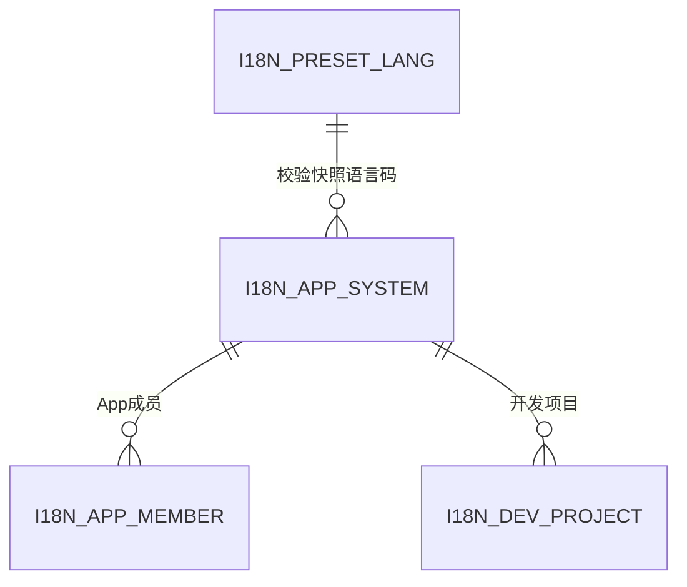
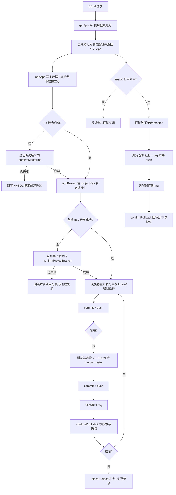
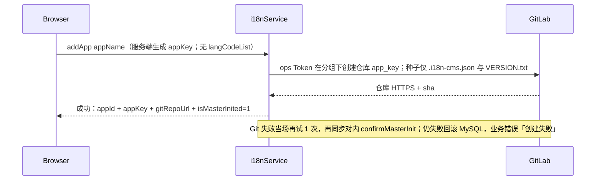
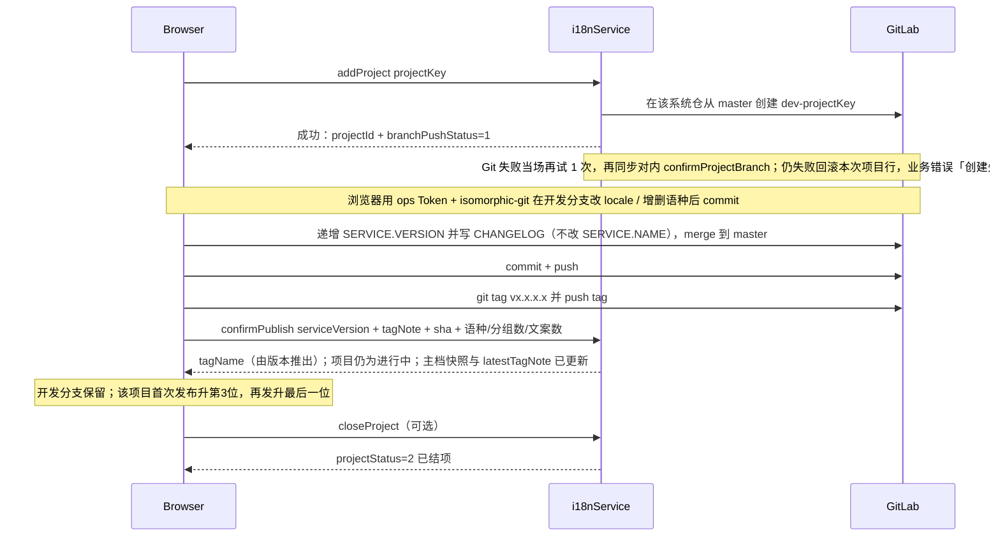
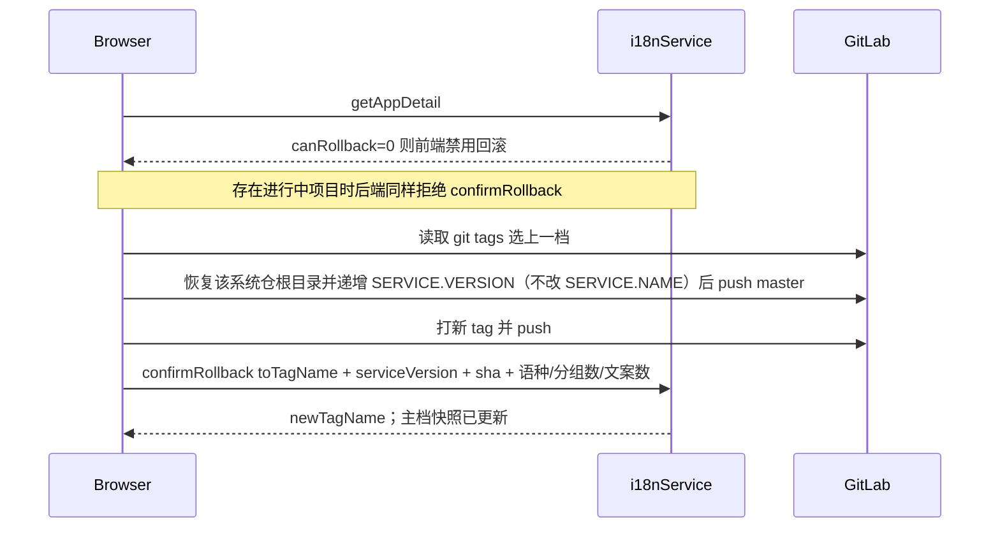

# i18n CMS 后端概要设计

> 接口设计须遵循公司接口设计规范，详见 [api-design-rules.md](api-design-rules.md)。
> 表结构设计须遵循公司数据库设计规范：MySQL 详见 [mysql-design-rules.md](mysql-design-rules.md)。
> Kafka 消息队列设计须遵循 [kafka-design-rules.md](kafka-design-rules.md)。
> 缓存设计须遵循公司 Redis 设计规范，详见 [redis-design-rules.md](redis-design-rules.md)。

**本版（2026-08-28）确认结论：**

1. 应用系统的名称、描述、成员为 **App 级主数据**，只存 MySQL。语种范围、分组数、文案数以 **最近一次发布/回滚快照** 写在系统主档，供卡片展示；权威内容在该系统自己的 Git 仓。
2. **弃用草稿的概念。** MySQL **不管理分组、截图、文案**；locale JSON、`.i18n-cms.json`、`VERSION.txt` 全部在业务 Git。
3. **一系统一 GitLab 仓库。** ops 占位符 `i18n_git_repo_url` 为 **GitLab 分组**地址；新建系统时本服务在该分组下创建以 `app_key` 为名的仓库。发布分支名、Token 仍为 `i18n_git_main_branch` / `i18n_git_token`。Token **不进 MySQL、不进业务接口、不进日志**。
4. 系统就绪后第 2 步是 **新建开发项目**：用户填写 `projectKey`，本服务从该系统仓库的 `master` 创建 `dev-{projectKey}`。支持多个**进行中**项目并行。
5. 分组/文案/导入/导出/查重/Diff、**增删语种文件** 的交互与 Git 落盘均在浏览器（当前开发分支）。本服务不提供分组树、文案 CRUD、导入导出、查重、Diff、语种增删接口。
6. **发布**：仅**进行中**项目可发。浏览器改 VERSION 的 `SERVICE.VERSION` 与 `CHANGELOG`（不改 `SERVICE.NAME`）、merge、commit + push、打 git tag，再调 `confirmPublish` 回写版本、**发布描述（tagNote=CHANGELOG）** 和语种/分组数/文案数快照。发布后项目仍为进行中。不提供 `getTagList`；完整 tag 历史由浏览器读 GitLab。
7. **回滚**：系统卡片上回滚；**存在任一进行中项目时不可操作**（前端用 `getAppDetail.canRollback` 禁用，后端拒绝）。`getAppList` 不返回 `canRollback`。无进行中项目时，浏览器在该系统仓库 master 上恢复上一 tag 并打新 tag，再 `confirmRollback`，同时回写快照。
8. **系统删除、项目删除均为软删除**，**不删除** GitLab 仓库、**不删除** 开发分支。`addApp` / `addProject` 在 Git 仍失败时**物理回滚本次插入行**（释放 Key），与用户主动软删不同；孤儿仓/分支可残留。
9. 开发项目状态为 **进行中 / 已结项**（另有软删标记）。提供 **结项** 操作。已结项不可再发布。
10. **Git 两端均可执行**：默认浏览器读写/merge/tag/回滚/增删语种文件；默认服务端在分组下建仓、建开发分支。不删仓、不删分支。建仓/拉分支失败由本服务当场再试并走对内 confirm；**仍失败则回滚本次 MySQL 并提示创建失败**。前端不调重试口。不提供 `saveAppGit` / `getAppGit` / `getTagList` / `getOperator`。仓地址由 `getAppDetail` 返回。
11. **权限**：可见范围为 **当前管理员 + 普通成员 + 超管**。软删系统、转让管理员仅 **当前管理员或超管**。`addApp` 时管理员即为创建者（登录账号写入成员表 `member_role=1`）；转让只改 `member_role`，**不改** `creator_account_id`。`canDelete` / `canTransfer` 为当前管理员或超管。不返回 `isCreator`、不返回 `isSuperAdmin`。不提供 `getOperator`。超管判定对齐说明书平台，本方案不展开。
12. **系统 Key**：服务端按「空格拆词 → 小写 → 中横线连接」从系统名生成，用作 GitLab 仓库名。`addApp` **请求不传** `appKey`，**响应返回**生成结果。格式 `^[a-z][a-z0-9-]{0,63}$`（≤64），一经生成不可改，全平台唯一（含已软删）。`addApp` **不传**初始语种；语种只在开发分支由前端增删。

**术语：** PRD「项目」= 本设计 **系统（App）**。本设计 **开发项目** = 一条 `dev-{projectKey}` 分支工作区。`app_key` = **系统 Key** = 该系统独立 GitLab 仓库名。`project_key` = 用户填写的开发项目 key。

---

## 1 引言

### 1.1 项目基本信息


| 项目   | 内容                                                             |
| ---- | -------------------------------------------------------------- |
| 项目名称 | i18n CMS（多语言文案管理系统）                                            |
| 需求链接 | 仓库文档 `doc/i18n CMS 需求文档V5.pdf`；交互原型 `http://10.25.34.20:8080/` |
| 创建日期 | 2026-08-20                                                     |
| 修订日期 | 2026-08-28                                                     |
| 负责人  | elin                                                           |


### 1.2 需求要点


| 序号  | 要点名称        | 涉及实体     | 简要描述                                                               |
| --- | ----------- | -------- | ------------------------------------------------------------------ |
| 1   | 统一认证鉴权      | 员工、会话    | 校验公司统一认证身份，识别内部员工                                                  |
| 2   | 平台超管全量权限    | 员工、系统    | 超管可查看并操作全部应用系统，含代删与代转让管理员                                          |
| 3   | 系统管理员即创建者   | 系统、成员    | **新建时**管理员即为创建者；转让后管理员可与创建者分离，创建者账号不改                              |
| 4   | 转让系统管理员     | 系统、成员    | 当前管理员或超管可将管理员角色转给本系统已有成员；只改 member_role                            |
| 5   | 成员绑定登录账号    | 系统成员     | 成员存账号 ID + 姓名快照；可见性按账号匹配成员表                                        |
| 6   | 按权限过滤系统可见性  | 系统、成员    | 超管全部未软删；非超管可见自己作为管理员或普通成员的系统                                       |
| 7   | 按名称搜索系统列表   | 系统       | 卡片列表，支持按系统名搜索                                                      |
| 8   | 聚合系统卡片统计    | 系统、项目    | 返回描述、语种快照、分组数、文案数、成员、进行中项目数、当前发布版本                                 |
| 9   | 新建系统        | 系统、Git   | 填名称、成员；服务端生成 appKey 并建独立仓写种子（无初始语种文件）                              |
| 10  | 编辑系统概览      | 系统、成员    | 改名称（不改 Key）、描述、成员                                                  |
| 11  | 软删除系统       | 系统       | 主档 is_deleted=1；不删 GitLab 仓库                                       |
| 12  | 项目内新增语种     | 开发项目、Git | 前端在当前开发分支新增 `{lang}.json`；须选自预设；本服务无接口                             |
| 13  | 项目内删除语种     | 开发项目、Git | 前端在当前开发分支删除语种文件；系统卡片语种以最近发布快照为准                                    |
| 14  | 查询预设语种 List | 语种       | 返回本库种子维护的预设语言码与名称                                                  |
| 15  | 语种必须选自预设    | 开发项目、语种  | 新增语种须在预设 List 内                                                    |
| 16  | 初始化系统仓库     | Git      | 本服务以服务端生成的 app_key 为名建仓；种子仅 .i18n-cms.json 与 VERSION.txt，无语种文件     |
| 17  | 新建开发项目      | 开发项目、Git | 用户填 projectKey，本服务从该系统仓 master 创建 `dev-{projectKey}`，状态=进行中        |
| 18  | 多人并行开发      | 开发项目     | 同一系统可同时存在多个进行中项目                                                   |
| 19  | 查询开发项目列表    | 开发项目     | 含 key、分支名、进行中/已结项、最新版本、git tag 名、发布描述、创建者、时间                       |
| 20  | 软删除开发项目     | 开发项目     | 进行中或已结项可软删；不删远端开发分支                                                |
| 21  | 发布合入 master | 开发项目     | 仅进行中可发；浏览器 merge/tag；本服务回写版本、CHANGELOG 发布描述与系统快照（语种/分组数/文案数）       |
| 22  | 完整 tag 历史   | Git      | 由浏览器读 GitLab tags；本服务不提供 getTagList                                |
| 23  | 回滚 master   | 系统、Git   | 无进行中项目时才可；getAppDetail 返回 canRollback；浏览器恢复该系统仓上一 tag；本服务回写当前版本与快照 |
| 24  | Git 失败重试    | Git      | 建仓/拉分支失败由本服务同步再试并对内 confirm；仍失败回滚本次 MySQL，提示创建失败                   |
| 25  | 结项          | 开发项目     | 进行中 → 已结项；已结项不可再发布                                                 |


**改由前端 Git 工作区实现（本服务不提供接口）：** 分组树 CRUD、截图、文案 CRUD/迁移/复制/查重、JSON/Excel 导入导出、Diff、日常 commit/push、发布 merge/tag、回滚恢复、**开发分支上增删语种 json**。内容权威在当前开发项目分支或该系统仓的 `master`/tag。单文件 ≤1MB。

本期不包含：截图 OCR、AI 翻译、CLI 拉取、S3 一键发布、操作日志、审核流程。本期 **包含** 服务端 Git 能力（与浏览器共用 ops 占位符 Token）。

---

## 2 整体设计

### 2.1 技术栈和框架


| 类别      | 技术选型                                                                                                                                                                         |
| ------- | ---------------------------------------------------------------------------------------------------------------------------------------------------------------------------- |
| 开发语言/框架 | Java / Spring Boot                                                                                                                                                           |
| 数据库     | MySQL，库名 `vesync_i18n`                                                                                                                                                       |
| 缓存      | 本期不使用 Redis                                                                                                                                                                  |
| 消息队列    | 本期不使用                                                                                                                                                                        |
| 其他中间件   | 不集成文件中间件。登录走 BEnd 网关 / 公司统一认证。GitLab：**一系统一仓**，服务端 GitLab HTTP API（必要时 JGit）+ 浏览器 isomorphic-git。ops 占位符：`i18n_git_repo_url`（分组） / `i18n_git_main_branch` / `i18n_git_token` |


### 2.2 方案设计

后台 CMS。对外 URL：`POST /ops/admin/i18nService/v1/{分类}/{method}`。对内补偿 URL：`POST /admin/i18nService/v1/{分类}/{method}`。协议 BEndReq。YAPI 模块 `cloud-i18nService`。

数据分两层：

- **MySQL（4 张表）**：预设语种、App 主数据（含独立仓地址、当前发布版本、语种/分组/文案快照、软删）、成员、开发项目（含最新 tag、进行中/已结项/软删）。
- **每系统独立业务 Git**：`master` 为发布分支；仓内根目录即 locale 文件；每开发项目一条 `dev-{projectKey}`；tag 打在 `master` 上。

```
新建系统 → 本服务在 GitLab 分组下建独立仓并写种子
    → 新建开发项目（进行中，本服务创建 dev-{projectKey}）  ‖  无进行中项目时可回滚该系统仓 master
    → 浏览器在开发分支改 locale / 增删语种 → commit + push
    → 发布：merge → tag → confirmPublish（回写版本 + 语种/分组数/文案数快照）；项目仍为进行中
    → 结项：进行中 → 已结项
```

#### 2.2.1 需求分组

已将 25 条后端要点分为 3 组：

【分组 1】平台级管理（system）：要点 1、2、14、15
分组理由：登录、超管、预设语种属平台目录。

【分组 2】应用系统（app）：要点 3–11、16
分组理由：App 主数据、独立仓创建与软删同属系统边界。语种增删不在本组接口。

【分组 3】开发项目与发布（project）：要点 12、13、17–21、23–25
分组理由：开发分支、项目级语种、发布快照、结项、回滚同属 Git 协作流。完整 tag 历史（要点 22）由前端读 GitLab。Git 失败补偿（要点 24）为对内接口。

#### 2.2.2 数据库表清单


| 分组      | 所属库         | 表名               | 说明                            | 核心实体 | 新增/已有 |
| ------- | ----------- | ---------------- | ----------------------------- | ---- | ----- |
| system  | vesync_i18n | i18n_preset_lang | 预设语言码（种子数据）                   | 语种   | 新增    |
| app     | vesync_i18n | i18n_app_system  | 应用系统主档 + 独立仓地址 + 发布快照 + 软删    | 系统   | 新增    |
| app     | vesync_i18n | i18n_app_member  | App 级成员姓名与角色                  | 系统成员 | 新增    |
| project | vesync_i18n | i18n_dev_project | 开发项目（dev 分支 + 最新 tag + 结项/软删） | 开发项目 | 新增    |


已删除：`i18n_app_git`（并入主档）、`i18n_app_tag`（并入开发项目）、`i18n_app_lang`（语种范围改为系统主档发布快照）、以及更早的草稿/文案/版本快照表。

#### 2.2.3 实体关系概览




#### 2.2.4 API 接口清单


| 分组      | 接口名称     | 接口类型 | 协议类型    | 路径                                                   | 变更类型 | 本次说明                                  |
| ------- | -------- | ---- | ------- | ---------------------------------------------------- | ---- | ------------------------------------- |
| system  | 查询预设语种   | 对外   | BEndReq | `/ops/admin/i18nService/v1/system/getPresetLangList` | 增加   | 启用语种；云端按 sort_no 排序，不返回 sortNo        |
| app     | 查询系统列表   | 对外   | BEndReq | `/ops/admin/i18nService/v1/app/getAppList`           | 增加   | 超管+成员可见；canDelete/canTransfer 仅管理员或超管 |
| app     | 查询系统详情   | 对外   | BEndReq | `/ops/admin/i18nService/v1/app/getAppDetail`         | 增加   | 含 canDelete/canTransfer/canRollback   |
| app     | 新建系统     | 对外   | BEndReq | `/ops/admin/i18nService/v1/app/addApp`               | 增加   | 服务端生成 appKey；请求不传；响应返回；无 langCodeList |
| app     | 更新系统信息   | 对外   | BEndReq | `/ops/admin/i18nService/v1/app/updateApp`            | 增加   | 改名称/描述/成员                             |
| app     | 软删除系统    | 对外   | BEndReq | `/ops/admin/i18nService/v1/app/deleteApp`            | 增加   | is_deleted=1；不删 Git 仓                 |
| app     | 转让管理员    | 对外   | BEndReq | `/ops/admin/i18nService/v1/app/transferAppAdmin`     | 增加   | 当前管理员或超管；不改 creator                   |
| app     | 重试建仓初始化  | 对内   | BEndReq | `/admin/i18nService/v1/app/confirmMasterInit`        | 增加   | 补偿建仓；仍失败回滚本次主档；前端不调用                  |
| project | 查询开发项目列表 | 对外   | BEndReq | `/ops/admin/i18nService/v1/project/getProjectList`   | 增加   | 进行中+已结项一次返回；含最新版本、tag 名、发布描述；无筛选入参    |
| project | 新建开发项目   | 对外   | BEndReq | `/ops/admin/i18nService/v1/project/addProject`       | 增加   | 用户填 projectKey；建分支；仍失败回滚并提示创建失败       |
| project | 重试创建开发分支 | 对内   | BEndReq | `/admin/i18nService/v1/project/confirmProjectBranch` | 增加   | 补偿拉分支；仍失败回滚本次项目行；前端不调用                |
| project | 软删除开发项目  | 对外   | BEndReq | `/ops/admin/i18nService/v1/project/deleteProject`    | 增加   | 软删；不删远端分支                             |
| project | 结项       | 对外   | BEndReq | `/ops/admin/i18nService/v1/project/closeProject`     | 增加   | 进行中→已结项                               |
| project | 确认发布     | 对外   | BEndReq | `/ops/admin/i18nService/v1/project/confirmPublish`   | 增加   | 回写版本、CHANGELOG 发布描述与快照                |
| project | 确认回滚     | 对外   | BEndReq | `/ops/admin/i18nService/v1/project/confirmRollback`  | 增加   | 无进行中才可；回写版本与快照                        |


共 **15** 个接口（对外 13、对内 2）。

#### 2.2.6 外部服务集成场景概览


| 分组      | 服务名称          | 集成方式                  | 调用场景                                                                       | 超时/重试策略                                              |
| ------- | ------------- | --------------------- | -------------------------------------------------------------------------- | ---------------------------------------------------- |
| system  | 公司统一认证 / 权限中心 | 网关 + HTTP             | 登录态校验；超管全量可见与代删代转；非超管按成员表账号过滤。对接方式对齐说明书平台，本方案不展开                           | 失败不授予超管；其余与说明书平台一致                                   |
| project | GitLab        | 浏览器 HTTPS + 本服务 HTTPS | 浏览器：读写该系统仓文件/commit/merge/tag/回滚/列 tag、开发分支增删语种文件；本服务：分组下建仓、建开发分支（不删仓不删分支） | 浏览器由前端控制；本服务单次超时 10s，失败当场再试并对内 confirm；仍失败回滚本次 MySQL |


#### 2.2.7 关键技术决策点


| 决策项         | 方案选项                            | 最终决策                                                                                                                                   | 理由       |
| ----------- | ------------------------------- | -------------------------------------------------------------------------------------------------------------------------------------- | -------- |
| 文案存储        | MySQL / 仅 Git                   | **仅该系统独立 Git 仓**                                                                                                                       | 澄清项      |
| 仓库布局        | 每系统一仓 / 一仓多目录                   | **一系统一 GitLab 仓**，仓内根目录即 locale 文件                                                                                                     | 已确认      |
| Git 表       | 独立 i18n_app_git / 并入主档          | **并入 i18n_app_system**                                                                                                                 | 1:1      |
| Tag 表       | 完整历史表 / 并入项目只记最新                | **并入 i18n_dev_project，只记最新；历史在 Git**                                                                                                   | 澄清项      |
| 开发分支        | `dev-{日期}` / `dev-{projectKey}` | `dev-{projectKey}`**，key 由用户填**                                                                                                        | 澄清项      |
| 项目生命周期      | 开发中/已发布 / 进行中/已结项               | **进行中 / 已结项** + 软删；发布不改变结项状态                                                                                                           | 已确认      |
| 版本号         | 整数 vN / VERSION.txt 四段          | **V1.0.0.0；项目首次发布升第 3 位，再发升最后一位；tag=**`v{x.x.x.x}`                                                                                     | 已确认      |
| 发布后开发分支     | 删除 / 保留                         | **发布后保留**                                                                                                                              | 澄清项      |
| 删系统/项目      | 硬删+删 Git / 软删不删 Git             | **软删；不删仓库、不删分支**                                                                                                                       | 已确认      |
| 语种增删        | 系统级接口 / 项目分支前端 Git              | **项目级，前端在开发分支增删 json；系统卡片读发布快照**                                                                                                       | 已确认      |
| 卡片统计        | 实时扫 Git / 发布回写快照                | **confirmPublish / confirmRollback 回写语种、分组数、文案数**                                                                                      | 已确认      |
| 回滚跳档校验      | 后端按 tag 历史校验 / 前端从 GitLab 选档    | **前端从 GitLab tags 选择；本服务不做跳档校验**                                                                                                       | 已确认      |
| 回滚前置        | 随时可滚 / 无进行中才可                   | **存在进行中项目则不可回滚**                                                                                                                       | 已确认      |
| Git 后端接口    | 去掉 / 保留                         | **去掉 saveAppGit / getAppGit / getTagList**；仓地址由 getAppDetail 返回；confirm 对内且同步走在 addApp/addProject 内；仍失败回滚 MySQL 提示创建失败；confirm 亦清理崩溃残留 | 已确认      |
| 一期可见性       | 仅创建者 / 管理员+成员+超管                | **超管全部；非超管为成员表中的管理员或普通成员**（须绑账号）                                                                                                       | 已确认      |
| 删/转权限       | 创建者 / 当前管理员                     | **当前管理员或超管**；创建者转让后若已不是管理员则不能再删/转                                                                                                      | 已确认      |
| 超管代删代转让     | 禁止 / 允许                         | **允许（软删）**                                                                                                                             | 已确认      |
| 超管判定        | 本方案详述权限中心接口 / 对齐既有模块            | **对齐说明书平台，本方案不展开接口与字段**                                                                                                                | 已确认      |
| getOperator | 对外提供 / 不提供                      | **不提供**；前端用每条 App 的 `canDelete` / `canTransfer`，不返回 `isCreator`、不返回 `isSuperAdmin`                                                     | 已确认      |
| 系统 Key      | 用户填写 / 由系统名生成                   | **服务端**按「空格拆词 → 小写 → 中横线」从系统名生成；`addApp` 请求不传、响应返回；一经生成不可改；全平台唯一                                                                       | 已确认      |
| Git 引擎      | 仅服务端 / 仅浏览器 / 两端均可              | **两端均可**：默认浏览器读写与 merge；默认服务端建仓/建分支                                                                                                    | 已确认      |
| Git Token   | ops 占位符 / IndexedDB 用户自填        | **ops 占位符**，前后端直接读取；切换账号只改占位符；接口与 MySQL 不存                                                                                             | 已确认      |
| Git 托管      | GitLab / GitHub                 | **GitLab**                                                                                                                             | 已确认      |
| 单文件大小       | 不限 / 限额                         | **1MB**                                                                                                                                | 已确认      |
| 日常文案落盘      | 浏览器直连 Git / 本服务工作区接口            | **浏览器 isomorphic-git**（无 getDevWorkspace）                                                                                              | 已确认      |
| 回滚是否 force  | reset+force / 新 commit          | **新 commit 恢复上一 tag 树，普通 push，再打新 tag**                                                                                                | 避免 force |
| 分组文案接口      | 后端 CRUD / 前端 Git                | **前端 Git**                                                                                                                             | 无文案落库    |
| 业务 ID       | 自增主键 / CloudId                  | App/项目用 **CloudId.nextId()**；成员**不设** `member_id`，对外用 `accountId`（表字段 `member_account_id`）；预设语种**不设** `preset_lang_id`，用 `lang_code`   | 规范禁止主键外露 |
| Redis       | 用 / 不用                          | 不用                                                                                                                                     | 已确认      |


### 2.3 业务流程图




### 2.4 注意事项

1. **术语**：PRD「项目」= 系统（App）。开发项目 = `dev-{projectKey}`。`app_key` 为系统 Key / 该系统独立 GitLab 仓库名。
2. **独立仓库**：一系统一仓。ops `i18n_git_repo_url` 为 **GitLab 分组** HTTPS 地址；`addApp` 在该分组下创建 path=`app_key` 的仓库，并把仓库 HTTPS 写入主档 `git_repo_url`。文档中的 master 均指占位符 `i18n_git_main_branch`。软删系统**不删**该仓库。
3. **ops 占位符**（前后端同一套，代码直接读取；切换平台服务账号只改占位符，不必改代码）：


| 占位符 key                | 用途                             | 写入主档                                  |
| ---------------------- | ------------------------------ | ------------------------------------- |
| `i18n_git_repo_url`    | GitLab **分组** HTTPS 地址         | 仅用于建仓；主档 `git_repo_url` 为**该系统独立仓**地址 |
| `i18n_git_main_branch` | 新仓默认发布分支名（如 `master` / `main`） | `git_master_branch`                   |
| `i18n_git_token`       | 平台服务账号 Token                   | **不入库**                               |


Token 禁止进入业务接口与 MySQL、禁止打印日志。
4. **系统名 / 系统 Key / project_key**：

- **系统名** `appName`：仅大小写字母、数字与空格，须以字母开头，≤128。禁止下划线、中横线、中文。连续空格视为一个分隔。前端无系统 Key 输入框。
- **系统 Key** `appKey`：服务端由系统名生成，用作 GitLab 仓库名。一经生成不可改，全平台唯一（含已软删）。`addApp` 请求不接收该字段，成功响应返回。`updateApp` 不接收、不修改、改名不重生。
- **生成规则**（服务端执行）：trim → 按空格拆词（丢弃空段）→ 各词转小写 → 中横线连接。结果须 `^[a-z][a-z0-9-]{0,63}$` 且 ≤64；冲突或超长则拒绝（请改系统名）。示例：`VeSync App` → `vesync-app`。
- `**project_key**`：用户填写；字母开头，后续字母、数字、下划线、中横线，≤64；同一 App 内唯一（含已软删项目）；分配后不可改。

1. **master**：未 `is_master_inited=1` 前禁止新建开发项目。`addApp` 成功路径内由本服务建仓并写种子；Git 失败当场再试 1 次，再走对内 `confirmMasterInit`。**仍失败则回滚本次插入的主档与成员，接口失败（创建失败）**。不删 GitLab 仓库。前端不调重试口。
2. **项目状态**：`project_status`：1=进行中，2=已结项，3=已软删。多个进行中可共存。仅进行中可发布、可结项。结项后不可再发布。`addProject` Git 仍失败则物理删除本次项目行，不留下进行中半成品。
3. **发布**：仅 `project_status=1` 且 `branch_push_status=1`。弹窗必填发布描述。浏览器改 `SERVICE.VERSION` 与 `CHANGELOG`（不改 `SERVICE.NAME`）→ merge → commit + push → 打 git tag，再调 `confirmPublish`。`tagNote` 与本次写入 `CHANGELOG` 的描述为同一内容。发布**不改变**进行中状态。入参带本次合入后的 `langCodeList`、`groupCount`、`textCount`，写入系统主档快照。远端开发分支保留。
4. **VERSION.txt**（仓库根目录）：

种子（`addApp` 写入）：

```
VERSION
SERVICE.NAME={app_key}

SERVICE.VERSION=V1.0.0.0
CHANGELOG
初始化
```

发布后只改 `SERVICE.VERSION` 与 `CHANGELOG`，`SERVICE.NAME` 保持 `{app_key}`。三者不要混用：

- `**SERVICE.VERSION`（serviceVersion / latestVersion）**：四段版本号，如 `V1.0.1.0`。
- **Git tag 名（tagName / latestTagName）**：打在 master 上的 git tag，由版本推出：去掉前缀 `V` 后加小写 `v`，如 `V1.0.1.0` → `v1.0.1.0`。不是人工填写的业务名。回滚选档读 GitLab 上的这些 tag。
- **发布描述（tagNote / latestTagNote）**：`CHANGELOG` 本次写入的说明，与发布弹窗填写的文字同一内容，≤256。`confirmPublish` 必填并写入项目表；`getProjectList` 返回。不提供 `getTagList`。

1. **回滚**：该系统**不存在** `project_status=1` 的项目时才可。前端以 `getAppDetail.canRollback` 禁用回滚按钮；`getAppList` 不返回该字段。后端 `confirmRollback` 同样拒绝。浏览器在该系统仓 master 恢复上一 tag 树，VERSION 最后一位 +1，打新 tag，再 `confirmRollback`，并回写快照。不做跳档校验。不 force-push。
2. **Git 文件**（仓库根目录）：`{langCode}.json`，分组 Key 作为嵌套 key；同目录 `.i18n-cms.json` 为分组树数组（`groupName` / `groupKey` / `screenshot` / `subGroups`）。顺序即显示顺序。业务应用只消费 `{langCode}.json`。单文件 ≤1MB。
3. **语种**：系统级只展示最近一次发布/回滚快照中的语种范围。`addApp` 不传语种、不写 `{langCode}.json`。增删语种只在**当前开发分支**由浏览器增删 `{langCode}.json`（须选自预设，至少保留 1 个）。校验、快照、Git 文件名一律用 `lang_code`，不设 `preset_lang_id`。本服务不提供 addAppLang / deleteAppLang。
4. **种子文件**：`addApp` / `confirmMasterInit` 只写 `.i18n-cms.json`（初始 `[{"groupName":"","groupKey":"","screenshot":"","subGroups":[]}]`）与 `VERSION.txt`（见第 8 条）。**不写**语种 json。空 `groupKey` 不当业务 Key。前端在开发分支新增语种时写入 `{langCode}.json` 为 `{}`。
5. **软删系统**：用户主动 `deleteApp` 置 `is_deleted=1`。列表/详情不再返回。不删 GitLab 仓库，不删开发分支，不级联物理删成员/项目行（项目一并视为不可见）。**创建失败**（Git 仍不可达）则物理删除本次未完成主档与成员并释放 `app_key`，不是软删。
6. **软删开发项目**：用户主动将 `project_status` 1 或 2 置 3。不删远端 `dev-{projectKey}`。**创建失败**则物理删除本次未完成项目行并释放 `project_key`，不是软删。
7. **Key 规则**（前端执行）：分组/文案 Key 字符集 `[A-Za-z0-9_]`，禁止 `.`。
8. **Git 分工**：读写文件 / commit / merge / tag / 回滚 / 列 tag / 开发分支增删语种文件 → 浏览器；分组下建仓、从 master 建 `dev-`* → 本服务。不删仓、不删分支。建仓/拉分支：单次超时 10s，失败当场再试 1 次，再走对内 confirm；**仍失败则回滚本次 MySQL，对外接口提示创建失败**。commit 作者暂定 `ops deploy` / `@deploy`。
9. **GitLab CORS**：后续由运维配置允许 CMS 前端域名。未放开前浏览器 Git 会失败，建仓/建分支仍可由本服务执行。
10. **权限**：
  - **assertVisible**：超管，或 `i18n_app_member.member_account_id` 等于当前登录账号（管理员或普通成员均可）。已软删一律不可见。
    - **assertAdmin**：超管，或该登录账号在成员表且 `member_role=1`。仅软删系统、转让管理员使用。
    - `canDelete` / `canTransfer` 与 assertAdmin 同值。不返回 `isCreator`。
    - **新建**：插入管理员行，账号/姓名取自登录态，`member_role=1`，并写入 `creator_account_id` / `creator_name`。此时管理员即创建者。
    - **转让**：入参 `accountId` 指定新管理员（须为本系统普通成员）。只对调 `member_role` 1/2，不改 `creator_account_id`。原创建者若变成普通成员，仍可见，但不能再删/转。
    - 禁止用 data 冒充账号。不提供 `getOperator`，不返回 `isCreator`、不返回 `isSuperAdmin`。超管判定对齐说明书平台。
11. 无 OCR（截图解析）、无 Redis、无 Kafka、禁止外键、主键 `id` 不进接口。成员不设 `member_id`，对外一律 `accountId`。预设语种用 `lang_code` 对外关联，无 CloudId。不提供 `saveAppGit` / `getAppGit` / `getTagList`。仓地址由 `getAppDetail` 返回。项目最新版本、git tag 名、CHANGELOG 发布描述由 `getProjectList` 返回。`confirmMasterInit` / `confirmProjectBranch` 为对内补偿接口，CMS 前端不调用。

---

## 3 数据库设计

### 3.1 数据库选型

仅 MySQL（`vesync_i18n`）。只存平台/App（含独立仓地址、发布快照、软删）/开发项目（含最新 tag、进行中/已结项/软删）元数据。分组、文案、截图 URL、完整 tag 历史、项目进行中的语种文件均不落库。无 Redis、无 MongoDB。服务端按需调用 GitLab API 建仓/建分支，不在本机常驻 git 工作副本。Token 不入库。

### 3.2 数据库结构

#### 3.2.1 实体关系


| 实体名  | 对应表名             | 所属库         | 说明                         |
| ---- | ---------------- | ----------- | -------------------------- |
| 预设语种 | i18n_preset_lang | vesync_i18n | 平台预设语言码，种子数据               |
| 应用系统 | i18n_app_system  | vesync_i18n | 名称、app_key、独立仓、发布快照、软删     |
| 应用成员 | i18n_app_member  | vesync_i18n | App 级成员                    |
| 开发项目 | i18n_dev_project | vesync_i18n | 一条 dev 分支 + 最新 tag + 结项/软删 |


#### 3.2.2 表结构设计

##### i18n_preset_lang

平台预设语言码，随库初始化脚本以种子数据写入，无对外写接口。不设 CloudId 业务 ID；`lang_code` 为对外业务关联键（快照 `snapshot_lang_codes`、Git `{langCode}.json`、`confirmPublish` / `confirmRollback` 的 `langCodeList` 均用该码）。`addApp` 不带语种。


| 字段名         | 类型                  | 必填  | 默认值                                           | 说明                         |
| ----------- | ------------------- | --- | --------------------------------------------- | -------------------------- |
| id          | BIGINT(20) UNSIGNED | Y   | AUTO_INCREMENT                                | 主键（禁止用于业务）                 |
| lang_code   | VARCHAR(32)         | Y   | ''                                            | DL-20260828-L4:语言码兼对外业务关联键 |
| lang_name   | VARCHAR(64)         | Y   | ''                                            | DL-20260824-L4:语种展示名称      |
| sort_no     | INT(11)             | Y   | 0                                             | DL-20260824-L4:排序号，越小越靠前   |
| is_enabled  | TINYINT(3) UNSIGNED | Y   | 1                                             | DL-20260824-L4:是否启用，1是，0否  |
| create_time | DATETIME            | Y   | CURRENT_TIMESTAMP                             | DL-20260824-L4:创建时间        |
| update_time | DATETIME            | Y   | CURRENT_TIMESTAMP ON UPDATE CURRENT_TIMESTAMP | DL-20260824-L4:更新时间        |


**索引说明：** `uniq_lang_code`。

**DDL：**

```sql
CREATE TABLE `vesync_i18n`.`i18n_preset_lang` (
  `id` bigint(20) unsigned NOT NULL AUTO_INCREMENT COMMENT 'DL-20260824-L4:主键禁止用于业务',
  `lang_code` varchar(32) NOT NULL DEFAULT '' COMMENT 'DL-20260828-L4:语言码兼对外业务关联键',
  `lang_name` varchar(64) NOT NULL DEFAULT '' COMMENT 'DL-20260824-L4:语种展示名称',
  `sort_no` int(11) NOT NULL DEFAULT 0 COMMENT 'DL-20260824-L4:排序号越小越靠前',
  `is_enabled` tinyint(3) unsigned NOT NULL DEFAULT 1 COMMENT 'DL-20260824-L4:是否启用1是0否',
  `create_time` datetime NOT NULL DEFAULT CURRENT_TIMESTAMP COMMENT 'DL-20260824-L4:创建时间',
  `update_time` datetime NOT NULL DEFAULT CURRENT_TIMESTAMP ON UPDATE CURRENT_TIMESTAMP COMMENT 'DL-20260824-L4:更新时间',
  PRIMARY KEY (`id`),
  UNIQUE KEY `uniq_lang_code` (`lang_code`)
) ENGINE=InnoDB DEFAULT CHARSET=utf8mb4 COMMENT='DL-20260824-L4:i18n预设语言码';
```

##### i18n_app_system

应用系统主档。一系统一 GitLab 仓；`git_repo_url` 为该系统独立仓 HTTPS（建仓成功后写入），不是分组地址。`snapshot_*` 为最近一次发布或回滚后的卡片快照。`is_deleted=1` 为软删。


| 字段名                  | 类型                  | 必填  | 默认值                                           | 说明                                         |
| -------------------- | ------------------- | --- | --------------------------------------------- | ------------------------------------------ |
| id                   | BIGINT(20) UNSIGNED | Y   | AUTO_INCREMENT                                | 主键（禁止用于业务）                                 |
| app_id               | BIGINT(20)          | Y   | -                                             | DL-20260828-L2:应用系统业务ID                    |
| app_name             | VARCHAR(128)        | Y   | ''                                            | DL-20260828-L4:系统名称字母数字与空格                 |
| app_key              | VARCHAR(64)         | Y   | ''                                            | DL-20260828-L4:系统Key兼GitLab仓库名全局唯一一经写入不可改  |
| app_desc             | VARCHAR(512)        | Y   | ''                                            | DL-20260828-L4:系统描述                        |
| creator_account_id   | VARCHAR(20)         | Y   | ''                                            | DL-20260828-L2:创建者账号ID，转让管理员不变更            |
| creator_name         | VARCHAR(64)         | Y   | ''                                            | DL-20260828-L2:创建者姓名快照                     |
| git_repo_url         | VARCHAR(512)        | Y   | ''                                            | DL-20260828-L4:该系统独立仓库HTTPS地址              |
| git_master_branch    | VARCHAR(128)        | Y   | master                                        | DL-20260828-L4:发布分支名来自i18n_git_main_branch |
| is_master_inited     | TINYINT(3) UNSIGNED | Y   | 0                                             | DL-20260828-L4:独立仓是否已创建并写入种子1是0否           |
| master_commit_sha    | VARCHAR(64)         | Y   | ''                                            | DL-20260828-L4:最近确认的master sha             |
| current_version      | VARCHAR(32)         | Y   | ''                                            | DL-20260828-L4:当前SERVICE.VERSION未发布空串      |
| current_tag_name     | VARCHAR(64)         | Y   | ''                                            | DL-20260828-L4:当前git tag                   |
| snapshot_lang_codes  | VARCHAR(512)        | Y   | ''                                            | DL-20260828-L4:发布快照语种码JSON数组如["en","zh"]   |
| snapshot_group_count | INT(11)             | Y   | 0                                             | DL-20260828-L4:发布快照分组数                     |
| snapshot_text_count  | INT(11)             | Y   | 0                                             | DL-20260828-L4:发布快照文案数                     |
| is_deleted           | TINYINT(3) UNSIGNED | Y   | 0                                             | DL-20260828-L4:软删1是0否                      |
| create_time          | DATETIME            | Y   | CURRENT_TIMESTAMP                             | DL-20260828-L4:创建时间                        |
| update_time          | DATETIME            | Y   | CURRENT_TIMESTAMP ON UPDATE CURRENT_TIMESTAMP | DL-20260828-L4:更新时间                        |


**索引说明：** `uniq_app_id`；`uniq_app_key`（`app_key` 前缀 32）；`idx_creator_account_id`；`idx_is_deleted`。

**DDL：**

```sql
CREATE TABLE `vesync_i18n`.`i18n_app_system` (
  `id` bigint(20) unsigned NOT NULL AUTO_INCREMENT COMMENT 'DL-20260828-L4:主键禁止用于业务',
  `app_id` bigint(20) NOT NULL COMMENT 'DL-20260828-L2:应用系统业务ID',
  `app_name` varchar(128) NOT NULL DEFAULT '' COMMENT 'DL-20260828-L4:系统名称字母数字与空格',
  `app_key` varchar(64) NOT NULL DEFAULT '' COMMENT 'DL-20260828-L4:系统Key兼GitLab仓库名全局唯一',
  `app_desc` varchar(512) NOT NULL DEFAULT '' COMMENT 'DL-20260828-L4:系统描述',
  `creator_account_id` varchar(20) NOT NULL DEFAULT '' COMMENT 'DL-20260828-L2:创建者账号ID',
  `creator_name` varchar(64) NOT NULL DEFAULT '' COMMENT 'DL-20260828-L2:创建者姓名快照',
  `git_repo_url` varchar(512) NOT NULL DEFAULT '' COMMENT 'DL-20260828-L4:该系统独立仓库HTTPS地址',
  `git_master_branch` varchar(128) NOT NULL DEFAULT 'master' COMMENT 'DL-20260828-L4:发布分支名来自i18n_git_main_branch',
  `is_master_inited` tinyint(3) unsigned NOT NULL DEFAULT 0 COMMENT 'DL-20260828-L4:独立仓是否已创建并写入种子1是0否',
  `master_commit_sha` varchar(64) NOT NULL DEFAULT '' COMMENT 'DL-20260828-L4:最近确认的master sha',
  `current_version` varchar(32) NOT NULL DEFAULT '' COMMENT 'DL-20260828-L4:当前SERVICE.VERSION',
  `current_tag_name` varchar(64) NOT NULL DEFAULT '' COMMENT 'DL-20260828-L4:当前git tag名',
  `snapshot_lang_codes` varchar(512) NOT NULL DEFAULT '' COMMENT 'DL-20260828-L4:发布快照语种码JSON数组',
  `snapshot_group_count` int(11) NOT NULL DEFAULT 0 COMMENT 'DL-20260828-L4:发布快照分组数',
  `snapshot_text_count` int(11) NOT NULL DEFAULT 0 COMMENT 'DL-20260828-L4:发布快照文案数',
  `is_deleted` tinyint(3) unsigned NOT NULL DEFAULT 0 COMMENT 'DL-20260828-L4:软删1是0否',
  `create_time` datetime NOT NULL DEFAULT CURRENT_TIMESTAMP COMMENT 'DL-20260828-L4:创建时间',
  `update_time` datetime NOT NULL DEFAULT CURRENT_TIMESTAMP ON UPDATE CURRENT_TIMESTAMP COMMENT 'DL-20260828-L4:更新时间',
  PRIMARY KEY (`id`),
  UNIQUE KEY `uniq_app_id` (`app_id`),
  UNIQUE KEY `uniq_app_key` (`app_key`(32)),
  KEY `idx_creator_account_id` (`creator_account_id`),
  KEY `idx_is_deleted` (`is_deleted`)
) ENGINE=InnoDB DEFAULT CHARSET=utf8mb4 COMMENT='DL-20260828-L4:i18n应用系统主档';
```

##### i18n_app_member

App 级成员。须绑定登录账号，可见性按 `member_account_id` 匹配。不设 `member_id`；同 App 内以 `member_account_id` 为自然键，接口对外为 `accountId`。`member_role`：1=管理员（每 App 仅一行；**新建时即为创建者**），2=普通成员。转让只改角色，不改主档 `creator_account_id`。


| 字段名               | 类型                  | 必填  | 默认值                                           | 说明                             |
| ----------------- | ------------------- | --- | --------------------------------------------- | ------------------------------ |
| id                | BIGINT(20) UNSIGNED | Y   | AUTO_INCREMENT                                | 主键（禁止用于业务）                     |
| app_id            | BIGINT(20)          | Y   | -                                             | DL-20260824-L2:应用系统业务ID        |
| member_account_id | VARCHAR(20)         | Y   | ''                                            | DL-20260828-L2:成员登录账号ID，兼对外关联键 |
| member_name       | VARCHAR(32)         | Y   | ''                                            | DL-20260824-L2:成员姓名快照          |
| member_role       | TINYINT(3) UNSIGNED | Y   | 2                                             | DL-20260828-L4:角色，1管理员，2普通成员   |
| create_time       | DATETIME            | Y   | CURRENT_TIMESTAMP                             | DL-20260824-L4:创建时间            |
| update_time       | DATETIME            | Y   | CURRENT_TIMESTAMP ON UPDATE CURRENT_TIMESTAMP | DL-20260824-L4:更新时间            |


**索引说明：** `uniq_app_id_member_account_id`；`idx_member_account_id`。

**DDL：**

```sql
CREATE TABLE `vesync_i18n`.`i18n_app_member` (
  `id` bigint(20) unsigned NOT NULL AUTO_INCREMENT COMMENT 'DL-20260824-L4:主键禁止用于业务',
  `app_id` bigint(20) NOT NULL COMMENT 'DL-20260824-L2:应用系统业务ID',
  `member_account_id` varchar(20) NOT NULL DEFAULT '' COMMENT 'DL-20260828-L2:成员登录账号ID兼对外关联键',
  `member_name` varchar(32) NOT NULL DEFAULT '' COMMENT 'DL-20260824-L2:成员姓名快照',
  `member_role` tinyint(3) unsigned NOT NULL DEFAULT 2 COMMENT 'DL-20260828-L4:角色1管理员2普通成员',
  `create_time` datetime NOT NULL DEFAULT CURRENT_TIMESTAMP COMMENT 'DL-20260824-L4:创建时间',
  `update_time` datetime NOT NULL DEFAULT CURRENT_TIMESTAMP ON UPDATE CURRENT_TIMESTAMP COMMENT 'DL-20260824-L4:更新时间',
  PRIMARY KEY (`id`),
  UNIQUE KEY `uniq_app_id_member_account_id` (`app_id`, `member_account_id`),
  KEY `idx_member_account_id` (`member_account_id`)
) ENGINE=InnoDB DEFAULT CHARSET=utf8mb4 COMMENT='DL-20260828-L4:i18n应用成员';
```

##### i18n_dev_project

一个开发项目对应一条远端分支 `dev-{project_key}`。`project_status`：1=进行中，2=已结项，3=已软删。仅进行中可发布、可结项。发布不改变状态。软删不删远端分支。本表只覆盖写入**该项目最新一次发布**的 `SERVICE.VERSION`、git tag 名、CHANGELOG 发布描述。完整 tag 历史在 GitLab，本服务不提供列表接口。


| 字段名                 | 类型                  | 必填  | 默认值                                           | 说明                                         |
| ------------------- | ------------------- | --- | --------------------------------------------- | ------------------------------------------ |
| id                  | BIGINT(20) UNSIGNED | Y   | AUTO_INCREMENT                                | 主键（禁止用于业务）                                 |
| project_id          | BIGINT(20)          | Y   | -                                             | DL-20260827-L2:开发项目业务ID                    |
| app_id              | BIGINT(20)          | Y   | -                                             | DL-20260827-L2:应用系统业务ID                    |
| project_key         | VARCHAR(64)         | Y   | ''                                            | DL-20260827-L4:用户填写的项目key                  |
| project_name        | VARCHAR(128)        | Y   | ''                                            | DL-20260827-L4:展示名，默认等于project_key         |
| git_branch          | VARCHAR(128)        | Y   | ''                                            | DL-20260827-L4:开发分支名dev-加key               |
| project_note        | VARCHAR(256)        | Y   | ''                                            | DL-20260827-L4:项目说明                        |
| project_status      | TINYINT(3) UNSIGNED | Y   | 1                                             | DL-20260828-L4:状态1进行中2已结项3已软删              |
| branch_push_status  | TINYINT(3) UNSIGNED | Y   | 0                                             | DL-20260827-L4:分支推送状态0待1成功2失败              |
| branch_commit_sha   | VARCHAR(64)         | Y   | ''                                            | DL-20260827-L4:开发分支最近确认sha                 |
| source_commit_sha   | VARCHAR(64)         | Y   | ''                                            | DL-20260827-L4:拉分支时的master sha             |
| latest_version      | VARCHAR(32)         | Y   | ''                                            | DL-20260827-L4:该项目最新SERVICE.VERSION        |
| latest_tag_name     | VARCHAR(64)         | Y   | ''                                            | DL-20260828-L4:该项目最新git tag名由版本推出如v1.0.1.0 |
| latest_tag_note     | VARCHAR(256)        | Y   | ''                                            | DL-20260828-L4:该项目最新CHANGELOG发布描述          |
| latest_tag_sha      | VARCHAR(64)         | Y   | ''                                            | DL-20260827-L4:该项目最新tag的commit sha         |
| operator_account_id | VARCHAR(20)         | Y   | ''                                            | DL-20260827-L2:创建者账号ID                     |
| operator_name       | VARCHAR(64)         | Y   | ''                                            | DL-20260827-L2:创建者姓名                       |
| create_time         | DATETIME            | Y   | CURRENT_TIMESTAMP                             | DL-20260827-L4:创建时间                        |
| update_time         | DATETIME            | Y   | CURRENT_TIMESTAMP ON UPDATE CURRENT_TIMESTAMP | DL-20260827-L4:更新时间                        |


**索引说明：** `uniq_project_id`；`uniq_app_id_project_key`（`project_key` 前缀 32）；`uniq_app_id_git_branch`（`git_branch` 前缀 64）；`idx_app_id_project_status`。

**DDL：**

```sql
CREATE TABLE `vesync_i18n`.`i18n_dev_project` (
  `id` bigint(20) unsigned NOT NULL AUTO_INCREMENT COMMENT 'DL-20260827-L4:主键禁止用于业务',
  `project_id` bigint(20) NOT NULL COMMENT 'DL-20260827-L2:开发项目业务ID',
  `app_id` bigint(20) NOT NULL COMMENT 'DL-20260827-L2:应用系统业务ID',
  `project_key` varchar(64) NOT NULL DEFAULT '' COMMENT 'DL-20260827-L4:用户填写的项目key',
  `project_name` varchar(128) NOT NULL DEFAULT '' COMMENT 'DL-20260827-L4:展示名',
  `git_branch` varchar(128) NOT NULL DEFAULT '' COMMENT 'DL-20260827-L4:开发分支名',
  `project_note` varchar(256) NOT NULL DEFAULT '' COMMENT 'DL-20260827-L4:项目说明',
  `project_status` tinyint(3) unsigned NOT NULL DEFAULT 1 COMMENT 'DL-20260828-L4:状态1进行中2已结项3已软删',
  `branch_push_status` tinyint(3) unsigned NOT NULL DEFAULT 0 COMMENT 'DL-20260827-L4:分支推送状态0待1成功2失败',
  `branch_commit_sha` varchar(64) NOT NULL DEFAULT '' COMMENT 'DL-20260827-L4:开发分支最近确认sha',
  `source_commit_sha` varchar(64) NOT NULL DEFAULT '' COMMENT 'DL-20260827-L4:拉分支时的master sha',
  `latest_version` varchar(32) NOT NULL DEFAULT '' COMMENT 'DL-20260827-L4:该项目最新版本',
  `latest_tag_name` varchar(64) NOT NULL DEFAULT '' COMMENT 'DL-20260828-L4:该项目最新git tag名由版本推出',
  `latest_tag_note` varchar(256) NOT NULL DEFAULT '' COMMENT 'DL-20260828-L4:该项目最新CHANGELOG发布描述',
  `latest_tag_sha` varchar(64) NOT NULL DEFAULT '' COMMENT 'DL-20260827-L4:该项目最新tag sha',
  `operator_account_id` varchar(20) NOT NULL DEFAULT '' COMMENT 'DL-20260827-L2:创建者账号ID',
  `operator_name` varchar(64) NOT NULL DEFAULT '' COMMENT 'DL-20260827-L2:创建者姓名',
  `create_time` datetime NOT NULL DEFAULT CURRENT_TIMESTAMP COMMENT 'DL-20260827-L4:创建时间',
  `update_time` datetime NOT NULL DEFAULT CURRENT_TIMESTAMP ON UPDATE CURRENT_TIMESTAMP COMMENT 'DL-20260827-L4:更新时间',
  PRIMARY KEY (`id`),
  UNIQUE KEY `uniq_project_id` (`project_id`),
  UNIQUE KEY `uniq_app_id_project_key` (`app_id`, `project_key`(32)),
  UNIQUE KEY `uniq_app_id_git_branch` (`app_id`, `git_branch`(64)),
  KEY `idx_app_id_project_status` (`app_id`, `project_status`)
) ENGINE=InnoDB DEFAULT CHARSET=utf8mb4 COMMENT='DL-20260827-L4:i18n开发项目';
```

---

## 4 接口设计

### 4.1 接口清单

> 接口设计须遵循公司接口设计规范，详见 [api-design-rules.md](api-design-rules.md)。


| 序号  | 描述         | 接口路径                                                      | 接口类型 | 协议类型    | 变更类型 | 模块名               | 接口管理系统链接                                                                     | 备注                          | 负责人  |
| --- | ---------- | --------------------------------------------------------- | ---- | ------- | ---- | ----------------- | ---------------------------------------------------------------------------- | --------------------------- | ---- |
| 1   | 查询预设语种     | `POST /ops/admin/i18nService/v1/system/getPresetLangList` | 对外   | BEndReq | 增加   | cloud-i18nService | [https://yapi.vesync.com/project/1379](https://yapi.vesync.com/project/1379) | 云端排序不返回 sortNo              | elin |
| 2   | 获取应用系统列表   | `POST /ops/admin/i18nService/v1/app/getAppList`           | 对外   | BEndReq | 增加   | cloud-i18nService | [https://yapi.vesync.com/project/1379](https://yapi.vesync.com/project/1379) | canDelete/canTransfer；卡片快照  | elin |
| 3   | 获取应用系统详情   | `POST /ops/admin/i18nService/v1/app/getAppDetail`         | 对外   | BEndReq | 增加   | cloud-i18nService | [https://yapi.vesync.com/project/1379](https://yapi.vesync.com/project/1379) | 含独立仓、sha、快照、can*            | elin |
| 4   | 新建应用系统     | `POST /ops/admin/i18nService/v1/app/addApp`               | 对外   | BEndReq | 增加   | cloud-i18nService | [https://yapi.vesync.com/project/1379](https://yapi.vesync.com/project/1379) | 服务端生成appKey；请求不传；响应返回；无初始语种 | elin |
| 5   | 更新系统名称描述成员 | `POST /ops/admin/i18nService/v1/app/updateApp`            | 对外   | BEndReq | 增加   | cloud-i18nService | [https://yapi.vesync.com/project/1379](https://yapi.vesync.com/project/1379) | 不改管理员                       | elin |
| 6   | 软删除应用系统    | `POST /ops/admin/i18nService/v1/app/deleteApp`            | 对外   | BEndReq | 增加   | cloud-i18nService | [https://yapi.vesync.com/project/1379](https://yapi.vesync.com/project/1379) | 不删Git仓                      | elin |
| 7   | 转让管理员      | `POST /ops/admin/i18nService/v1/app/transferAppAdmin`     | 对外   | BEndReq | 增加   | cloud-i18nService | [https://yapi.vesync.com/project/1379](https://yapi.vesync.com/project/1379) | 当前管理员或超管；不改creator          | elin |
| 8   | 重试建仓初始化    | `POST /admin/i18nService/v1/app/confirmMasterInit`        | 对内   | BEndReq | 增加   | cloud-i18nService | [https://yapi.vesync.com/project/1379](https://yapi.vesync.com/project/1379) | 仍失败回滚本次主档                   | elin |
| 9   | 查询开发项目列表   | `POST /ops/admin/i18nService/v1/project/getProjectList`   | 对外   | BEndReq | 增加   | cloud-i18nService | [https://yapi.vesync.com/project/1379](https://yapi.vesync.com/project/1379) | 无projectStatus入参；含进行中+已结项   | elin |
| 10  | 新建开发项目     | `POST /ops/admin/i18nService/v1/project/addProject`       | 对外   | BEndReq | 增加   | cloud-i18nService | [https://yapi.vesync.com/project/1379](https://yapi.vesync.com/project/1379) | Git仍失败回滚并提示创建失败             | elin |
| 11  | 重试创建开发分支   | `POST /admin/i18nService/v1/project/confirmProjectBranch` | 对内   | BEndReq | 增加   | cloud-i18nService | [https://yapi.vesync.com/project/1379](https://yapi.vesync.com/project/1379) | 仍失败回滚本次项目行                  | elin |
| 12  | 软删除开发项目    | `POST /ops/admin/i18nService/v1/project/deleteProject`    | 对外   | BEndReq | 增加   | cloud-i18nService | [https://yapi.vesync.com/project/1379](https://yapi.vesync.com/project/1379) | 不删远端分支                      | elin |
| 13  | 结项         | `POST /ops/admin/i18nService/v1/project/closeProject`     | 对外   | BEndReq | 增加   | cloud-i18nService | [https://yapi.vesync.com/project/1379](https://yapi.vesync.com/project/1379) | 进行中变已结项                     | elin |
| 14  | 确认发布       | `POST /ops/admin/i18nService/v1/project/confirmPublish`   | 对外   | BEndReq | 增加   | cloud-i18nService | [https://yapi.vesync.com/project/1379](https://yapi.vesync.com/project/1379) | 回写版本、CHANGELOG与快照           | elin |
| 15  | 确认回滚       | `POST /ops/admin/i18nService/v1/project/confirmRollback`  | 对外   | BEndReq | 增加   | cloud-i18nService | [https://yapi.vesync.com/project/1379](https://yapi.vesync.com/project/1379) | 无进行中才可                      | elin |


### 4.2 接口详细设计

> **公共约定**
>
> - 统一 POST；Content-Type 为 `application/json`，参数结构为 `context` + `data`。
> - 响应统一 `IotResponse.result`。
> - 布尔用 Integer `0/1`；时间为毫秒时间戳；数组字段以 `List` 结尾；空集合返回 `[]`；禁止返回表主键 `id`。
> - App 标识统一 `appId`；开发项目 `projectId`。所有 App 内接口均须传 `appId`。成员对外一律 `accountId`（对应 `i18n_app_member.member_account_id`），不提供 `memberId`。语种对外一律 `langCode`（对应 `i18n_preset_lang.lang_code`），不提供 `presetLangId`。
> - **assertVisible**：超管可见全部未软删 App；非超管须在该 App 的 `i18n_app_member` 中（管理员或普通成员，按 `member_account_id` 匹配登录账号）。已软删一律当无权限。超管由登录账号判定（对齐说明书平台），禁止 data 传入账号。
> - **assertAdmin**：超管，或该登录账号在成员表且 `member_role=1`。仅 `deleteApp` / `transferAppAdmin` 使用。
> - `canDelete` / `canTransfer`：与 assertAdmin 同值（当前管理员或超管为 1）。不返回 `isCreator`。不返回 `isSuperAdmin`。不提供 `getOperator`。写接口仍服务端鉴权。
> - `canRollback` 仅 `getAppDetail` 返回；`getAppList` 不返回。
> - `appName`：仅大小写字母、数字与空格，须以字母开头，≤128。`appKey` 由服务端按「空格拆词 → 小写 → 中横线连接」从 `appName` 生成；`addApp` 请求禁止传入，成功响应返回；创建后不可改；`updateApp` 禁止传入。`projectKey`：`^[A-Za-z][A-Za-z0-9_-]{0,63}$`。
> - `serviceVersion`：`^V\d+\.\d+\.\d+\.\d+$`。Git tag 名 `tagName` 由它推出为 `v{x.x.x.x}`（去掉 `V` 后加小写 `v`），不是人工填写的业务名。
> - `tagNote`：`VERSION.txt` 中 `CHANGELOG` 的本次发布描述，≤256，与发布弹窗填写内容一致。
> - 全部接口禁止 Token 字段。Git Token 只从 ops 占位符读取（前后端各自读取，不经本接口转发）。
> - 不提供系统级 `addAppLang` / `deleteAppLang`。增删语种由浏览器在当前开发分支完成。
> - 不提供 `getAppGit`。独立仓地址、发布分支、初始化状态、`masterCommitSha` 由 `getAppDetail` 返回。
> - 不提供 `getTagList`。完整 tag 历史由浏览器读 GitLab。项目最新版本、git tag 名、发布描述由 `getProjectList` 返回。
> - `confirmMasterInit` / `confirmProjectBranch` 为**对内**补偿接口（路径无 `ops` 前缀），CMS 前端不调用。`addApp` / `addProject` 在 Git 失败后当场再试 1 次，再同步走对内 confirm；**仍失败则回滚本次 MySQL，对外接口返回创建失败**。
> - 各接口「请求示例」仅为 `data` 部分。

#### 4.2.1 查询预设语种（getPresetLangList）

**请求参数（data 部分）：** 无业务参数。

**请求示例（data）：**

```json
{}
```

**响应参数（result 部分）：**


| 参数名            | Java类型     | 说明                      | deSensitiveType | 父节点            |
| -------------- | ---------- | ----------------------- | --------------- | -------------- |
| presetLangList | ListObject | 启用的预设语种集合，已按 sort_no 升序 | -               | -              |
| langCode       | String     | 语言码，对外业务关联键             | no              | presetLangList |
| langName       | String     | 语种展示名称                  | no              | presetLangList |


**处理流程（AI提示词参考）：** 查 `is_enabled=1`，按 `sort_no` 升序后返回。响应不返回 `sortNo`、不返回表主键 `id`。外部用 `langCode` 关联（发布/回滚快照、Git 文件名、开发分支增删语种）。前端按数组顺序展示即可。`addApp` 不使用本列表做初始语种。

**安全设计：** 必须登录；平台级只读。

#### 4.2.2 查询系统列表（getAppList）

登录后即可调用。云端根据 `context.accountID` 判定超管。超管返回全部未软删；非超管返回自己作为管理员或普通成员的系统。每条返回 `canDelete` / `canTransfer`（当前管理员或超管）。不返回 `isCreator`。不返回 `isSuperAdmin`。

**请求参数（data 部分）：**


| 参数名      | Java类型  | 必填  | 说明                                 | javaAnnotation | deSensitiveType | 父节点 |
| -------- | ------- | --- | ---------------------------------- | -------------- | --------------- | --- |
| appName  | String  | N   | 按系统名模糊搜索，≤128；不传或空串不过滤。示例：`VeSync` | -              | no              | -   |
| pageNo   | Integer | N   | 页码，区间 ≥1；不传默认 1。示例：`1`             | -              | no              | -   |
| pageSize | Integer | N   | 每页条数，区间 1–200；不传默认 20。示例：`20`      | -              | no              | -   |


**请求示例（data）：**

```json
{"appName": "VeSync", "pageNo": 1, "pageSize": 20}
```

**响应参数（result 部分）：**


| 参数名            | Java类型     | 说明                       | deSensitiveType | 父节点        |
| -------------- | ---------- | ------------------------ | --------------- | ---------- |
| totalCount     | Integer    | 符合条件的总条数                 | no              | -          |
| pageNo         | Integer    | 当前页码                     | no              | -          |
| pageSize       | Integer    | 当前每页条数                   | no              | -          |
| appList        | ListObject | 系统卡片集合                   | -               | -          |
| appId          | Long       | 应用系统业务ID                 | no              | appList    |
| appName        | String     | 系统名称                     | no              | appList    |
| appKey         | String     | 系统 Key / GitLab 仓库名      | no              | appList    |
| appDesc        | String     | 系统描述                     | no              | appList    |
| langCodeList   | ListString | 发布快照语种码                  | -               | appList    |
| groupCount     | Integer    | 发布快照分组数                  | no              | appList    |
| textCount      | Integer    | 发布快照文案数                  | no              | appList    |
| projectCount   | Integer    | 进行中项目数                   | no              | appList    |
| currentVersion | String     | 当前 SERVICE.VERSION，未发布空串 | no              | appList    |
| currentTagName | String     | 当前 git tag，未发布空串         | no              | appList    |
| isMasterInited | Integer    | 独立仓是否已创建并写入种子            | no              | appList    |
| memberList     | ListObject | App 成员集合                 | -               | appList    |
| accountId      | String     | 成员登录账号ID                 | no              | memberList |
| memberName     | String     | 成员姓名快照                   | no              | memberList |
| memberRole     | Integer    | 角色，1管理员，2普通成员            | no              | memberList |
| canDelete      | Integer    | 1 表示可软删（当前管理员或超管）        | no              | appList    |
| canTransfer    | Integer    | 1 表示可发起转让（当前管理员或超管）      | no              | appList    |
| createTime     | Long       | 创建时间毫秒                   | no              | appList    |


**处理流程（AI提示词参考）：** 按登录账号判定超管。超管查 `is_deleted=0` 全部；非超管 join `i18n_app_member` 且 `member_account_id=登录账号`。分页查主档。`langCodeList` / `groupCount` / `textCount` 读自主档快照。`projectCount` 计 `project_status=1`。每条：`canDelete` / `canTransfer` = assertAdmin（当前管理员或超管；判定失败按非超管）。不返回 `isCreator`。不返回 `isSuperAdmin`。不返回 `canRollback`。目标成员是否存在不进入 `canTransfer`，由 `transferAppAdmin` 校验。

**安全设计：** 禁止用 data 指定他人账号。

#### 4.2.3 查询系统详情（getAppDetail）

**请求参数（data 部分）：**


| 参数名   | Java类型 | 必填  | 说明                  | javaAnnotation | deSensitiveType | 父节点 |
| ----- | ------ | --- | ------------------- | -------------- | --------------- | --- |
| appId | Long   | Y   | 应用系统业务ID。示例：`10001` | @NotNull       | no              | -   |


**请求示例（data）：**

```json
{"appId": 10001}
```

**响应参数（result 部分）：**


| 参数名             | Java类型     | 说明                     | deSensitiveType | 父节点        |
| --------------- | ---------- | ---------------------- | --------------- | ---------- |
| appId           | Long       | 应用系统业务ID               | no              | -          |
| appName         | String     | 系统名称                   | no              | -          |
| appKey          | String     | 系统 Key / GitLab 仓库名    | no              | -          |
| appDesc         | String     | 系统描述                   | no              | -          |
| canDelete       | Integer    | 1 表示可软删（当前管理员或超管）      | no              | -          |
| canTransfer     | Integer    | 1 表示可发起转让（当前管理员或超管）    | no              | -          |
| createTime      | Long       | 创建时间毫秒                 | no              | -          |
| currentVersion  | String     | 当前版本，未发布空串             | no              | -          |
| currentTagName  | String     | 当前 tag，未发布空串           | no              | -          |
| langList        | ListObject | 发布快照语种                 | -               | -          |
| langCode        | String     | 语言码                    | no              | langList   |
| langName        | String     | 语种展示名称                 | no              | langList   |
| groupCount      | Integer    | 发布快照分组数                | no              | -          |
| textCount       | Integer    | 发布快照文案数                | no              | -          |
| canRollback     | Integer    | 1 表示可回滚（已发布过且无进行中项目）   | no              | -          |
| memberList      | ListObject | 成员                     | -               | -          |
| accountId       | String     | 成员登录账号ID               | no              | memberList |
| memberName      | String     | 成员姓名快照                 | no              | memberList |
| memberRole      | Integer    | 角色，1管理员，2普通成员          | no              | memberList |
| gitRepoUrl      | String     | 该系统独立仓 HTTPS，异常时空串     | no              | -          |
| gitMasterBranch | String     | 发布分支名                  | no              | -          |
| isMasterInited  | Integer    | 独立仓是否已初始化              | no              | -          |
| masterCommitSha | String     | 最近确认的 master sha，未建完空串 | no              | -          |


**处理流程（AI提示词参考）：** `assertVisible`（含未软删）。读主档快照、成员、独立仓字段。语种名用预设表补全。`canRollback=1` 当 `current_tag_name` 非空且不存在 `project_status=1` 的项目。`canDelete` / `canTransfer` = assertAdmin。前端用 `canRollback` 禁用回滚，用 `canDelete` / `canTransfer` 控制软删与转让，并用仓地址直连 GitLab。不返回 `isCreator`。不返回 `isSuperAdmin`。不返回 Token。不另提供 `getAppGit`。

**安全设计：** 不可见返回无权限。

#### 4.2.4 新建系统（addApp）

**请求参数（data 部分）：**


| 参数名        | Java类型     | 必填  | 说明                                      | javaAnnotation | deSensitiveType | 父节点        |
| ---------- | ---------- | --- | --------------------------------------- | -------------- | --------------- | ---------- |
| appName    | String     | Y   | 系统名称，字母数字与空格，以字母开头，≤128。示例：`VeSync App` | @NotBlank      | no              | -          |
| appDesc    | String     | N   | 系统描述，≤512；不传存空串。示例：`多语言文案`              | -              | no              | -          |
| memberList | ListObject | N   | 额外普通成员；不传只建管理员。不可含创建者本人账号。示例见下          | -              | -               | -          |
| accountId  | String     | Y   | 成员登录账号ID。示例：`10002`                     | @NotBlank      | no              | memberList |
| memberName | String     | Y   | 成员姓名快照，≤32。示例：`Alice`                   | @NotBlank      | no              | memberList |


**请求示例（data）：**

```json
{
  "appName": "VeSync App",
  "appDesc": "多语言文案",
  "memberList": [{ "accountId": "10002", "memberName": "Alice" }]
}
```

**响应参数（result 部分）：**


| 参数名             | Java类型  | 说明                          | deSensitiveType | 父节点 |
| --------------- | ------- | --------------------------- | --------------- | --- |
| appId           | Long    | 新建系统业务ID                    | no              | -   |
| appKey          | String  | 服务端生成的系统 Key，如 `vesync-app` | no              | -   |
| gitRepoUrl      | String  | 该系统独立仓 HTTPS                | no              | -   |
| isMasterInited  | Integer | 成功恒为 1；失败不返回 result         | no              | -   |
| masterCommitSha | String  | 成功时的 master sha             | no              | -   |


**处理流程（AI提示词参考）：**

1. 校验 `appName` 格式。按第 2.4 条生成 `appKey`；超长或全局不唯一（含已软删）则拒绝。不接收请求中的 `appKey`。不接收 `langCodeList`。`memberList` 按 `accountId` 去重，不可含当前登录账号。
2. 从 ops 占位符读取分组地址 `i18n_git_repo_url`、`i18n_git_main_branch`、`i18n_git_token`（Token 不入库）。
3. 插主档：`creator_account_id` / `creator_name` 取自登录态；`is_master_inited=0`，`is_deleted=0`，`snapshot_lang_codes`=`[]`，分组数/文案数=0。插入管理员成员：`member_role=1`，`member_account_id`=登录账号，`member_name`=登录姓名。再插入 `memberList` 为 `member_role=2`。此时管理员即为创建者。
4. 本服务在该分组下创建 GitLab 仓库（path/name=`appKey`），默认分支为占位符发布分支名；写入仓根目录种子：**不写**语种 json；只写 `.i18n-cms.json` 初始空树、`VERSION.txt` 的 `SERVICE.NAME={appKey}`、`SERVICE.VERSION=V1.0.0.0`。把仓库 HTTPS 写入 `git_repo_url`。单次 Git 超时 10s；失败则**当场再试 1 次**。成功则 `is_master_inited=1` 并写 sha。
5. 两次仍失败则**同步**走对内 `confirmMasterInit` 同等逻辑。confirm **仍失败**：物理删除本次插入的主档与成员（占用的 `app_key` 释放，用户可改名重试），**不删** GitLab 仓库（已建出的仓可残留；重试时仓库已存在视为幂等），对外业务错误「创建失败」。成功则 `isMasterInited=1`。不返回半成功。前端不调重试接口。进程崩溃残留的 `is_master_inited=0` 行由对内 confirm（或定时）清理，仍失败同样物理删。

**安全设计：** 无 Token 字段。`appKey` 由服务端生成，创建后不可改。请求不接收 `appKey`、不接收 `langCodeList`。

#### 4.2.5 更新系统信息（updateApp）

**请求参数（data 部分）：**


| 参数名        | Java类型     | 必填  | 说明                                                  | javaAnnotation | deSensitiveType | 父节点        |
| ---------- | ---------- | --- | --------------------------------------------------- | -------------- | --------------- | ---------- |
| appId      | Long       | Y   | 应用系统业务ID。示例：`10001`                                 | @NotNull       | no              | -          |
| appName    | String     | N   | 新名称，字母数字与空格，以字母开头，≤128；不传不修改；禁止只传空串。示例：`VeSync App` | -              | no              | -          |
| appDesc    | String     | N   | 新描述，≤512；传空串则清空，不传不修改。示例：`多语言文案`                    | -              | no              | -          |
| memberList | ListObject | N   | 普通成员全量替换；空数组清空普通成员（管理员保留）；字段不传则不改成员。不可含管理员账号        | -              | -               | -          |
| accountId  | String     | Y   | 成员登录账号ID。示例：`10002`                                 | @NotBlank      | no              | memberList |
| memberName | String     | Y   | 成员姓名快照，≤32。示例：`Alice`                               | @NotBlank      | no              | memberList |


**请求示例（data）：**

```json
{"appId": 10001, "appName": "VeSync App", "appDesc": "多语言文案", "memberList": [{ "accountId": "10002", "memberName": "Alice" }]}
```

**响应参数（result 部分）：**


| 参数名   | Java类型 | 说明       | deSensitiveType | 父节点 |
| ----- | ------ | -------- | --------------- | --- |
| appId | Long   | 应用系统业务ID | no              | -   |


**处理流程（AI提示词参考）：** `assertVisible`。不接收、不修改 `appKey`。改名仍校验系统名格式。`memberList`：**不传**则不改成员；**传入**（含 `[]`）则删除全部 `member_role=2`，再按 `accountId` 去重插入普通成员（不可与管理员账号重复）。管理员行始终保留，本接口不能改管理员。`[]` 表示清掉全部普通成员。被移出的原成员将不再可见该系统。

**安全设计：** 仅可见者可写。响应不含 `memberCount`。

#### 4.2.6 软删除应用系统（deleteApp）

**请求参数（data 部分）：**


| 参数名   | Java类型 | 必填  | 说明                  | javaAnnotation | deSensitiveType | 父节点 |
| ----- | ------ | --- | ------------------- | -------------- | --------------- | --- |
| appId | Long   | Y   | 应用系统业务ID。示例：`10001` | @NotNull       | no              | -   |


**请求示例（data）：**

```json
{"appId": 10001}
```

**响应参数（result 部分）：** 无业务字段，成功时 `result` 为空对象。

```json
{}
```

**处理流程（AI提示词参考）：** `assertAdmin`（当前管理员或超管）。已软删拒绝。置 `is_deleted=1`。不删 GitLab 仓库，不删开发分支，不物理删成员/项目行。普通成员调用拒绝。响应不返回 `appId` / `appKey` / `gitRepoUrl`。

**安全设计：** `assertAdmin`。前端二次确认。软删后列表不可见。`app_key` 仍占用全平台唯一。

#### 4.2.7 转让管理员（transferAppAdmin）

**请求参数（data 部分）：**


| 参数名       | Java类型 | 必填  | 说明                               | javaAnnotation | deSensitiveType | 父节点 |
| --------- | ------ | --- | -------------------------------- | -------------- | --------------- | --- |
| appId     | Long   | Y   | 应用系统业务ID。示例：`10001`              | @NotNull       | no              | -   |
| accountId | String | Y   | 新管理员的登录账号ID，须为本系统普通成员。示例：`10002` | @NotBlank      | no              | -   |


**请求示例（data）：**

```json
{"appId": 10001, "accountId": "10002"}
```

**响应参数（result 部分）：** 无业务字段，成功时 `result` 为空对象。

```json
{}
```

**处理流程（AI提示词参考）：** `assertAdmin`（当前管理员或超管）。按 `accountId` 查本系统成员，须存在且 `member_role=2`。原管理员改 `member_role=2`，目标改 `member_role=1`。`creator_account_id` 不变。双方仍在成员表，故均仍可见；原管理员失去删/转权限。响应不返回 `appId`。普通成员调用拒绝。不可把当前管理员自己的 `accountId` 当作目标。

**安全设计：** 非当前管理员且非超管拒绝。不改 `creator_account_id`。

#### 4.2.8 重试建仓初始化（confirmMasterInit）

**对内接口。** `addApp` 内同步最后一次建仓尝试；亦用于进程崩溃后残留 `is_master_inited=0` 的补偿。本服务执行 GitLab API。CMS 前端不调用。

**请求参数（data 部分）：**


| 参数名   | Java类型 | 必填  | 说明                  | javaAnnotation | deSensitiveType | 父节点 |
| ----- | ------ | --- | ------------------- | -------------- | --------------- | --- |
| appId | Long   | Y   | 应用系统业务ID。示例：`10001` | @NotNull       | no              | -   |


**请求示例（data）：**

```json
{"appId": 10001}
```

**响应参数（result 部分）：**


| 参数名             | Java类型  | 说明              | deSensitiveType | 父节点 |
| --------------- | ------- | --------------- | --------------- | --- |
| appId           | Long    | 应用系统业务ID        | no              | -   |
| gitRepoUrl      | String  | 该系统独立仓 HTTPS    | no              | -   |
| isMasterInited  | Integer | 更新后状态           | no              | -   |
| masterCommitSha | String  | 成功时的 master sha | no              | -   |


**处理流程（AI提示词参考）：** 不校验 CMS 登录态。校验 `appId` 存在且 `is_deleted=0`。若已 `is_master_inited=1` 视为幂等，刷新 sha 并成功返回。否则读 ops 分组 URL：若主档 `git_repo_url` 为空则在分组下创建 path=`app_key` 的仓库并回写地址；仓库已存在则视为幂等并补写地址。在仓库根目录写入种子：`.i18n-cms.json`、`VERSION.txt`（`SERVICE.NAME={app_key}`），**不写** `{lang}.json`。成功：`is_master_inited=1` 并写 sha。**仍失败**：物理删除该未完成创建的主档与成员（仅 `is_master_inited` 仍为 0），不删 GitLab 仓库，返回业务错误「创建失败」。已软删系统不物理删。

**安全设计：** 对内，仅本服务或受信任内部调用。不接收 sha / Token。禁止对 CMS 前端暴露。不删除已初始化成功的系统。

#### 4.2.9 查询开发项目列表（getProjectList）

**请求参数（data 部分）：**


| 参数名   | Java类型 | 必填  | 说明                  | javaAnnotation | deSensitiveType | 父节点 |
| ----- | ------ | --- | ------------------- | -------------- | --------------- | --- |
| appId | Long   | Y   | 应用系统业务ID。示例：`10001` | @NotNull       | no              | -   |


**请求示例（data）：**

```json
{"appId": 10001}
```

**响应参数（result 部分）：**


| 参数名              | Java类型     | 说明                                        | deSensitiveType | 父节点         |
| ---------------- | ---------- | ----------------------------------------- | --------------- | ----------- |
| projectList      | ListObject | 按创建时间倒序                                   | -               | -           |
| projectId        | Long       | 开发项目业务ID                                  | no              | projectList |
| projectKey       | String     | 项目 key                                    | no              | projectList |
| projectName      | String     | 展示名                                       | no              | projectList |
| gitBranch        | String     | `dev-{projectKey}`                        | no              | projectList |
| projectNote      | String     | 说明                                        | no              | projectList |
| projectStatus    | Integer    | 1进行中 2已结项                                 | no              | projectList |
| branchPushStatus | Integer    | 分支推送状态                                    | no              | projectList |
| latestVersion    | String     | 该项目最新 SERVICE.VERSION，未发布空串               | no              | projectList |
| latestTagName    | String     | 该项目最新 git tag 名（由版本推出，如 `v1.0.1.0`），未发布空串 | no              | projectList |
| latestTagNote    | String     | 该项目最新 CHANGELOG 发布描述，未发布空串                | no              | projectList |
| operatorName     | String     | 创建者姓名                                     | no              | projectList |
| createTime       | Long       | 创建时间毫秒                                    | no              | projectList |
| isPublishable    | Integer    | 仅进行中且分支已推送为 1                             | no              | projectList |


**处理流程（AI提示词参考）：** `assertVisible`。不接收 `projectStatus` 筛选。固定返回该 App 下 `project_status` 为 1 或 2 的项目，排除已软删。`isPublishable = (project_status==1 且 branch_push_status==1)`。已结项 `isPublishable=0`。`latestVersion` / `latestTagName` / `latestTagNote` 读项目表最新一次 `confirmPublish` 回写；完整 tag 历史由浏览器读 GitLab。前端按每条 `projectStatus` 自行区分进行中/已结项。

**安全设计：** 仅可见未软删 App。

#### 4.2.10 新建开发项目（addProject）

**请求参数（data 部分）：**


| 参数名         | Java类型 | 必填  | 说明                                 | javaAnnotation | deSensitiveType | 父节点 |
| ----------- | ------ | --- | ---------------------------------- | -------------- | --------------- | --- |
| appId       | Long   | Y   | 应用系统业务ID。示例：`10001`                | @NotNull       | no              | -   |
| projectKey  | String | Y   | 项目 key，≤64。示例：`home_revamp`        | @NotBlank      | no              | -   |
| projectName | String | N   | 展示名，≤128；不传等于 projectKey。示例：`首页改版` | -              | no              | -   |
| projectNote | String | N   | 说明，≤256；不传空串。示例：`首页文案`             | -              | no              | -   |


**请求示例（data）：**

```json
{"appId": 10001, "projectKey": "home_revamp", "projectName": "首页改版", "projectNote": "首页文案"}
```

**响应参数（result 部分）：**


| 参数名              | Java类型  | 说明                  | deSensitiveType | 父节点 |
| ---------------- | ------- | ------------------- | --------------- | --- |
| projectId        | Long    | 开发项目业务ID            | no              | -   |
| projectKey       | String  | 项目 key              | no              | -   |
| gitBranch        | String  | `dev-home_revamp`   | no              | -   |
| branchPushStatus | Integer | 成功恒为 1；失败不返回 result | no              | -   |
| sourceCommitSha  | String  | 拉分支时的 master sha    | no              | -   |


**处理流程（AI提示词参考）：** `assertVisible`；`is_master_inited=1`。校验 `projectKey` 格式及 App 内唯一（含已软删）。`git_branch = dev-{projectKey}`。插入 `project_status=1`（进行中）、`branch_push_status=0`。本服务在该系统独立仓从当前 master 创建该远端分支。单次 Git 超时 10s；失败则**当场再试 1 次**。成功：`branch_push_status=1` 并写 sha。两次仍失败则**同步**走对内 `confirmProjectBranch`（失败过程可将 `branch_push_status` 暂置 2）。confirm **仍失败**：物理删除本次项目行（`project_key` 释放，用户可重试），**不删**远端分支（已建出的分支可残留；重试时已存在视为幂等），对外业务错误「创建失败」。不返回半成功。前端不调重试接口。进程崩溃残留的 `branch_push_status≠1` 进行中行由对内 confirm（或定时）清理，仍失败同样物理删。

**安全设计：** `projectKey` 由用户填，服务端校验字符集与唯一性。

#### 4.2.11 重试创建开发分支（confirmProjectBranch）

**对内接口。** `addProject` 内同步最后一次拉分支尝试；亦用于进程崩溃后残留未拉成分支的进行中行。仅未完成拉分支的进行中项目可补偿。CMS 前端不调用。

**请求参数（data 部分）：**


| 参数名       | Java类型 | 必填  | 说明                  | javaAnnotation | deSensitiveType | 父节点 |
| --------- | ------ | --- | ------------------- | -------------- | --------------- | --- |
| appId     | Long   | Y   | 应用系统业务ID。示例：`10001` | @NotNull       | no              | -   |
| projectId | Long   | Y   | 开发项目业务ID。示例：`30001` | @NotNull       | no              | -   |


**请求示例（data）：**

```json
{"appId": 10001, "projectId": 30001}
```

**响应参数（result 部分）：**


| 参数名              | Java类型  | 说明         | deSensitiveType | 父节点 |
| ---------------- | ------- | ---------- | --------------- | --- |
| projectId        | Long    | 开发项目ID     | no              | -   |
| branchPushStatus | Integer | 更新后状态      | no              | -   |
| branchCommitSha  | String  | 成功时的分支 sha | no              | -   |


**处理流程（AI提示词参考）：** 不校验 CMS 登录态。校验项目属于该 App。仅未完成拉分支的进行中项目可补偿（`project_status=1` 且 `branch_push_status≠1`）；已拉分支成功（status=1 且 push=1）幂等返回成功；已结项、已软删拒绝且不物理删。本服务从该系统仓当前 master 创建远端 `dev-{projectKey}`（已存在则视为幂等并刷新 sha）。成功写 sha 与 `branch_push_status=1`。**仍失败**：物理删除该未完成创建的项目行，不删远端分支，返回业务错误「创建失败」。

**安全设计：** 对内，仅本服务或受信任内部调用。不接收 sha / Token。禁止对 CMS 前端暴露。不删除已拉分支成功或已结项/已软删的项目。

#### 4.2.12 软删除开发项目（deleteProject）

**请求参数（data 部分）：**


| 参数名       | Java类型 | 必填  | 说明                  | javaAnnotation | deSensitiveType | 父节点 |
| --------- | ------ | --- | ------------------- | -------------- | --------------- | --- |
| appId     | Long   | Y   | 应用系统业务ID。示例：`10001` | @NotNull       | no              | -   |
| projectId | Long   | Y   | 开发项目业务ID。示例：`30001` | @NotNull       | no              | -   |


**请求示例（data）：**

```json
{"appId": 10001, "projectId": 30001}
```

**响应参数（result 部分）：** 无业务字段，成功时 `result` 为空对象。

```json
{}
```

**处理流程（AI提示词参考）：** `project_status` 为 1 或 2 可软删，置 3。已软删拒绝。`project_key` 仍占用唯一性。不删除远端 `gitBranch`。响应不返回 `projectId` / `gitBranch` / `projectStatus`。

**安全设计：** 前端二次确认。不调用 GitLab 删分支 API。

#### 4.2.13 结项（closeProject）

**请求参数（data 部分）：**


| 参数名       | Java类型 | 必填  | 说明                  | javaAnnotation | deSensitiveType | 父节点 |
| --------- | ------ | --- | ------------------- | -------------- | --------------- | --- |
| appId     | Long   | Y   | 应用系统业务ID。示例：`10001` | @NotNull       | no              | -   |
| projectId | Long   | Y   | 开发项目业务ID。示例：`30001` | @NotNull       | no              | -   |


**请求示例（data）：**

```json
{"appId": 10001, "projectId": 30001}
```

**响应参数（result 部分）：**


| 参数名           | Java类型  | 说明        | deSensitiveType | 父节点 |
| ------------- | ------- | --------- | --------------- | --- |
| projectId     | Long    | 开发项目业务ID  | no              | -   |
| projectStatus | Integer | 固定为 2 已结项 | no              | -   |


**处理流程（AI提示词参考）：** `assertVisible`。仅 `project_status=1` 可结项，置 2。已结项幂等返回 2。已软删拒绝。不改 Git 分支。结项后不可再 `confirmPublish`。若该系统已无 status=1 的项目，`getAppDetail.canRollback` 在已有当前 tag 时可变为 1。

**安全设计：** 对 App 可见即可。前端二次确认。

#### 4.2.14 确认发布（confirmPublish）

浏览器已改 `VERSION.txt` 的 `SERVICE.VERSION` 与 `CHANGELOG`（**不改** `SERVICE.NAME`，单文件 ≤1MB）、将开发分支合入 master、commit + push、打 git tag（tag 名由版本推出）之后调用。不删除远端开发分支。前端在合入后的树上统计语种范围、分组数、文案数并随本接口回写主档快照。

**请求参数（data 部分）：**


| 参数名             | Java类型     | 必填  | 说明                                                    | javaAnnotation | deSensitiveType | 父节点 |
| --------------- | ---------- | --- | ----------------------------------------------------- | -------------- | --------------- | --- |
| appId           | Long       | Y   | 应用系统业务ID。示例：`10001`                                   | @NotNull       | no              | -   |
| projectId       | Long       | Y   | 开发项目业务ID。示例：`30001`                                   | @NotNull       | no              | -   |
| masterCommitSha | String     | Y   | 合入后的 master sha，≤64。示例：`a1b2c3d4e5f6`                 | @NotBlank      | no              | -   |
| serviceVersion  | String     | Y   | VERSION.txt 中的版本。示例：`V1.0.1.0`                        | @NotBlank      | no              | -   |
| tagNote         | String     | Y   | VERSION.txt 中 CHANGELOG 本次发布描述，≤256，弹窗必填。示例：`首页文案第一批` | @NotBlank      | no              | -   |
| langCodeList    | ListString | Y   | 合入后仓库根目录语种码，至少 1 个。示例：`["en","zh"]`                   | @NotEmpty      | no              | -   |
| groupCount      | Integer    | Y   | 合入后分组数，≥0。示例：`12`                                     | @NotNull       | no              | -   |
| textCount       | Integer    | Y   | 合入后文案数，≥0。示例：`86`                                     | @NotNull       | no              | -   |


**请求示例（data）：**

```json
{"appId": 10001, "projectId": 30001, "masterCommitSha": "a1b2c3d4e5f6789012345678901234567890abcd", "serviceVersion": "V1.0.1.0", "tagNote": "首页文案第一批", "langCodeList": ["en", "zh"], "groupCount": 12, "textCount": 86}
```

**响应参数（result 部分）：**


| 参数名            | Java类型  | 说明                              | deSensitiveType | 父节点 |
| -------------- | ------- | ------------------------------- | --------------- | --- |
| projectId      | Long    | 开发项目业务ID                        | no              | -   |
| serviceVersion | String  | 已记录版本                           | no              | -   |
| tagName        | String  | 本次 git tag 名，由版本推出，如 `v1.0.1.0` | no              | -   |
| gitBranch      | String  | 本次合入的开发分支名                      | no              | -   |
| projectStatus  | Integer | 仍为 1 进行中                        | no              | -   |


**处理流程（AI提示词参考）：**

1. `assertVisible`。行锁主档。仅 `project_status=1` 且 `branch_push_status=1`；已结项拒绝。
2. 校验 `serviceVersion` 格式 `^V\d+\.\d+\.\d+\.\d+$`。以主档 `current_version` 为基数（空则 `V1.0.0.0`）：该项目 `latest_version` 为空则期望第 3 位 +1、末位为 0；否则期望最后一位 +1。与入参不一致则拒绝。
3. `langCodeList` 去重后至少 1 个，且均须为已启用预设码。`groupCount` / `textCount` ≥0。
4. `tagName = v` + 去掉前缀 `V` 的版本号（如 `V1.0.1.0` → `v1.0.1.0`）。覆盖写入项目 `latest_version` / `latest_tag_name` / `latest_tag_note`（入参 `tagNote`，即本次 CHANGELOG 描述）/ `latest_tag_sha`；主档 `current_version` / `current_tag_name` / `master_commit_sha`；主档 `snapshot_lang_codes`（JSON 数组）/ `snapshot_group_count` / `snapshot_text_count`。**不改** `project_status`（保持进行中）。
5. 本期本服务不执行 merge / 打 tag（浏览器已完成）。不删开发分支。同一进行中项目可再次发布。

**安全设计：** 本期不向 GitLab 核对 merge。版本递增规则由本服务校验。不 force-push。

#### 4.2.15 确认回滚（confirmRollback）

浏览器已确认该系统无进行中项目，从 GitLab tags 选上一档，把该系统仓库根目录恢复为该 tag 的树（`SERVICE.VERSION` 递增并写回滚说明，**不改** `SERVICE.NAME`，单文件 ≤1MB）、push master、打新 tag 之后调用。同时把恢复后的语种范围、分组数、文案数回写主档快照。

**请求参数（data 部分）：**


| 参数名             | Java类型     | 必填  | 说明                                       | javaAnnotation | deSensitiveType | 父节点 |
| --------------- | ---------- | --- | ---------------------------------------- | -------------- | --------------- | --- |
| appId           | Long       | Y   | 应用系统业务ID。示例：`10001`                      | @NotNull       | no              | -   |
| toTagName       | String     | Y   | 恢复目标的已有 git tag 名。示例：`v1.0.0.0`          | @NotBlank      | no              | -   |
| serviceVersion  | String     | Y   | 回滚后新 VERSION。示例：`V1.0.0.2`               | @NotBlank      | no              | -   |
| masterCommitSha | String     | Y   | 回滚 commit 的 sha，≤64                      | @NotBlank      | no              | -   |
| tagNote         | String     | N   | 写入 CHANGELOG 的回滚说明，≤256；不传空串。示例：`回滚到上一版` | -              | no              | -   |
| langCodeList    | ListString | Y   | 恢复后仓库根目录语种码，至少 1 个。示例：`["en"]`           | @NotEmpty      | no              | -   |
| groupCount      | Integer    | Y   | 恢复后分组数，≥0。示例：`10`                        | @NotNull       | no              | -   |
| textCount       | Integer    | Y   | 恢复后文案数，≥0。示例：`80`                        | @NotNull       | no              | -   |


**请求示例（data）：**

```json
{"appId": 10001, "toTagName": "v1.0.0.0", "serviceVersion": "V1.0.0.2", "masterCommitSha": "a1b2c3d4e5f6789012345678901234567890abcd", "tagNote": "回滚到上一版", "langCodeList": ["en"], "groupCount": 10, "textCount": 80}
```

**响应参数（result 部分）：**


| 参数名            | Java类型 | 说明                             | deSensitiveType | 父节点 |
| -------------- | ------ | ------------------------------ | --------------- | --- |
| newTagName     | String | 新 git tag 名，由版本推出，如 `v1.0.0.2` | no              | -   |
| serviceVersion | String | 新版本                            | no              | -   |
| toTagName      | String | 恢复目标 tag                       | no              | -   |


**处理流程（AI提示词参考）：** `assertVisible`；主档 `current_tag_name` 非空。若存在任一 `project_status=1` 的项目则拒绝。校验 `serviceVersion`（相对当前版本最后一位 +1）。`langCodeList` / `groupCount` / `textCount` 规则同 `confirmPublish`。`newTagName` 由版本推出。更新主档当前版本/tag/sha 以及 `snapshot_`*。不写入某个开发项目的 latest_*（回滚是系统级）。浏览器已打新 tag。不 force-push。本服务不做跳档校验，本期不代为恢复仓库根目录。

**安全设计：** 前端二次确认；系统卡片在存在进行中项目时禁用回滚。历史 tag 以 GitLab 为准。

### 4.3 接口流程图（按需）

#### 新建系统并建独立仓




#### 新建开发项目并发布




#### 回滚 master（系统卡片；无进行中才可）




---

## 5 外部服务集成设计（按需）

> 本期无消息队列，5.1 章节略。

### 5.2 其他外部服务集成

**公司统一认证 / 权限中心**

- 集成方式：BEnd 网关校验令牌；超管判定对接权限中心，**对齐说明书平台，本方案不展开接口与字段**。
- 调用场景：全部 **13** 个对外接口由网关统一校验登录态；2 个对内补偿接口不走 CMS 登录。getAppList：超管全量，非超管按成员表账号过滤。删/转用 assertAdmin。列表/详情把删转权限收敛为 `canDelete` / `canTransfer`。不提供 getOperator，不返回 isCreator、不返回 isSuperAdmin。
- 超时/重试策略：与说明书平台一致；异常或失败按非超管，不得默认授予超管。
- 接口/方法：参考说明书平台既有对接，本方案不列出权限中心接口。身份以登录态 `context.accountID` 为准。
- 请求/响应说明：禁止使用 `data` 中的账号字段冒充身份。
- 异常处理：令牌无效按未登录；权限中心不可用时降级为非超管。

**GitLab（一系统一仓；浏览器直连 + 本服务可执行）**

- 集成方式：前后端均从 **ops 占位符** 读取 `i18n_git_repo_url`（**分组** HTTPS）/ `i18n_git_main_branch` / `i18n_git_token`。浏览器用 isomorphic-git 直连**该系统独立仓**；本服务用 GitLab HTTP API（必要时 JGit）。主档 `git_repo_url` 存该系统独立仓地址，不是分组地址。切换平台服务账号只改占位符。
- 调用场景：
  - **浏览器（默认）**：读写该系统仓根目录文件（单文件 ≤1MB）、commit/push、发布 merge/写 SERVICE.VERSION 与 CHANGELOG（不改 SERVICE.NAME）/打 tag、回滚恢复根目录、列 tag、在**当前开发分支**增删语种 json。
  - **本服务（默认）**：在分组下创建仓库并写种子、从 master 创建 `dev-`* 分支。不删除仓库，不删除分支。
- 超时/重试策略：浏览器由前端控制；本服务单次 Git 调用超时 10s。`addApp` / `addProject` 失败后当场再试 1 次，再**同步**走对内 confirm；**仍失败则物理回滚本次 MySQL 插入行，对外业务错误「创建失败」**。对内 confirm 亦清理进程崩溃残留的未完成行，仍失败同样物理删。前端不调重试口。不返回 `isMasterInited=0` / `branchPushStatus=2` 的半成功。
- 接口/方法：GitLab。commit 作者暂定显示名 `**ops deploy**`，GitLab 账号 `**@deploy**`（前后端提交均用）。GitLab CORS **后续由运维配置**，允许 CMS 前端域名跨域访问。
- 异常处理：Token 无效或仓库不可达时返回明确错误；不把 Token 写入业务接口响应或日志。`addApp` / `addProject` 及对内 confirm 在 Git 仍失败时**物理删除本次未完成插入行**（释放 Key）；用户主动软删不物理删。不删 GitLab 仓库/分支（孤儿仓/分支可残留）。CORS 未放开时浏览器 Git 失败，建仓/建分支仍走本服务。

本期不集成 fileService / OSS SDK / OCR / MQ。

---

## 7 安全设计

### 7.1 鉴权方式

全部 **13** 个对外接口均为 **BEndReq Auth**，必须登录。`confirmMasterInit` / `confirmProjectBranch` 为**对内**接口，不走 CMS 登录态，仅本服务或受信任内部调用。不提供 NoAuth 对外接口。不提供 `getOperator`。不提供 `getAppGit` / `getTagList`。

### 7.2 数据权限

- 读/写 App：超管全部未软删；非超管须为该 App 成员（管理员或普通成员）。判定发生在服务端，依据登录账号与成员表 `member_account_id`。已软删一律不可见。
- 软删除 App、转让管理员：**当前管理员或超管**（assertAdmin）。已转让出去的原创建者若只是普通成员，不能再删/转。超管可代软删、代转让。前端用 `canDelete` / `canTransfer` 展示入口。
- 开发项目/发布/结项：对 App 可见即可。仅进行中可发布、可结项。
- 回滚：对 App 可见，且该系统不存在进行中项目。
- 软删除开发项目：进行中或已结项，且须对 App 可见。
- `appId` / `projectId` / 成员 `accountId` 由服务端重查归属。
- Git Token 禁止入库、禁止进入业务接口请求/响应、禁止写入日志。只从 ops 占位符读取。前端构建/运行时亦可读取同一套占位符，故 Token 对已登录 CMS 前端可见；权限仍依赖 CMS 登录态。
- 本服务不把 locale JSON 写入 MySQL。单文件上限 1MB 由浏览器在提交 Git 前校验。不提供系统级增删语种接口。仓地址由 `getAppDetail` 返回，不含 Token。对内补偿接口禁止对 CMS 前端暴露。

### 7.3 数据安全

- 统一 POST，业务参数走 Body。
- 传输走 BEnd **网关 HTTPS/TLS**。
- 本期接口字段均为 `deSensitiveType=no`，**无脱敏字段**。
- 表主键 `id` 不出现在对外响应。
- 仓库地址可返回给已授权操作者（不含 Token）。
- 日志禁止打印完整 token 与 locale 正文。

---

## 8 测试建议


| 所属模块/接口                      | 测试类型    | 测试内容                                                                                                                                    | 优先级 |
| ---------------------------- | ------- | --------------------------------------------------------------------------------------------------------------------------------------- | --- |
| system-getPresetLangList     | 单元测试    | 只返回启用行；按 sort_no 升序                                                                                                                     | 高   |
| system-getPresetLangList     | 接口测试    | 未登录访问被拒；响应不含 isEnabled、不含 sortNo、不含 presetLangId、不含主键 id；含 langCode                                                                     | 高   |
| system-getPresetLangList     | 集成测试    | 种子数据可查                                                                                                                                  | 中   |
| app-getAppList               | 单元测试    | 按账号判定超管；非超管按成员表过滤；权限中心异常不授予超管；projectCount 只计进行中；软删系统不出现                                                                                | 高   |
| app-getAppList               | 接口测试    | 非成员看不到该 App；普通成员看得到且 canDelete=0；含 canDelete/canTransfer；memberList 用 accountId、不含 memberId；不含 isCreator、不含 isSuperAdmin、不含 canRollback | 高   |
| app-getAppList               | 集成测试    | 超管看他人：canDelete=1；新建后管理员 canDelete=1；currentVersion 来自主档                                                                                | 高   |
| app-getAppDetail             | 单元测试    | 含 appKey、独立仓、masterCommitSha、快照、canDelete/canTransfer；canRollback=1 当已有 tag 且无进行中                                                       | 高   |
| app-getAppDetail             | 接口测试    | 无权限统一错误码；已软删当无权限；有进行中则 canRollback=0；memberList 用 accountId、不含 memberId；响应不含 token、不含 isCreator、不含 isSuperAdmin；gitRepoUrl 为独立仓而非分组     | 高   |
| app-getAppDetail             | 集成测试    | 响应无 Token；响应含 canRollback；gitRepoUrl 与 addApp 写入的独立仓地址一致                                                                                | 高   |
| app-addApp                   | 单元测试    | 系统名非法失败；VeSync App→vesync-app；管理员行为登录账号 role=1；额外成员不可含创建者账号；不采用入参 appKey                                                                | 高   |
| app-addApp                   | 接口测试    | 请求无 appKey、无 langCodeList；响应返回生成的 appKey；响应无 Token                                                                                      | 高   |
| app-addApp                   | 集成测试    | 仓 path=appKey；种子无语种 json；快照语种为空；Git 失败当场再试再同步 confirm；仍失败物理回滚主档与成员、接口「创建失败」、app_key 可重试；GitLab 仓不删；前端不调 confirmMasterInit               | 高   |
| app-updateApp                | 单元测试    | 不改 appKey；空数组清空普通成员且管理员仍在；不可把管理员账号写入 memberList                                                                                         | 高   |
| app-updateApp                | 接口测试    | 空串改名被拒；中文/下划线/中横线名称被拒；响应含 appId、不含 memberCount                                                                                          | 中   |
| app-updateApp                | 集成测试    | 覆盖普通成员不影响管理员；被移出的账号对该 App 不可见                                                                                                           | 高   |
| app-deleteApp                | 单元测试    | 普通成员拒绝；非管理员非超管拒绝；超管可代软删；已转让的原创建者（现为成员）拒绝                                                                                                | 高   |
| app-deleteApp                | 接口测试    | 响应不含 appId/appKey/gitRepoUrl；列表不再出现                                                                                                     | 高   |
| app-deleteApp                | 集成测试    | is_deleted=1；GitLab 仓库仍在；开发分支仍在；成员/项目行不物理删除                                                                                             | 高   |
| app-transferAppAdmin         | 单元测试    | 按 accountId 转让；非本系统成员/当前管理员自己拒绝；转让后唯一管理员；creator 不变；原管理员仍可见且 canDelete=0；新管理员 canDelete=1                                               | 高   |
| app-transferAppAdmin         | 接口测试    | 超管可代转让；普通成员拒绝；响应不含 appId                                                                                                                | 高   |
| app-transferAppAdmin         | 集成测试    | 转让后双方仍在列表；可见性跟成员表走，不跟 creator_account_id                                                                                                | 中   |
| app-confirmMasterInit        | 单元测试    | 成功置 1；未完成仍失败则物理删主档与成员；已初始化幂等不删                                                                                                          | 高   |
| app-confirmMasterInit        | 接口测试    | 对内路径；不接收 sha；CMS 前端不可调用                                                                                                                 | 高   |
| app-confirmMasterInit        | 集成测试    | 崩溃残留 is_master_inited=0 可被 confirm 置 1 或物理清理；未初始化禁止 addProject；已初始化系统不因 confirm 失败被删                                                    | 高   |
| project-getProjectList       | 单元测试    | 含 projectKey、latestTagName、latestTagNote、projectStatus；不返回 status=3；不按入参筛选                                                              | 高   |
| project-getProjectList       | 接口测试    | 请求仅 appId、无 projectStatus；无权限拒绝；isPublishable 仅进行中且分支已推送                                                                                | 高   |
| project-getProjectList       | 集成测试    | 多进行中项目并行可列出；发布后 latestTagNote 等于本次 CHANGELOG                                                                                            | 高   |
| project-addProject           | 单元测试    | key 非法/重复（含已软删）拒绝；未初始化拒绝                                                                                                                | 高   |
| project-addProject           | 接口测试    | 分支名为 dev- 加 key；响应含 projectId/gitBranch；不含 appKey、不含 gitRepoUrl、不含 gitMasterBranch                                                      | 高   |
| project-addProject           | 集成测试    | 同一 App 多个进行中项目；Git 失败当场再试再同步 confirm；仍失败物理删项目行、接口「创建失败」、project_key 可重试；远端分支不删；前端不调 confirmProjectBranch                                | 高   |
| project-confirmProjectBranch | 单元测试    | 已软删拒绝且不物理删；已结项拒绝且不物理删；仅进行中未拉成可补偿；仍失败物理删未完成行                                                                                             | 高   |
| project-confirmProjectBranch | 接口测试    | 对内路径；CMS 前端不可调用；跨 App projectId 被拒                                                                                                      | 高   |
| project-confirmProjectBranch | 集成测试    | 补偿成功后 isPublishable=1；崩溃残留 push≠1 仍失败则物理清理该行；已拉成不删                                                                                      | 高   |
| project-deleteProject        | 单元测试    | 进行中或已结项可置 3；已软删拒绝                                                                                                                       | 高   |
| project-deleteProject        | 接口测试    | 响应不含 projectId/gitBranch/projectStatus                                                                                                  | 高   |
| project-deleteProject        | 集成测试    | 删除后 status=3；远端分支仍在                                                                                                                     | 高   |
| project-closeProject         | 单元测试    | 进行中→已结项；已结项幂等；已软删拒绝                                                                                                                     | 高   |
| project-closeProject         | 接口测试    | 结项后 confirmPublish 拒绝                                                                                                                   | 高   |
| project-closeProject         | 集成测试    | 最后一个进行中结项后 getAppDetail.canRollback 在已有 tag 时可变为 1                                                                                      | 高   |
| project-confirmPublish       | 单元测试    | 项目首次发布升第3位；再发升末位；tagNote（CHANGELOG）必填；缺快照字段拒绝；已结项拒绝                                                                                     | 高   |
| project-confirmPublish       | 接口测试    | 缺版本或描述拒绝；版本与规则不符拒绝；发布后 status 仍为 1；tagName 由版本推出                                                                                        | 高   |
| project-confirmPublish       | 集成测试    | 主档 current_version、snapshot_* 与项目 latest_version/tag_name/tag_note 同时更新                                                                 | 高   |
| project-confirmRollback      | 单元测试    | 未发布拒绝；存在进行中拒绝；回写新版本与快照                                                                                                                  | 高   |
| project-confirmRollback      | 接口测试    | 不传 toTagName 或快照字段拒绝                                                                                                                    | 高   |
| project-confirmRollback      | 集成测试    | 不改开发项目 latest_*；主档当前版本与 snapshot_* 更新                                                                                                   | 高   |
| 非功能性                         | 性能测试    | 系统/项目列表千级分页                                                                                                                             | 中   |
| 非功能性                         | 安全测试    | 越权、跨 App ID、主键不外露、业务接口与日志无 Git Token                                                                                                    | 高   |
| 非功能性                         | 数据一致性测试 | 无独立 git/tag/语种表；发布后保留开发分支；用户软删不删仓不删分支；创建失败物理回滚 MySQL 且不删仓不删分支；卡片读快照不扫 Git                                                               | 高   |


